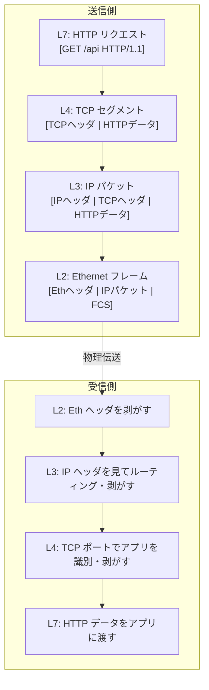
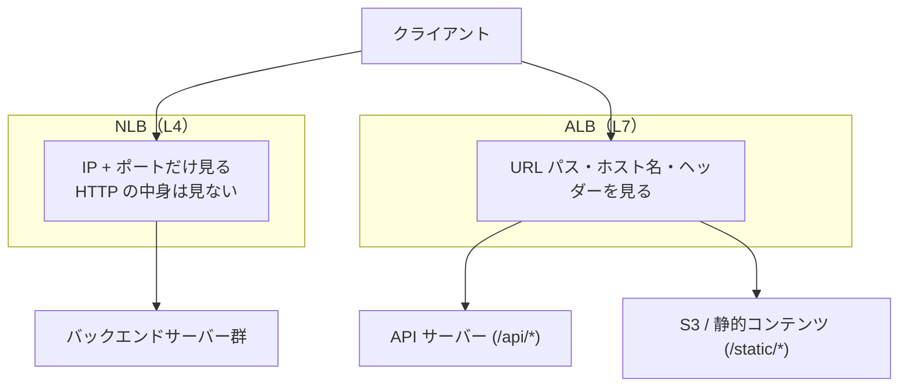

# OSIモデルとTCP/IPモデル

## 1. 概念理解

### 学ぶ範囲

OSI 7層モデルの各層の役割、TCP/IP 4層モデルとの対応、PDU（Protocol Data Unit）の名前、カプセル化と非カプセル化、「L4」「L7」という業界共通言語の意味と使われ方。

---

### なぜOSIモデルを学ぶか

OSIモデルは実際のプロトコル実装ではなく**設計の共通言語**として機能する。「L4ロードバランサー」「L7 WAF」「L3ルーティング」という表現はIT業界で日常的に使われる。モデルを知らなければ会話の前提が分からない。

---

### OSI 7層モデル

ネットワーク通信を機能ごとに7つの層に分割した参照モデル。1984年にISOが標準化。

| 層番号 | 層名 | PDU | 主なプロトコル・技術 | 役割 |
|--------|------|-----|---------------------|------|
| L7 | アプリケーション | データ | HTTP, HTTPS, DNS, SMTP | アプリケーション間の通信 |
| L6 | プレゼンテーション | データ | TLS/SSL, JSON, JPEG | データの表現・暗号化・圧縮 |
| L5 | セッション | データ | TLS（ハンドシェイク）, RPC | セッションの確立・維持・終了 |
| L4 | トランスポート | セグメント / データグラム | TCP, UDP | 端末間の信頼性・ポート番号による多重化 |
| L3 | ネットワーク | パケット | IP, ICMP, BGP | ネットワーク間の経路選択（ルーティング） |
| L2 | データリンク | フレーム | Ethernet, Wi-Fi, ARP | 同一ネットワーク内の転送・MACアドレス |
| L1 | 物理 | ビット | ケーブル, 光ファイバー, 無線 | ビット列の物理的な送受信 |

> **覚え方（英語）**: "Please Do Not Throw Sausage Pizza Away"（Physical, Data link, Network, Transport, Session, Presentation, Application）

---

### TCP/IP 4層モデルとの対応

実際のインターネットはTCP/IPモデルで動いている。OSIモデルの7層を実用的に4層に統合したもの。

| TCP/IP 層 | OSI 対応 | 単位 | アドレス | 役割 |
|-----------|---------|------|----------|------|
| アプリケーション | L5–L7 | メッセージ | — | HTTP, DNS, TLS などのプロトコル |
| トランスポート | L4 | セグメント / データグラム | ポート番号 | TCP/UDP で端末間の通信・信頼性制御 |
| インターネット | L3 | パケット | IP アドレス | ネットワーク間の転送・ルーティング |
| ネットワークアクセス | L1–L2 | フレーム | MAC アドレス | 同一ネットワーク内の転送 |

OSIモデルはよくある参照・議論の語彙として使われ、実装の世界では TCP/IP モデルで話が進む。両者の対応を押さえておくと「L5はどこに行ったか」という疑問が解消する（TLSのハンドシェイクがL5相当だが、TCP/IPではL7のアプリ層にまとめられる）。

---

### カプセル化と非カプセル化

送信側は上位層から順にヘッダーを付け加えていく（カプセル化）。受信側は逆に下位層からヘッダーを剥がしていく（非カプセル化）。各層は自分より上の層を「ペイロード」として扱い、中身を見ない。これがレイヤー分離の本質。

```
送信側（カプセル化）:
L7  [HTTPデータ]
L4  [TCPヘッダ | HTTPデータ]
L3  [IPヘッダ | TCPヘッダ | HTTPデータ]
L2  [Ethヘッダ | IPヘッダ | TCPヘッダ | HTTPデータ | FCS]
         ↓ 物理伝送
受信側（非カプセル化）:
L2  Ethヘッダを剥がす
L3  IPヘッダを見てルーティング判断・剥がす
L4  TCPポートでアプリを識別・剥がす
L7  HTTPデータをアプリに渡す
```

---

### 「Lx」という業界共通言語

OSI の層番号（Lx表記）はIT業界全体の共通語として使われる。

| 表現 | 意味 |
|------|------|
| L3 ルーティング | IP アドレスを見てパケットを転送 |
| L4 ロードバランサー | TCP ポート番号を見て振り分け（HTTPの中身は見ない） |
| L7 ロードバランサー | HTTP の URL・ホスト名・ヘッダーを見て振り分け |
| L7 WAF | HTTP リクエストの中身を検査してフィルタリング |
| L2 スイッチ | MAC アドレスを見てフレームを転送 |
| L4 ファイアウォール | IP アドレス + ポート番号で通信を制御 |
| L7 ファイアウォール | HTTP メソッド・URL など中身まで検査 |

---

## 2. 選択肢の比較

### L4 vs L7 ロードバランサー

何を「見て」振り分けるかが根本的な違い。

| 観点 | L4（NLB） | L7（ALB） |
|------|-----------|-----------|
| 判断材料 | IP アドレス + TCP ポート | HTTP ヘッダー, URL, ホスト名, Cookie |
| HTTP の内容 | 見えない | 見える |
| パフォーマンス | 高速（ヘッダー解析なし） | やや遅い（HTTP デコードが必要） |
| ルーティング例 | ポート443 → バックエンド群 | `/api/*` → API サーバー, `/static/*` → S3 |
| セッション維持 | IP ベース（ソース IP 固定） | Cookie ベース（スティッキーセッション） |
| 固定パブリック IP | 対応（EIP を直接アタッチ可） | 非対応（IP は可変） |
| 非 HTTP 通信 | 対応（TCP/UDP どちらでも） | HTTP/HTTPS のみ |
| AWS での実装 | NLB（Network Load Balancer） | ALB（Application Load Balancer） |

**使い分け**: パスベース・ホストベースのルーティングや Cookie 制御が必要なら ALB。非 HTTP（TCP アプリ, UDP ゲーム, IoT）や超低レイテンシ・固定 IP が必要なら NLB。

---

### L4 vs L7 ファイアウォール

| 観点 | L4 ファイアウォール | L7 ファイアウォール |
|------|------------------|------------------|
| 判断材料 | IP + ポート + プロトコル | HTTP リクエストの中身 |
| SQL インジェクション検知 | 不可 | 可能 |
| 処理コスト | 低 | 高 |
| AWS での例 | Security Group, Network ACL | WAF（Web Application Firewall） |

---

## 3. AWSでの実装例

| OSI 層 | AWS サービス | 役割 |
|--------|-------------|------|
| L7 | ALB, WAF, CloudFront | HTTP ルーティング, アプリレベルのフィルタリング, CDN |
| L4 | NLB, Security Group（ポート制御） | TCP/UDP ポートベースの転送・制御 |
| L3 | Route Table, Internet Gateway, NAT Gateway | IP ルーティング, VPC 間・インターネット接続 |
| L2 | VPC 内仮想スイッチ（明示的なサービスなし） | VPC 内の同一サブネット転送 |

```
インターネット
  ↓ L3: Internet Gateway（IP ルーティング）
  ↓ L7: CloudFront（HTTP キャッシュ・WAF 適用）
  ↓ L7: ALB（パスベース・ホストベースルーティング）
  ↓ L4: Security Group（ポート制限）
  ↓ ECS / Lambda / EC2
```

---

## 4. アーキテクチャ図

### カプセル化の流れ



### L4 vs L7 ロードバランサーの違い



---

## 5. 設計トレードオフ

### どのレイヤーで制御するか

通信を制御する層が深いほど精度は上がるが処理コストも上がる。

| レイヤー | コスト | 精度 | AWSでの手段 |
|---------|--------|------|------------|
| L3 IP 制限 | 最低 | 粗い（IP 単位） | Security Group の IP ルール |
| L4 ポート制限 | 低 | 中（プロセス単位） | Security Group のポートルール |
| L7 コンテンツ検査 | 高 | 細かい（URL・ヘッダー単位） | ALB ルール, WAF |

**原則**: まず Security Group で L4 制御。URL パスやリクエスト中身を見た制御が必要なときだけ ALB / WAF を追加する。

### ALB vs NLB の選択

| 必要な要件 | 選択 |
|-----------|------|
| HTTP パスベースルーティング | ALB |
| 複数ドメインのホストベースルーティング | ALB |
| L7 SSL 終端 + ヘッダー付け替え | ALB |
| 固定パブリック IP（EIP アタッチ） | NLB |
| 超低レイテンシ（数百μs） | NLB |
| TCP / UDP 通信（非 HTTP） | NLB |
| WebSocket（バイトストリームのまま通したい） | NLB（または ALB も可） |

---

## 6. 自分の言葉で説明

<!-- 一言説明、30秒説明、採用理由を自分で書く -->

---

## 7. 理解確認

<!-- 判断問題への回答、疑問、理解度（A/B/C）を残す -->
