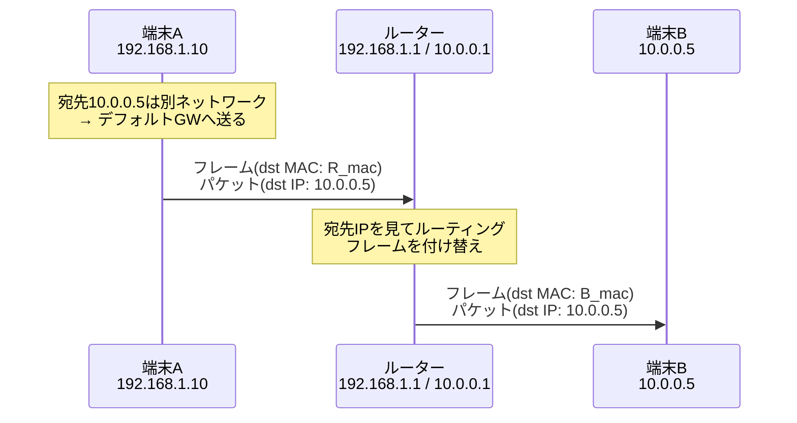
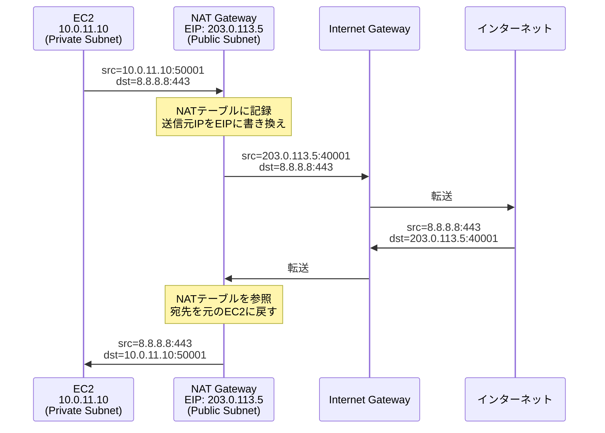
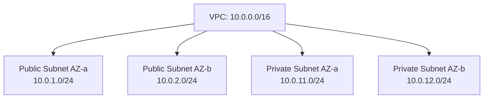

# 通信の基礎とIPアドレス

## 1. 概念理解

### 学ぶ範囲

TCP/IPの階層、フレームとパケット、MACアドレスとARP、IPv4/IPv6、プライベートIPとパブリックIP、ネットワーク部とホスト部、CIDR、サブネット分割、DHCP、ICMP、アドレス範囲の重複。

---

### TCP/IPの階層

OSIモデルを実用的に整理したTCP/IPモデルは4層で構成される。

| 層 | OSI対応 | 単位 | アドレス | 役割 |
|----|---------|------|----------|------|
| アプリケーション | L5–L7 | メッセージ | — | HTTP、DNS、TLSなどのプロトコル |
| トランスポート | L4 | セグメント/データグラム | ポート番号 | TCP/UDPでアプリを識別、信頼性制御 |
| インターネット | L3 | パケット | IPアドレス | ネットワーク間の転送・ルーティング |
| ネットワークアクセス | L1–L2 | フレーム | MACアドレス | 同一ネットワーク内の転送 |

### フレームとパケット

**パケット（L3）**: IPアドレスを持ち、送信元から最終宛先まで変わらない。ルーターを越えてもIPは保持される。

**フレーム（L2）**: MACアドレスを持ち、1ホップ（同一L2セグメント内）でのみ有効。ルーターを通るたびに付け替えられる。

```
[端末A] ──フレーム(MAC: A→ルーター)──> [ルーター] ──フレーム(MAC: ルーター→B)──> [端末B]
         パケット(IP: A→B)             パケット(IP: A→B)←変わらない
```

### MACアドレスとARP

**MACアドレス**: 48ビット（6バイト）のハードウェアアドレス。NICに固有。同一ネットワーク内での通信に使う。

**ARP（Address Resolution Protocol）**: IPアドレス → MACアドレスへの変換。「このIPを持っている人は誰?」をブロードキャストで問い合わせ、対象ホストがMACアドレスを返す。

- 同一サブネット内の通信: ARPで相手のMACを直接解決
- 別ネットワークへの通信: デフォルトゲートウェイ（ルーター）のMACをARPで解決し、そこへ送る

### IPv4 と IPv6

**IPv4**: 32ビット、4オクテット表記（例: `192.168.1.1`）。約43億アドレス。現在は枯渇しておりNATで延命中。

**IPv6**: 128ビット、16進コロン区切り（例: `2001:db8::1`）。約340澗アドレス。NATが不要な十分な空間を持つ。

AWSでは VPC に IPv6 CIDR ブロック（/56）を追加割り当て可能。サブネットには /64 を割り当てる。

### プライベートIPとパブリックIP

**プライベートIP（RFC 1918）**: インターネット上でルーティングされない。組織内で自由に使用可能。

| 範囲 | CIDR | アドレス数 |
|------|------|-----------|
| 10.x.x.x | 10.0.0.0/8 | 約1,677万 |
| 172.16〜31.x.x | 172.16.0.0/12 | 約104万 |
| 192.168.x.x | 192.168.0.0/16 | 約6.5万 |

**パブリックIP**: IANAが管理し、グローバルに一意。インターネットから直接到達可能。AWSではElastic IP（EIP）として取得できる。

### ネットワーク部とホスト部

IPアドレスは「どのネットワークか（ネットワーク部）」と「そのネットワーク内の何番か（ホスト部）」に分かれる。

```
192.168.1.10 / 24

ネットワーク部: 192.168.1  (上位24ビット)
ホスト部:       10         (下位8ビット)
→ このアドレスは 192.168.1.0/24 ネットワークに所属
```

### CIDR（Classless Inter-Domain Routing）

プレフィックス長（/N）でネットワーク部のビット数を表す。

| CIDR | アドレス数 | 備考 |
|------|-----------|------|
| /8 | 16,777,216 | 10.0.0.0/8 など |
| /16 | 65,536 | VPC全体によく使う |
| /24 | 256 | サブネットによく使う（実用254） |
| /28 | 16 | 小サブネット（実用11、AWSは5つ予約） |
| /32 | 1 | 単一ホスト（Security Groupルールなど） |

アドレス数 = **2^(32 − プレフィックス長)**

### サブネット分割

大きなCIDRブロックを用途・AZ・公開範囲ごとに小さなサブネットへ分割する。

```
VPC: 10.0.0.0/16
├── Public  Subnet AZ-a: 10.0.1.0/24
├── Public  Subnet AZ-b: 10.0.2.0/24
├── Private Subnet AZ-a: 10.0.11.0/24
└── Private Subnet AZ-b: 10.0.12.0/24
```

**AWSの予約アドレス**: 各サブネットの先頭4IPとブロードキャスト用末尾1IPはAWSが予約するため使用不可。/28 = 16アドレスから5を引いて実質11アドレス。

### DHCP

端末にIPアドレスを動的に割り当てるプロトコル。DORA手順（Discover → Offer → Request → Acknowledge）でリース期間付きのIPを取得する。AWSではVPC DHCP Option SetでDNSサーバー、ドメイン名などを設定できる。

### ICMP

制御メッセージとエラー通知のプロトコル（L3）。

- `ping` = ICMP Echo Request / Echo Reply（疎通確認）
- 到達不能（Destination Unreachable）
- TTL超過（Time Exceeded） ← `traceroute` で利用

### NAT（Network Address Translation）

プライベートIPのままインターネットへ通信するために、**パケットのIPアドレス（とポート番号）を書き換える**技術。IPv4のアドレス枯渇への対処として普及した。

#### なぜNATが必要か

IPv4は約43億アドレスしかなく世界中のデバイスに配布できない。そこで組織内はプライベートIP（RFC 1918）を使い、インターネットに出るときだけパブリックIPに変換することでアドレスを節約している。

#### NAPTの具体的な動作（最も一般的な形態）

NAPT（Network Address Port Translation）はIPアドレスに加えてポート番号も書き換えることで、**複数のプライベートIPを1つのパブリックIPで共有**する（多対1）。

**外向き通信の手順：**

```
① PC（192.168.1.10:50001）→ Google（8.8.8.8:443） へパケット送信

② NATルーターが送信元IP+ポートを書き換えて転送
   Before: src=192.168.1.10:50001  dst=8.8.8.8:443
   After:  src=203.0.113.5:40001   dst=8.8.8.8:443
                ↑ルーターのパブリックIP

③ NATテーブルに変換記録を保存
   192.168.1.10:50001 ←→ 203.0.113.5:40001
   192.168.1.11:50002 ←→ 203.0.113.5:40002  ← 別PCも同じパブリックIPを共有

④ Googleからの応答が 203.0.113.5:40001 に届く

⑤ NATルーターがNATテーブルを引いて宛先を書き換えてPCへ転送
   Before: src=8.8.8.8:443  dst=203.0.113.5:40001
   After:  src=8.8.8.8:443  dst=192.168.1.10:50001
```

インターネット側からはすべて `203.0.113.5` という1つのIPに見える。PCのプライベートIPは一切露出しない。

#### NATの重要な制約

```
✅ 内 → 外: NATテーブルが作られる、通信可能
❌ 外 → 内: NATテーブルがないため届かない（接続開始不可）
```

外からアクセスさせたい場合は別途 DNAT（Destination NAT）/ ポートフォワーディングが必要。

#### AWSでの実装（NAT Gateway）

Private Subnet の EC2 にパブリックIPを持たせずに外向き通信だけ許可する構成。

```
EC2（10.0.11.10, Private Subnet）
  → NAT Gateway（Elastic IP: 203.0.113.5, Public Subnet に配置）
    → Internet Gateway
      → インターネット
```

#### IPv6でNATが不要な理由

IPv6は2^128 ≒ 340澗アドレスを持つ。地球上のすべてのデバイスにグローバルIPを割り当てても余るため、アドレス変換が不要。セキュリティはファイアウォールが担う。AWSではIPv6のEgress-only Internet Gatewayが「外向きのみ許可」というNATに近い役割を果たす。

### アドレス範囲の重複

CIDRが重複する2つのネットワークはVPC PeeringやTransit Gatewayで接続できない。後から変更するにはVPCを作り直す必要があるため、**設計初期に重複しないよう計画することが最重要**。

---

## 2. 選択肢の比較

### IPv4 vs IPv6

| 観点 | IPv4 | IPv6 |
|------|------|------|
| アドレス長 | 32ビット（約43億） | 128ビット（約340澗） |
| 表記例 | 192.168.1.1 | 2001:db8::1 |
| NAT | 必要（枯渇対策） | 不要（全デバイスにグローバルIP） |
| AWSデフォルト | VPCのデフォルト | オプション追加（/56をVPCに割当） |
| 互換性 | 既存システムと広く互換 | 対応済みの環境が必要 |

#### ユースケース別の使い分け

| 状況 | 選択 | 理由 |
|------|------|------|
| 一般的なAWS VPC設計 | IPv4 | デフォルト対応、既存ツールとの互換 |
| EC2に外向き通信だけ許可したい | IPv4 + NAT Gateway | パブリックIPを持たせずに外部アクセス |
| オンプレミスとのVPN接続 | IPv4 | オンプレ側がIPv4前提であることが多い |
| IoTデバイスを大量展開 | IPv6 | デバイスごとにグローバルIPが必要、NATが管理コストになる |
| モバイルキャリア経由の通信 | IPv6 | 多くのキャリアがIPv6ネイティブ |
| CloudFront / CDN | デュアルスタック | IPv4/IPv6どちらのクライアントも受け入れる |
| IPv6環境で外向きのみ許可 | Egress-only IGW | AWSのIPv6版NAT相当（インバウンド不可） |

### パブリックIP vs プライベートIP

| 観点 | パブリックIP | プライベートIP |
|------|------------|--------------|
| 到達性 | インターネットから到達可能 | VPC内/接続先のみ |
| 管理 | IANAが割り当て | RFC 1918を自由使用 |
| AWSでの取得 | Elastic IP、自動割り当てパブリックIP | VPCのCIDR内から自動/固定 |
| コスト | 未アタッチのEIPに課金 | 無料 |
| セキュリティリスク | インターネット露出 | インターネット非露出 |

### CIDR幅のトレードオフ

| 選択 | メリット | デメリット |
|------|---------|-----------|
| 広い（/16など） | 拡張余地が大きい | 他ネットワークと重複する範囲が増える |
| 狭い（/28など） | アドレス節約 | 拡張できない、AWSの予約で実用が少ない |

**推奨**: VPCに/16、サブネットに/24前後を基本とし、用途に応じて調整する。

### 固定IP vs 動的IP（DHCP）

| 観点 | 固定IP | 動的IP（DHCP） |
|------|--------|--------------|
| 用途 | サーバー、ルーター | 一般端末、スケールするEC2 |
| 管理 | 手動、重複リスク | 自動、管理が楽 |
| AWSでの例 | ENI固定IP、Elastic IP | EC2インスタンス起動時の自動割り当て |

---

## 3. AWSでの実装例

VPC CIDR、Subnet CIDR、Private IPv4、Elastic IP、Amazon提供IPv6 CIDR、VPC DHCP Option Set。

| AWSリソース | 役割 |
|------------|------|
| VPC | プライベートネットワーク空間。CIDRブロックを割り当てる |
| Subnet | VPC内の分割された範囲。AZに対応付ける |
| Elastic IP (EIP) | 固定パブリックIPアドレス。EC2/NAT GatewayなどにアタッチできるIPv4 |
| VPC DHCP Option Set | DHCPで配布するDNSサーバーやドメイン名を設定 |
| IPv6 CIDR Block | VPCに追加できるAmazon提供のIPv6アドレス空間 |

---

## 4. アーキテクチャ図

### パケット転送の流れ



### NAT Gateway による外向き通信フロー



### VPC / Subnet のアドレス設計例



---

## 5. 設計トレードオフ

### 将来の拡張
VPCのCIDRは**後から縮小・変更ができない**（CIDRブロックの追加は可能）。最初に余裕のある/16を確保し、サブネットを/24前後で切ると変更に強い。

### 他ネットワークとの接続
VPC Peering、Transit Gateway、Direct Connectで接続するネットワーク同士はCIDRが重複すると接続不可になる。将来の接続先（オンプレミス、他VPC）のCIDRも考慮して重複しないよう設計する。

### アドレス浪費とアドレス不足のバランス
- 広すぎると（例: /8を複数VPCに割り当て）他の用途に使える空間が減る
- 狭すぎると（例: /28サブネット）AWSの予約アドレス5つを除いた実質11アドレスしか使えず、スケールできない
- AWSではサブネット内のEC2が起動するたびにIPを1つ消費するため、小さなサブネットは高負荷サービスには不向き

### 固定IP vs Elastic IP のコスト
EIPは**アタッチしていない時間に課金**される。不要なEIPを解放する運用ルールを設けることが重要。

---

## 6. 自分の言葉で説明

### IPアドレスとMACアドレスの役割
IPアドレスはネットワークを越えても変わらない「グローバルな住所」。MACアドレスは同一L2セグメント内でのみ有効な「局所的な識別子」。パケットはIPアドレスを宛先として持ち続けるが、フレームはホップするたびにMACアドレスが更新される。

### CIDRとは何か
IPアドレスの「ネットワーク部が上位何ビットか」を示す表記。`10.0.0.0/16`なら上位16ビットがネットワーク部なので2^16 = 65,536アドレスを持つ。スラッシュの数字が大きいほど範囲が狭くなる。

### なぜ最初のCIDR設計が重要か
VPCのCIDRは後から変更できない。また他のVPCやオンプレミスと接続する際にCIDRが重複していると経路が決定できず接続不可になる。修正するにはVPCを作り直すコストが発生するため、初期設計が最も影響が大きい。

### NATとは何か、なぜ必要か
IPv4のアドレスが枯渇しているため、組織内はプライベートIPを使い、インターネットに出るときだけNATルーターがパブリックIPに書き換える。NAPTではポート番号も書き換えることで複数ホストが1つのパブリックIPを共有できる。NATは内→外は可能だが外→内の接続開始は不可という制約がある。

<!-- ↑ 自分の言葉に書き換えてみること -->

---

## 7. 理解確認

### 到達目標

パケットが宛先へ届く基本要素を説明し、必要な規模から重複しないVPCとSubnetのアドレス範囲を考えられる。

### 現在の理解度

| トピック | 理解度 | メモ |
|---------|--------|------|
| TCP/IPの階層とフレーム/パケットの違い | <!-- A/B/C --> | |
| MACアドレスとARPの役割 | <!-- A/B/C --> | |
| プライベートIP / パブリックIPの違い | <!-- A/B/C --> | |
| CIDRの読み方とアドレス数の計算 | <!-- A/B/C --> | |
| サブネット分割の設計方針 | <!-- A/B/C --> | |
| なぜCIDR重複を避けるか | <!-- A/B/C --> | |
| NATの仕組み（NAPTの動作手順） | <!-- A/B/C --> | |
| IPv4でNATが必要でIPv6では不要な理由 | <!-- A/B/C --> | |
| AWS NAT Gatewayの役割と配置場所 | <!-- A/B/C --> | |

<!-- A：説明できる / B：見れば分かる / C：まだ怪しい -->
