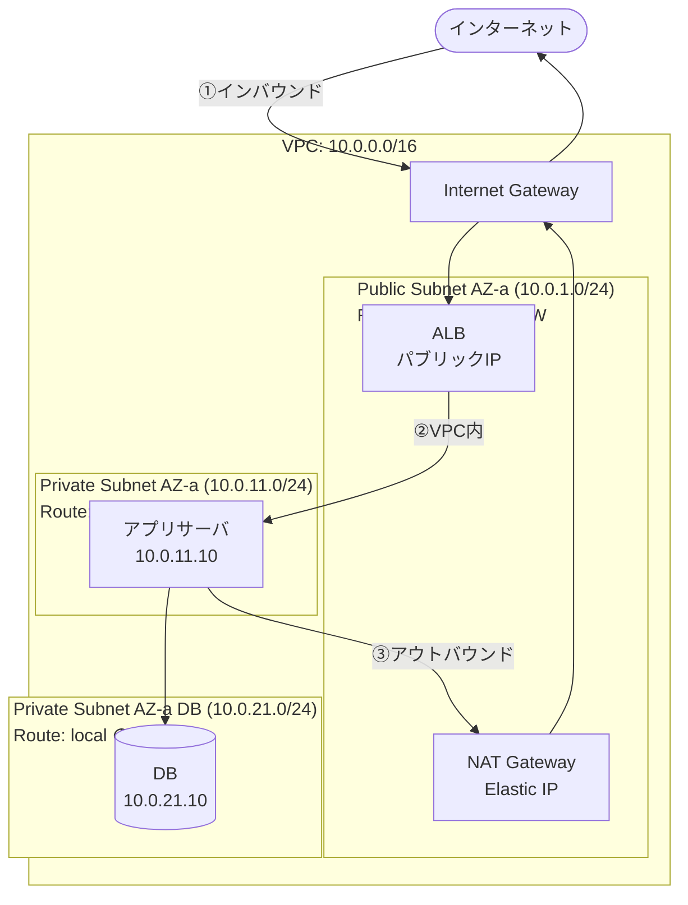
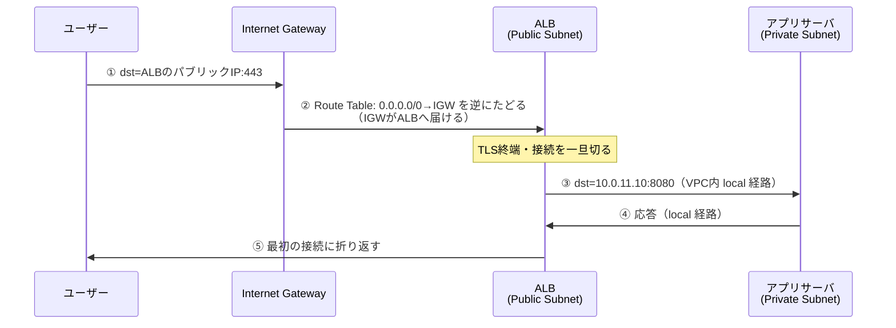
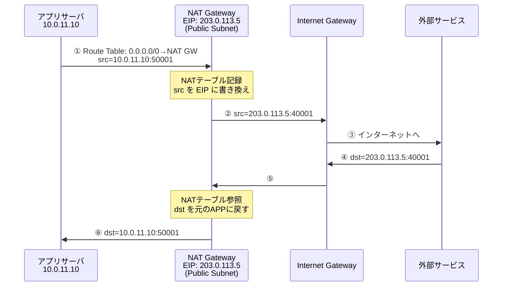

# ルーティングとインターネット接続

## 1. 概念理解

### 学ぶ範囲

ルーター、Route Table、最長プレフィックス一致、デフォルトルート、Public/Private Subnet、Internet Gateway、NAT、インバウンド/アウトバウンド経路、戻り経路。

---

### そもそもルーターとは何か

**異なるネットワーク（L3）同士を繋ぎ、パケットを次のネットワークへ中継する機器**。前回学んだ「別ネットワーク宛ての通信はデフォルトゲートウェイ（ルーター）に送る」の、その受け取り手。

- **スイッチ（L2）** … 同一ネットワーク内でMACアドレスを見てフレームを転送する。ネットワークをまたげない。
- **ルーター（L3）** … 複数のネットワークにまたがり、宛先IPアドレスを見てパケットをネットワーク間で転送する。

1台のルーターは複数のネットワークに足を持ち（各足がそのネットワーク内のIPを持つ）、「どの宛先ならどの足から出すか」を**Route Table**で判断する。パケットがルーターを通るたびにフレーム（L2のMAC）は付け替えられるが、パケット（L3のIP）の宛先は変わらない。

**AWSでは物理ルーターは見えない**。VPCが内部で暗黙のルーター機能（"implicit router"）を持ち、利用者はそこに紐づくRoute Tableを編集することでルーティングを制御する。「ルーターを置く」のではなく「Route Tableを書く」のがAWSでの操作になる。

### ルーターは何を見て転送先を決めるか

ルーターは受け取ったパケットの**宛先IPアドレス**を見て、**Route Table（経路表）**と照合し、「この宛先範囲宛てなら次はここへ送れ」という転送先（Target）を決める。

AWSのPrivate Subnetに紐づくRoute Tableの例：

| 宛先（Destination） | 転送先（Target） |
|---|---|
| 10.0.0.0/16 | local（VPC内） |
| 0.0.0.0/0 | nat-xxxx（NAT Gateway） |

### 最長プレフィックス一致（Longest Prefix Match）

1つの宛先IPが複数のルールにマッチしたとき、**プレフィックス長が最も長い（＝最も具体的に宛先を絞り込んでいる）ルール**が選ばれる。

例: 宛先 `10.0.5.20` のパケット
- `10.0.0.0/16` … 上位16ビットを指定 → 具体的
- `0.0.0.0/0` … 何も指定しない＝全アドレス → 最もざっくり

→ プレフィックスが長い `/16` が勝つ。

プレフィックスが長い = マッチする範囲が狭い = 具体的、なので優先される。この性質により、最短プレフィックスの `0.0.0.0/0`（デフォルトルート）は「他のどのルールにも当てはまらなかったパケットの受け皿（最後の砦）」として機能する。

**注意（設計事故の典型）**: より具体的なルールを後から足すと、VPC内向けのはずの通信がそちらに吸い出される。

| 宛先 | 転送先 | 172.16.3.8 は |
|---|---|---|
| 0.0.0.0/0 | igw | マッチ（/0） |
| 172.16.0.0/16 | local | マッチ（/16） |
| 172.16.3.0/24 | pcx（VPC Peering） | **マッチ（/24）← 選ばれる** |

`172.16.3.8` は `local`（VPC内）ではなく、最長の `/24` に従ってVPC Peering先へ転送される。VPC Peeringやオンプレ接続を追加した際に「VPC内通信が意図せず外へ流れる」事故の原因になりやすい。

### AWS特有の割り切り

AWSのRoute Tableは**最長プレフィックス一致のみ**で経路を決める。物理ルーターにあるメトリックや管理距離（同じプレフィックス長で複数経路があるときの優先順位付け）という概念は持たず、シンプルに保たれている。

### Public Subnet と Private Subnet の正体

AWSのサブネットに「Public/Private」という設定項目は存在しない。違いは**紐づくRoute Tableの `0.0.0.0/0` の転送先がどこを向いているか**だけ。

| | Public Subnet | Private Subnet |
|---|---|---|
| `0.0.0.0/0` の向き先 | **Internet Gateway (igw)** | NAT Gateway / なし |
| インターネットからの直接到達 | 可能（要パブリックIP） | 不可 |

### なぜ外 → Private Subnet に直接入れないか（2重の鍵）

- **鍵①（住所がない）**: Private SubnetのEC2はプライベートIP（RFC 1918）しか持たない。プライベートIPはインターネット上でルーティングされないため、外部からそもそも宛先に指定できない。
- **鍵②（折り返し記録がない）**: NAT Gatewayは内側発の通信のときだけNATテーブル（折り返し先の記録）を作る。外から突然NATのパブリックIP宛てに来ても、対応する記録がなく破棄される。

内 → 外は、EC2が自ら通信を始める＝NATテーブルが作られる＝折り返せるので成立。この非対称性が「外向きだけ許可」を実現する。

### では外からPrivateサーバを使わせる方法（Webアプリの典型）

外部ユーザーはPrivateサーバに**直接繋いでいない**。Public Subnetに**公開された入口専用の窓口**を置く。

```
[外部ユーザー] → ① ALBのパブリックIP宛てに接続（宛先はALB）
   → [ALB: Public Subnet, パブリックIP] → ② 接続を終端し、VPC内で新接続をPrivateサーバへ
      → [アプリ: Private Subnet, プライベートIPのみ] → ③ 応答をALBへ(local経路)
   → [ALB] → ④ 最初のユーザー接続に折り返す
```

| | NAT Gateway | ロードバランサー（ALB等） |
|---|---|---|
| 想定する向き | 内 → 外 | 外 → 内 |
| 折り返し記録 | 内側発のとき動的に作る | 外の接続を受ける前提で常時待ち受け |
| Privateサーバの露出 | しない | しない（ALBが代理で受ける） |

ロードバランサーは「外の接続を受ける専任の窓口」としてパブリックIPを持ちPublic Subnetに常駐するため外→内が成立する。一方でPrivateサーバ自身は一度もインターネットに顔を出さず、会話相手はALBだけ（VPC内local経路）。外部の接続はALBで一旦切れて別接続に張り替えられている。他にAPI Gateway、リバースプロキシ、NATにDNAT/ポートフォワーディングを設定する方法もある。

## 2. 選択肢の比較

### NAT Gateway vs NAT Instance

| 軸 | NAT Gateway | NAT Instance |
|---|---|---|
| 可用性 | AWS管理・自動冗長化 | 単一EC2 → SPOF。自分でHA構成が必要 |
| 管理コスト | フルマネージド。OSパッチ・設定変更不要 | OS管理・フェイルオーバースクリプト・Source/Dest Check無効化など自己管理 |
| コスト（AWS請求） | 時間課金＋データ処理料金（$0.045/GB）で高めになりやすい | EC2料金のみ。超低トラフィックなら安くなるケースあり |

**結論**: 人件費・運用コストを含めると実質NAT Gateway一択。NAT Instanceが有利な場面は「超低トラフィック＋運用コストをゼロとみなす場合」のみ。

### Internet Gateway vs NAT Gateway

| | Internet Gateway | NAT Gateway |
|---|---|---|
| 通信の向き | 双方向 | 内 → 外のみ |
| 外→内の扱い | パブリックIPがあれば通す | NATテーブルに記録がなければ破棄 |
| NATテーブル | なし（ただのゲート） | 内側発のときだけ記録を作る |
| 主な用途 | Public Subnetのインターネット出口 | Private Subnetの代理出口 |

**なぜNATは外→内を通さないか**: 内側から通信を始めたときだけNATテーブルに「折り返し先の記録」が作られる。外から突然来てもテーブルに対応記録がなく破棄される。

### Public / Private 配置の基準

Public Subnetに置く条件（いずれか1つでも該当すれば Public）:
1. **インターネットから直接到達される必要があるもの**
2. **自身がインターネットへの出口として機能するもの**（= Elastic IPを持ち IGW 経由で出る）

| リソース | 配置 | 理由 |
|---|---|---|
| ALB / NLB | Public | 外部からの入口。パブリックIPが必要 |
| NAT Gateway | Public | Private→外部の出口代理。自身が IGW 経由で出る |
| 踏み台サーバ（Bastion） | Public | SSH等で外から直接繋ぐ必要がある |
| アプリサーバ | Private | ALBの後ろに隠す。外部から直接不要 |
| DBサーバ | Private | 外部露出ゼロが原則 |
| バッチサーバ | Private | 外向き通信は NAT 経由で十分 |

## 3. AWSでの実装例

VPC、Subnet、Route Table、Internet Gateway、NAT Gateway、Egress-only Internet Gateway。

### 経路を担う3つのGateway

| Gateway | 向き | 使う場面 |
|---|---|---|
| **Internet Gateway (IGW)** | 双方向 | Public Subnetがインターネットと通信する土台 |
| **NAT Gateway** | 内→外のみ | Private SubnetのIPv4外向き通信 |
| **Egress-only IGW** | 内→外のみ | Private SubnetのIPv6外向き通信 |

### なぜNAT GatewayはPublic Subnetに置くのか

NAT GatewayはPrivate SubnetのEC2の代わりに外へ出る。そのためNAT Gateway自身も「インターネットへの出口」が必要。

- **Elastic IP（グローバルIP）を持つ** → インターネット上で送信元IPとして機能する
- **`0.0.0.0/0 → IGW` というRoute Tableのサブネットに属する** → これがPublic Subnetの定義そのもの

もしPrivate Subnetに置いた場合、そのサブネットの `0.0.0.0/0` は別のNAT Gatewayを指すことになり、無限ループか到達不能になる。

```
Private Subnet の Route Table:  0.0.0.0/0 → NAT Gateway（Public Subnetにいる）
Public Subnet の Route Table:   0.0.0.0/0 → IGW（インターネットの出口）
```

NAT Gatewayは「Private SubnetとIGWの橋渡し役」として、Public Subnet側に足を置く。

## 4. アーキテクチャ図

### VPC全体構成



### インバウンド経路（外 → アプリ）



### アウトバウンド経路（アプリ → 外部API等）



## 5. 設計トレードオフ

### 可用性: NAT Gatewayの冗長化

NAT GatewayはAZスコープのリソース（特定のAZ内のPublic Subnetに作る）。1つだけ置くと2つの問題が生じる：

1. **SPOF**: そのAZが落ちると、他のAZのPrivate Subnetもアウトバウンド不能になる
2. **AZ間転送コスト**: 別AZのNAT GWを経由するとAZ間データ転送料金が発生する

**ベストプラクティス**: AZごとにNAT GWを1つ置き、各AZのPrivate SubnetのRoute Tableは同一AZのNAT GWを指す。

**トレードオフ**: NAT GWを複数置くと稼働時間料金が増える。小規模・開発環境では1つに絞ってコスト節約する判断もあり得る。

### NATコストの削減手段

NAT Gatewayは「稼働時間＋データ処理料金（$0.045/GB）」の二重課金。コストを抑える手段：

| 手段 | 効果 | トレードオフ |
|---|---|---|
| **VPC Endpoint（Gateway型）** | S3・DynamoDBへのアクセスがNATをバイパス。**無料** | サービスごとに設定が必要 |
| **VPC Endpoint（Interface型）** | ECR・Secrets Manager等がNATをバイパス。ENI料金発生 | NAT料金と比較して判断 |
| Public Subnetへ移動 | NATそのものが不要になる | セキュリティを下げる選択 |
| AZ集約（NAT GW削減） | 稼働時間料金を削減 | 可用性・AZ間コストのリスク |

```
通常:   EC2 → NAT GW（課金）→ IGW → S3
Endpoint: EC2 → VPC Endpoint → S3（AWSバックボーン内、NAT不要）
```

### Route Table / SG / NACLの役割分担

3つは制御するレイヤーが異なる別物。パケットは全部を順番に通過する。

```
外部 → Route Table（経路）→ NACL（サブネット境界）→ SG（リソース境界）→ EC2
```

| | Route Table | Security Group | NACL |
|---|---|---|---|
| 制御対象 | 経路（どこへ転送するか） | リソース単位（EC2・RDS等） | サブネット単位 |
| 許可/拒否 | なし（転送先を指定するだけ） | 許可のみ | 許可・拒否の両方 |
| ステート | - | **ステートフル**（戻り自動許可） | **ステートレス**（戻りも明示的に許可が必要） |
| デフォルト | - | インバウンド全拒否・アウトバウンド全許可 | 全許可（デフォルトNACL） |

**ステートレス（NACL）の落とし穴**: インバウンドを許可しても、アウトバウンド側に戻り経路（エフェメラルポート: 1024-65535）の許可がないと応答が返せない。SGはステートフルなのでこの問題が起きない。

### 公開範囲: EC2をPublicに直置きするか、ALB + Privateにするか

「外部公開するかどうか」は両方に共通。選択の軸は**どれだけ堅牢にするか**。

| | Public直置き | ALB + Private EC2 |
|---|---|---|
| 外部からのアクセス | あり（EC2に直接） | あり（ALBが代理） |
| 典型的な用途 | 開発・検証環境 | 本番環境 |
| スケーリング | 単一インスタンスで十分 | 複数EC2へ振り分け |
| セキュリティ | EC2がインターネットに直接晒される | EC2はPrivate、外部はALBとのみ通信 |

**Public直置きを選ぶ条件（3つ揃うとき）:** 外部公開が必要 ＋ 単一インスタンスで十分 ＋ 開発/検証環境

**ALB + Privateを選ぶ条件（いずれか1つでも該当）:** 本番環境 / スケーリング必要 / SSL終端・ヘルスチェックをALBに任せたい

なお「内部に閉じた用途」ならPublicに置く理由はなく、最初からPrivate Subnetが適切。

### 外向き通信と戻り経路

アプリ（Private Subnet）→ 外部API → レスポンスが戻る経路。「戻り経路」は複数の仕組みが層ごとに保証する。

```
行き: EC2 → Route Table（経路）→ NAT GW（IPを書き換え）→ IGW → 外部API
戻り: 外部API → IGW → NAT GW（NATテーブルでEC2のIPに復元）→ NACL → SG（自動許可）→ EC2
```

| 仕組み | 役割 | 戻り経路への関与 |
|---|---|---|
| Route Table | 経路を示す | どのルートを通るかを決めるが状態は持たない |
| NATテーブル（NAT GW） | IP変換の記録 | **戻りパケットの宛先を元のEC2に復元**。これがなければEC2に届かない |
| SG（ステートフル） | リソース境界 | 出て行った通信の戻りを自動許可 |
| NACL（ステートレス） | サブネット境界 | 戻りのエフェメラルポート（1024-65535）を明示的に許可しないとブロックされる落とし穴あり |

## 6. 自分の言葉で説明

<!-- 一言説明、30秒説明、採用理由を自分で書く -->

## 7. 理解確認

<!-- 判断問題への回答、疑問、理解度（A/B/C）を残す -->
