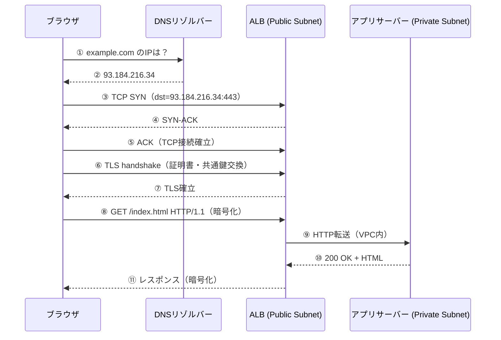
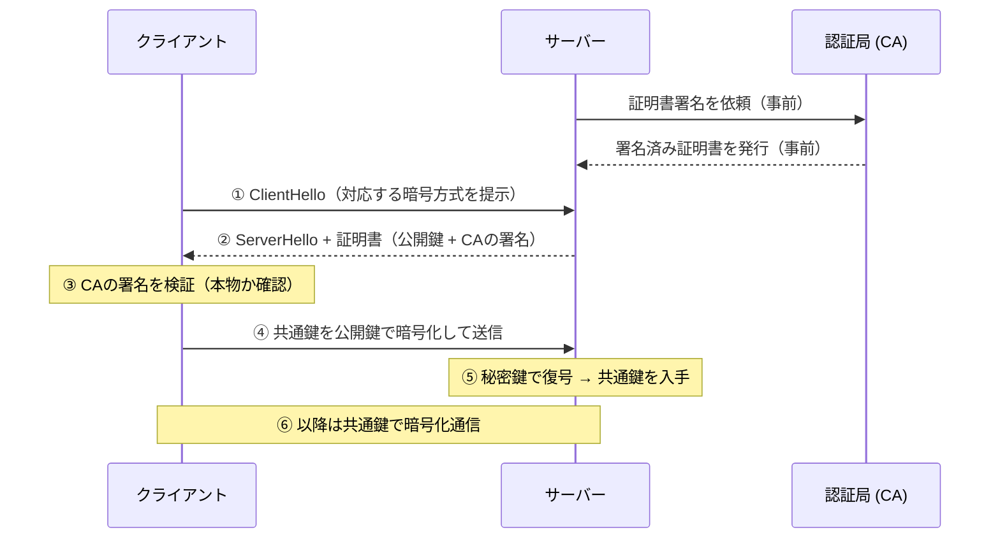

# エンドツーエンド通信

## 1. 概念理解

### 学ぶ範囲

TCP/UDP、ポート番号、コネクション、名前解決、ドメイン、DNSレコード、HTTPのリクエスト/レスポンス、HTTPS、TLS証明書と暗号化。

---

### TCP と UDP

インターネットでデータを送るとき、データは小さな塊（パケット）に分割されて相手に届く。パケットは途中で消えることがある。この「消えたらどうするか」に対する答え方が2種類ある。

**TCP（Transmission Control Protocol）**

全パケットの到着を確認しながら送り、消えたら再送する。確実だが、再送待ちで後続パケットが詰まる。

```
送信側: パケット①送ります
受信側: ①届きました（ACK）
送信側: パケット③が届いてないっぽい、再送します
```

**UDP（User Datagram Protocol）**

確認なしで送り続け、届かなくても再送しない。欠損はあるが遅延が小さい。

```
送信側: ①②③④⑤… （確認なしで撃ち続ける）
受信側: ①③⑤… （②④は消えたが処理を続ける）
```

| | TCP | UDP |
|---|---|---|
| 確認 | する（遅いが確実） | しない（速いが欠損あり） |
| 再送 | あり | なし |
| 使い道 | Web・ファイル転送 | 動画通話・ゲーム |

動画通話でTCPを使わない理由：1秒前の映像パケットが消えて再送を待つ間、後続も詰まって映像が固まる。リアルタイム系は「完全性より鮮度」を優先するためUDPが向く。

---

### ポート番号

IPアドレスはサーバーの「住所」だが、1台のサーバーには複数のアプリが同時に動いていることがある。ポート番号は「部屋番号」として、届いたパケットをどのアプリに渡すかを識別する。

```
192.168.1.10:80   → Webサーバー（nginx）
192.168.1.10:22   → SSH daemon
192.168.1.10:5432 → PostgreSQL
```

| ポート | プロトコル | 用途 |
|---|---|---|
| 22 | SSH | サーバーへのリモートログイン |
| 80 | HTTP | 暗号化なしWeb |
| 443 | HTTPS | 暗号化ありWeb |
| 5432 | PostgreSQL | DB接続 |
| 8080, 8000 | （慣習） | ローカル開発 |

80/443はブラウザが自動で付けるのでURLに書かなくてよい。

---

### DNS 名前解決

ブラウザはドメイン名（`example.com`）を受け取り、IPアドレスに変換してから通信する。

```
ブラウザ
  → ① キャッシュを確認（前回の結果が残っていれば使う）
  → ② なければリゾルバー（ISPや8.8.8.8など）に問い合わせ
      → ③ ルートDNSサーバーへ（「.com は誰が管理？」）
      → ④ .com のDNSサーバーへ（「example.com は誰が管理？」）
      → ⑤ example.com のDNSサーバーへ（「IPは？」）
      → ⑥ 「93.184.216.34」を返す
  → ブラウザに返す
```

②〜⑥はリゾルバーが代行するため、ブラウザからは「聞いたら返ってきた」だけに見える。

**TTL（Time To Live）**: DNSの回答を何秒間キャッシュしていいかをDNSサーバーが指定する値。大きいと問い合わせが減る一方、IP変更の反映が遅い。サーバー移行前日にTTLを小さくしておくと、切り替え後すぐ全員に新IPが届く。

---

### DNSレコードの種類

| レコード | 意味 | 例 |
|---|---|---|
| **A** | ドメイン → IPv4アドレス | `example.com → 93.184.216.34` |
| **AAAA** | ドメイン → IPv6アドレス | |
| **CNAME** | ドメイン → 別のドメイン名（別名） | `www.example.com → example.com` |
| **MX** | メールサーバーはどこか | |
| **TXT** | 任意のテキスト（認証等に使う） | |

CNAMEはIPではなく「別のドメイン名」を指す。AWSのALBやCloudFrontはIPが変わるため、AレコードではなくCNAMEで指すことが多い。

---

### TCP 3-way handshake

DNSでIPが判明した後、実際の通信を始める前にTCP接続を確立する。3回のやり取りで双方向の疎通を確認する。

```
クライアント → サーバー: SYN（「繋いでいいですか？」）
サーバー → クライアント: SYN-ACK（「いいですよ、そっちも聞こえますか？」）
クライアント → サーバー: ACK（「聞こえます」）
→ ここからHTTPリクエストを送れる
```

2回では「クライアント→サーバー」方向しか確認できない。3回やることで双方向の疎通が確認できる。

---

### HTTPリクエスト / レスポンス

**リクエスト**

```
GET /api/users/123 HTTP/1.1
Host: example.com
Authorization: Bearer eyJhbGci...
Content-Type: application/json
```

| 部分 | 名前 | 役割 |
|---|---|---|
| `GET` | メソッド | 何をしたいか |
| `/api/users/123` | パス | どのリソースか |
| `HTTP/1.1` | バージョン | プロトコルのバージョン |
| `Host:` 以下 | ヘッダー | メタ情報（認証・形式等） |
| ボディ | ボディ | 送るデータ（GETは通常なし） |

**レスポンス**

```
HTTP/1.1 200 OK
Content-Type: application/json

{"id": 123, "name": "alice"}
```

ステータスコード: 2xx 成功・4xx クライアントエラー・5xx サーバーエラー。

---

### TLS と HTTPS

HTTPはリクエスト/レスポンスの中身が平文で流れる。途中で盗み見られると全部読まれる。これを暗号化するのがTLS。

**共通鍵暗号の問題**

送受信者が同じ鍵を使う方式。問題は、初対面の相手と事前に鍵を共有する手段がないこと。鍵を送る際に盗まれると暗号化が無意味になる。

**公開鍵暗号（非対称暗号）**

数学的な仕組みで「公開してよい鍵（公開鍵）」と「秘密の鍵（秘密鍵）」のペアを作る。

```
サーバー → 全員に公開鍵を配る（盗み見られても問題ない）
クライアント → 公開鍵でデータを暗号化して送る
サーバー → 秘密鍵でのみ復号できる
```

公開鍵で暗号化したものは、対応する秘密鍵でしか復号できないという数学的性質を利用する。

**TLSの設計（いいとこ取り）**

公開鍵暗号は安全だが計算コストが高い。TLSはこう組み合わせる：

```
① 公開鍵暗号で「共通鍵」だけを安全に交換する
② 以降の通信は速い共通鍵暗号で暗号化する
```

**TLS証明書（サーバー証明書）**

「この公開鍵は本物のexample.comのものです」と認証局（CA）が署名して保証する。ブラウザはCAを信頼しているため、証明書を見て本物かどうか判断できる。

**TLS handshakeの流れ**

```
① クライアント → サーバー証明書を要求
② サーバー → 証明書（公開鍵 + CAの署名）を送る
③ クライアント → CAの署名を検証（本物か確認）
④ クライアント → 公開鍵で共通鍵を暗号化して送る
⑤ サーバー → 秘密鍵で復号して共通鍵を入手
⑥ 以降 → 共通鍵で暗号化通信
```

---

### 「鍵」の役割の違い

TLSの鍵とAPI Keyは別物。

| 種類 | 役割 | 例 |
|---|---|---|
| **TLSの公開鍵/秘密鍵** | 通信の暗号化 | サーバー証明書の鍵ペア |
| **API Key / Secret Key** | 認証（あなたは誰か） | `sk-ant-xxxxx`、AWS Access Key |
| **Token（JWT等）** | 認可（何をしていいか） | `Bearer eyJhbGci...` |

API KeyをHTTPで送ると平文で流れて盗まれる。HTTPSで送るからこそ安全——TLSが通信路を守って初めて成り立つ。

JWTの署名方式 `RS256`（RSA）は非対称暗号を認可に応用したもの。秘密鍵で署名し、公開鍵で検証するという構造はTLS証明書の検証と同じ考え方。

## 2. 選択肢の比較

### TCP vs UDP

| 軸 | TCP | UDP |
|---|---|---|
| 確認・再送 | あり | なし |
| 順序保証 | あり | なし |
| 遅延 | 大きい（再送待ちがある） | 小さい |
| 向いている用途 | Web・ファイル転送・API通信 | 動画通話・ゲーム・DNS |
| HTTPSで使うのは | ✅ | |

### HTTP vs HTTPS

| | HTTP | HTTPS |
|---|---|---|
| 暗号化 | なし（平文） | TLSで暗号化 |
| ポート | 80 | 443 |
| 証明書 | 不要 | 必要（CA発行） |
| 使い分け | 内部通信の一部 | 原則HTTPS一択 |

### 共通鍵暗号 vs 公開鍵暗号

| | 共通鍵暗号 | 公開鍵暗号 |
|---|---|---|
| 鍵の種類 | 1つ（送受信者が共有） | 公開鍵・秘密鍵のペア |
| 速度 | 速い | 遅い（計算コスト高） |
| 鍵配送問題 | あり（鍵を安全に渡せない） | なし（公開鍵は配っていい） |
| TLSでの使い方 | 本体通信の暗号化 | 共通鍵の交換のみ |

### DNSレコードの使い分け

| レコード | 指す先 | 典型的な用途 |
|---|---|---|
| A | IPv4アドレス | 固定IPのサーバー |
| CNAME | 別のドメイン名 | ALB・CloudFront（IPが変わるもの） |
| MX | メールサーバー | メール送受信 |

## 3. AWSでの実装例

Route 53、Private Hosted Zone、ACM、ALB、CloudFront。

### Route 53

AWSのDNSサービス。ドメインの登録とDNSレコードの管理を行う。

- **Public Hosted Zone**: インターネットからの名前解決。`example.com → ALBのDNS名`（CNAME）など。
- **Private Hosted Zone**: VPC内からの名前解決のみ。`db.internal → 10.0.21.10`（A）のように内部サービスをDNSで引ける。外部には非公開。

### ACM（AWS Certificate Manager）

TLS証明書の発行・管理サービス。証明書の更新も自動。ALBやCloudFrontにアタッチして使う。

### ALBとCloudFrontでのTLS終端

```
クライアント ──HTTPS──▶ ALB（TLS終端）──HTTP──▶ アプリサーバー（Private）
```

TLS handshakeをALBで終わらせ、VPC内部はHTTPで通信することが多い。VPC内は閉じたネットワークなので許容されるケースが多い。

CloudFrontを前段に置くとエッジでTLSを終端でき、グローバルの低遅延と証明書管理の一元化が得られる。

## 4. アーキテクチャ図

### URLを入力してからレスポンスが返るまで



### TLS handshakeの詳細



## 5. 設計トレードオフ

### TTL：DNSキャッシュの有効期限

| | TTL大（例: 3600秒） | TTL小（例: 60秒） |
|---|---|---|
| DNSへの問い合わせ | 少ない（キャッシュが長持ち） | 多い |
| IP変更の反映速度 | 遅い | 速い |
| 向いている場面 | 安定した本番環境 | 切り替え前後・障害対応時 |

**実務パターン**: サーバー移行前日にTTLを小さくしておく。切り替え後すぐ全員に新IPが反映される。

### TLS終端をどこで行うか

| 終端箇所 | 特徴 |
|---|---|
| **ALB** | VPC内はHTTP。管理がシンプル。内部通信は信頼できる前提 |
| **CloudFront** | エッジで終端。グローバル低遅延・証明書管理の一元化 |
| **アプリサーバーまでHTTPS** | 完全E2E暗号化。管理コスト増 |

本番環境では ALB または CloudFront でのTLS終端が一般的。VPC内を全て暗号化するコストに見合う要件（金融・医療等）なら E2E も選択肢に入る。

### 証明書管理

ACM（AWS Certificate Manager）を使えば証明書の発行・更新が自動化できる。自己管理証明書（Let's Encrypt等）は更新作業が必要になり、更新忘れによる障害リスクがある。ALBやCloudFrontと組み合わせるならACM一択。

### APIの認証・認可とTLSの関係

API Key や JWT はHTTPSで送って初めて安全。HTTPで送ると平文で流れ、盗まれる。TLSが通信路を守り、その上で認証・認可の仕組みが機能する。

## 6. 自分の言葉で説明

<!-- 「URLを入力してから応答が返るまで」をTCP/UDP、DNS、TLS、HTTPの役割を区別して説明する -->

## 7. 理解確認

### 到達目標

TCP/UDP、ポート、DNS、HTTP、TLSの役割を区別し、名前解決から暗号化通信までの流れを説明できる。

### 現在の理解度

<!-- A：説明できる / B：見れば分かる / C：まだ怪しい -->
