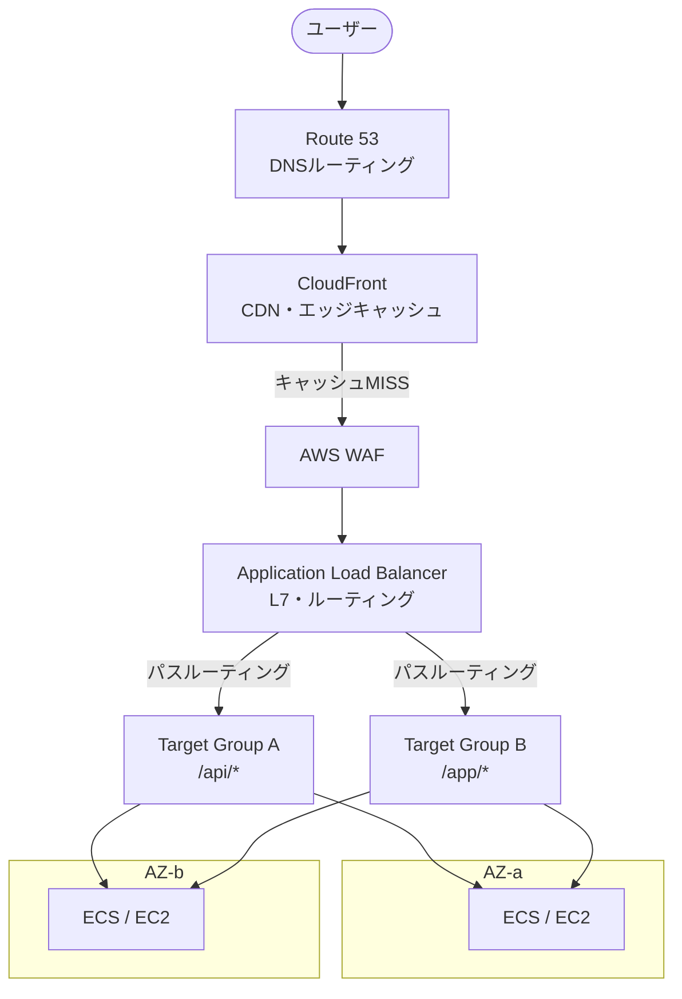

# トラフィックの分散と入口

## 1. 概念理解

### 学ぶ範囲

負荷分散、L4/L7、リバースプロキシ、リスナー、ターゲット、ヘルスチェック、スティッキーセッション、DNSルーティング、CDN、冗長化。

### なぜ必要か

サーバーが1台だと、負荷集中・単一障害点になる。複数台に分散することで可用性とスケーラビリティを確保する。

### 全体の流れ

```
ユーザー
  ↓ DNS解決（Route 53）
CloudFront（CDN・エッジキャッシュ）
  ↓ キャッシュMISSの場合
ALB / NLB（Load Balancer）
  ↓
複数AZのサーバー群
```

### リバースプロキシ

クライアントからのリクエストを受け取り、裏側の複数サーバーに中継する代理人。ALBはリバースプロキシの一種。  
（対義：フォワードプロキシ＝社内PCが外部へリクエストする際の代理人）

### L4 vs L7

OSI参照モデルのLayerを指す。通信を7層に分けた縦構造のうち、Load BalancerはL4またはL7で動作する。

| Layer | 情報 | 代表プロトコル |
|---|---|---|
| L3 | IPアドレス（どのマシンか） | IP |
| L4 | ポート番号＋TCP/UDP接続管理（どのプロセスか） | TCP, UDP |
| L7 | HTTPの中身（パス、ヘッダー、Cookie等） | HTTP, HTTPS |

**L4 Load Balancer**：パケットを開封せずIPアドレス＋ポートだけで振り分ける。中身を読まない分、高速・低レイテンシ。  
**L7 Load Balancer**：HTTPヘッダーやパスを読んで振り分ける。柔軟なルーティングが可能。

### ヘルスチェック

Load Balancerが定期的にバックエンドサーバーの死活を確認する仕組み。異常なサーバーは自動的にルーティング対象から外れる（冗長化の核心）。

### スティッキーセッション

同一クライアントからのリクエストを毎回同じサーバーに送り続ける設定。セッション情報をサーバーローカルに持つ設計の場合に必要になる（ただしスケールアウトの妨げになるためセッション外部化が望ましい）。

## 2. 選択肢の比較

### ALB vs NLB

| 観点 | ALB（Application LB） | NLB（Network LB） |
|---|---|---|
| 動作Layer | L7（HTTP/HTTPS） | L4（TCP/UDP） |
| 振り分け基準 | パス・ホスト名・ヘッダー・Cookie | IPアドレス＋ポートのみ |
| 固定IP | 不可 | 可（Elastic IP割り当て可） |
| TLS終端 | ALBで終端 | NLBで終端またはパススルー |
| 主なユースケース | WebアプリのHTTPルーティング | 固定IPが必要・UDP・超低レイテンシ |

**判断軸**：ホスト名やパスで振り分けたい → ALB。固定IPが必要・非HTTP → NLB。

### 内部向け vs 外部向け

どちらもALB/NLBで作成できる。  
- **インターネット向け（Internet-facing）**：外部からのトラフィックを受ける。パブリックIPを持つ。  
- **内部向け（Internal）**：VPC内部からのみアクセス可。マイクロサービス間通信等に使う。

### DNS分散 vs Load Balancer分散

| 方式 | 仕組み | 特徴 |
|---|---|---|
| DNSラウンドロビン | DNSが複数IPを順番に返す | シンプルだがヘルスチェックなし、TTLがネック |
| Load Balancer | 専用装置がリアルタイムに振り分け | ヘルスチェック・スティッキー・ルーティングルール対応 |

実務ではRoute 53のルーティングポリシー（加重・フェイルオーバー・レイテンシ等）でリージョン間を切り替え、リージョン内はALB/NLBで分散する構成が多い。

### CDNあり vs なし

| 観点 | CDNあり（CloudFront） | CDNなし |
|---|---|---|
| 静的コンテンツ配信 | エッジキャッシュで高速 | オリジンに直撃 |
| オリジン負荷 | キャッシュHITで軽減 | 全リクエストがオリジンへ |
| グローバル展開 | 世界中のエッジで低レイテンシ | オリジンまでの物理距離依存 |
| コスト | エッジ転送料＋オリジン料 | オリジン転送料のみ |

静的コンテンツが多い・グローバルユーザーがいる場合はCDN採用が基本。

## 3. AWSでの実装例

| 概念 | AWSサービス | 補足 |
|---|---|---|
| L7 Load Balancer | Application Load Balancer（ALB） | リスナー・ルール・ターゲットグループで設定 |
| L4 Load Balancer | Network Load Balancer（NLB） | 固定IP（EIP）割り当て可 |
| バックエンドの宛先管理 | Target Group | EC2・ECS・Lambda・IPを登録。ヘルスチェックもここで設定 |
| DNSルーティング | Route 53 | シンプル・加重・フェイルオーバー・レイテンシ・地理的ポリシー |
| CDN・エッジキャッシュ | CloudFront | オリジンはS3・ALB・API Gateway等を指定 |
| グローバル高速化（L4） | Global Accelerator | AWSのバックボーン網を使って固定エントリーポイントを提供 |
| 自動スケーリング | Auto Scaling Group | Target GroupにEC2を自動追加/削除。ALBと組み合わせて使う |

**ターゲットグループ**はALB/NLBから独立した概念。「どこに振り分けるか」と「ヘルスチェック」を管理する単位。1つのALBが複数のターゲットグループに振り分けられる。

## 4. アーキテクチャ図



## 5. 設計トレードオフ

### ALB vs NLB の選択

- **ALBを選ぶ条件**：HTTPベースのWebアプリ、ホスト名・パスで振り分けたい、TLS終端をLBに任せたい
- **NLBを選ぶ条件**：固定IPが必要（取引先のFW許可申請等）、UDP・gRPC・低レイテンシが要件、TLSパススルーが必要

### スティッキーセッションの扱い

スティッキーセッションを有効にすると特定サーバーに負荷が集中しスケールアウトの恩恵を受けにくくなる。  
根本解決は**セッション情報の外部化**（ElastiCache等）。スティッキーはあくまで一時的な対処。

### CDNキャッシュ戦略

- 静的コンテンツ（画像・CSS・JS）は長いTTLでキャッシュ → ファイル名にハッシュを付けてキャッシュバスティング
- 動的コンテンツはキャッシュしないかTTL=0にしてオリジンに通す
- CloudFrontのオリジンをALBにするとHTTPSの終端がCloudFrontになり、ALB-CloudFront間をHTTPSにするかどうかも設計ポイント

### ヘルスチェックの設計

- チェック間隔・閾値・タイムアウトが短すぎると誤検知でサーバーが頻繁に除外される
- 重いエンドポイントをヘルスチェックに使うとサーバー負荷になる → 軽量な `/health` エンドポイントを専用に用意する

### Global Accelerator vs CloudFront

| 観点 | Global Accelerator | CloudFront |
|---|---|---|
| 動作Layer | L4（TCP/UDP） | L7（HTTP/HTTPS） |
| キャッシュ | なし | あり |
| 主用途 | 固定エントリーポイント・非HTTP・レイテンシ改善 | 静的コンテンツ配信・HTTP高速化 |

## 6. 自分の言葉で説明

<!-- 「なぜLoad Balancerが必要か」「ALBとNLBの違い」を説明する -->
負荷分散のために必要。
NLBはIP/portレベルでクイックに振り分けることができる。固定IPが必要な要件にも合致。
ALBは、アプリレイヤーでの分散でリクエストの内容によって振り分けるため精緻だがレスポンスはかかる。簡易なwebアプリではALBを使っておけばOK。

## 7. 理解確認

### 到達目標

要件からDNS、CDN、L4/L7 Load Balancerの役割を選択し、ヘルスチェックを含む負荷分散と冗長化を説明できる。

### 現在の理解度

<!-- A：説明できる / B：見れば分かる / C：まだ怪しい -->
A