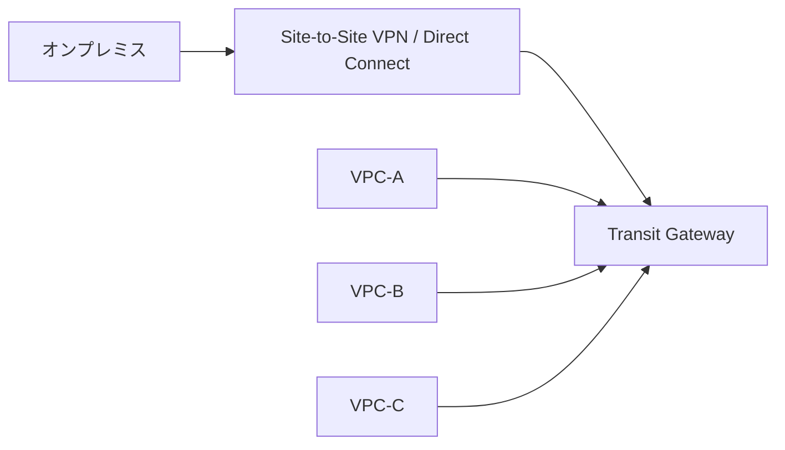
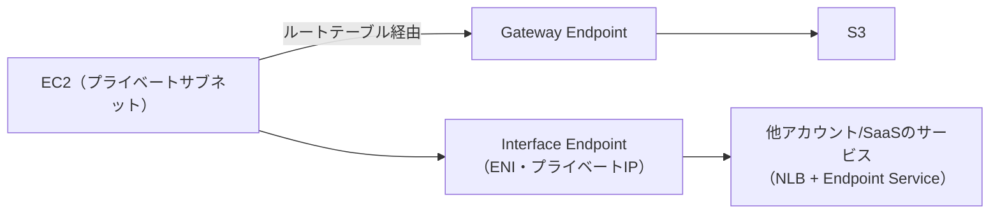

# ネットワーク間接続

## 1. 概念理解

### 学ぶ範囲

オンプレミスとクラウドの接続、VPC間接続、サービスへのプライベート接続、VPN、専用線、ハブ型接続、経路伝播、推移的ルーティング。

## 2. 選択肢の比較

### オンプレ ↔ AWS

| 方式 | 概要 | 向いているケース |
|------|------|-----------------|
| Site-to-Site VPN | インターネット上にIPSecトンネル | 低コスト・すぐ使いたい・帯域の安定性は二の次 |
| Direct Connect | キャリア経由の専用物理回線 | 安定帯域・低レイテンシが必須（コスト高・開通に時間） |

実務では専用線はコスト的にハードルが高く、重要度の高い接続のみ採用されることが多い。

### VPC ↔ VPC

| 方式 | 概要 | 向いているケース |
|------|------|-----------------|
| VPC Peering | 2点間の直接接続 | VPCが少ない（2〜3個）・オンプレ接続なし |
| Transit Gateway | ハブ型でN対N接続 | VPCが多い・オンプレ接続を集約したい |

**推移的ルーティング問題**：Peeringは中継しない。A↔B、B↔CをつないでもA↔Cは通じない。TGWはハブなので全経路が集約される。

### VPC → AWSサービス / 他アカウントサービス

| 方式 | 対象 | 仕組み | コスト |
|------|------|--------|--------|
| VPC Endpoint（Gateway型） | S3・DynamoDB | ルートテーブルにエントリ追加 | 無料 |
| VPC Endpoint（Interface型） | ほぼ全AWSサービス | VPC内にENI（プライベートIP）を作成 | ENI時間課金あり |
| PrivateLink | 他アカウント・SaaSのサービス | Interface Endpointを通じて特定サービスだけ公開 | 同上 |

## 3. AWSでの実装例

Site-to-Site VPN、Direct Connect、VPC Peering、Transit Gateway、PrivateLink、VPC Endpoint。

## 4. アーキテクチャ図

### TGWによるハブ型接続

### PrivateLink / VPC Endpoint

## 5. 設計トレードオフ

### VPN vs Direct Connect

| 観点 | VPN | Direct Connect |
|------|-----|----------------|
| コスト | 低い | 高い（回線費用・開通費） |
| 帯域・安定性 | インターネット依存 | 保証された帯域 |
| 導入時間 | 即日〜数日 | 数週間〜数ヶ月 |
| セキュリティ | 暗号化あり（IPSec） | 物理的に閉じた回線 |

→ 実務では「まずVPNで繋いで、要件が固まったらDCへ移行」というパターンもある。

### VPC Peering vs Transit Gateway

| 観点 | VPC Peering | Transit Gateway |
|------|-------------|-----------------|
| コスト | データ転送料のみ | TGW時間課金＋データ転送料 |
| スケール | VPC数が増えると配線が爆発（N×(N-1)/2本） | N本で済む |
| オンプレ集約 | 不可 | 可能 |
| 経路制御 | ルートテーブルを個別管理 | TGWルートテーブルで集中管理 |

→ VPC 2〜3個ならPeering、それ以上 or オンプレ接続ありならTGW。

### Gateway Endpoint vs Interface Endpoint vs PrivateLink

| 観点 | Gateway型 | Interface型 | PrivateLink（他者サービス） |
|------|-----------|-------------|---------------------------|
| 対象 | S3・DynamoDB | ほぼ全AWSサービス | 他アカウント・SaaS |
| コスト | 無料 | ENI課金あり | 同左 |
| オンプレから使用 | 不可（ルートテーブルの仕組みのため） | 可能 | 可能 |
| 露出範囲 | - | - | サービス単位（VPC全体を見せない） |

→ S3はまずGateway Endpointを検討。他サービスはInterface型。他アカウントへの最小権限接続はPrivateLink。

## 6. 自分の言葉で説明

<!-- 「どのネットワークと何を接続するのか」「なぜインターネット経由にしないか」「各接続方式の違い」を説明する -->

## 7. 理解確認

### 到達目標

接続対象、通信方向、経路、帯域、可用性の要件からVPN、専用線、VPC間接続、サービス接続を使い分けられる。

### 現在の理解度

<!-- A：説明できる / B：見れば分かる / C：まだ怪しい -->
B