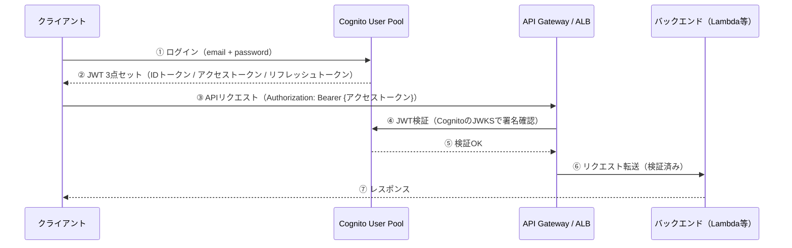
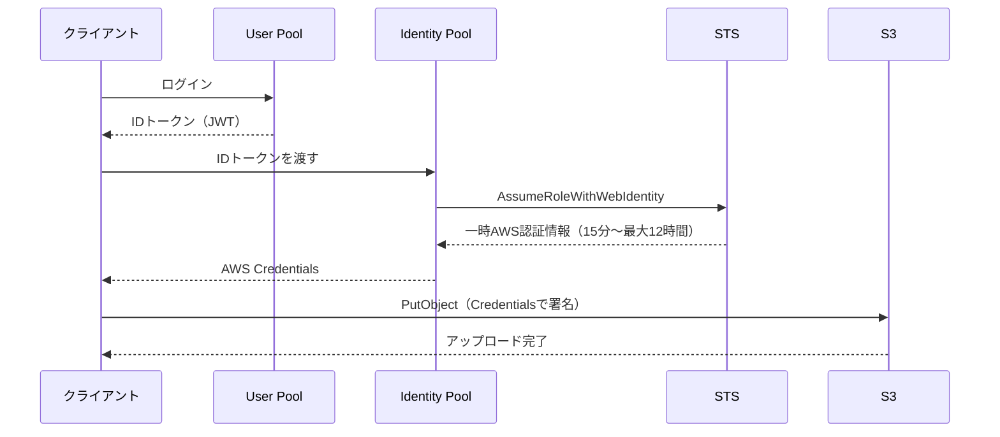

# 認証とアイデンティティ

## 1. 概念理解

### 認証（Authentication）とは

「お前は誰か」を確認すること。システムへのアクセスを許可する前に、相手が本当に名乗り通りの存在かを証明させる行為。

認証の方式は「何を使って証明するか」で分類される：

| 種別 | 方式 | 例 |
|---|---|---|
| 知識ベース | Something you **know** | パスワード、PIN |
| 所持ベース | Something you **have** | SMS OTP、認証アプリ（TOTP）、物理トークン |
| 生体ベース | Something you **are** | 指紋、顔認証 |

**MFA（多要素認証）** = これらを2つ以上組み合わせる。1つが漏れても単独では突破できない。

### アイデンティティ（Identity）とは

「誰が」の単位。人間だけでなく、**機械・サービス・プロセス**もアイデンティティを持つ。

- **人間**: ユーザー（メール+パスワードで登録）
- **機械**: EC2インスタンス、Lambdaファンクション、サービスアカウント

人間は「ログイン画面でパスワードを入力」できるが、機械はそれができない。だから機械には別の仕組み（IAM Role）が必要。

### 長期認証情報 vs 一時認証情報

| | 長期認証情報 | 一時認証情報 |
|---|---|---|
| 例 | IAM Userのアクセスキー、パスワード | STSが発行するトークン（有効期限つき） |
| リスク | 漏れたら永続的に悪用される | 漏れても期限切れで無効化される |
| AWS推奨 | **避ける** | IAM Role + STS を使う |

### フェデレーション（Federation）とは

「外部の認証システムを信頼して、自分のシステムへのアクセスを許可する」こと。SSOの仕組みの核心。例：会社のGoogleアカウントで社内システムにログインできる状態。

---

## 2. 選択肢の比較

### パスワード単体 vs MFA

| | パスワードのみ | MFA |
|---|---|---|
| 突破条件 | パスワード1つ漏れれば即アウト | パスワード＋第2要素の両方が必要 |
| フィッシング耐性 | 無い | TOTPは低い / WebAuthn（パスキー）は高い |
| 今の標準 | 最低ライン（単体では不十分） | **必須** |

WebAuthn/パスキーが今の最前線。認証がオリジン紐付きのためフィッシング不可能。Cognitoも2023年以降サポート済み。

### IAM User vs IAM Role

| | IAM User | IAM Role |
|---|---|---|
| アイデンティティ | 特定の人・サービスに紐づく | 誰でも一時的に引き受けられる（Assume） |
| 認証情報 | 長期アクセスキー（ローテーション必要） | STSが発行する一時トークン（15分〜最大12時間） |
| EC2/Lambdaへの付与 | アクセスキーを環境変数に置く（危険） | インスタンスプロファイル/実行ロールで安全に |
| 向いている場面 | ほぼ無い | **基本これ一択** |

「IAM Userのアクセスキーを.envに書く」はアンチパターンの筆頭。Roleに切り替えるとその問題が構造的に消える。

### ローカル認証 vs フェデレーション/SSO

| | ローカル認証 | フェデレーション/SSO |
|---|---|---|
| IDの管理場所 | 各システムが個別に持つ | IdPが一元管理 |
| 退職者対応 | システムごとに無効化が必要（漏れリスク） | IdPで1回無効化→全システムに波及 |
| AWS実装 | IAM Userにパスワード設定 | IAM Identity Center / Cognito |

### Cognito：User Pool vs Identity Pool

| | User Pool | Identity Pool |
|---|---|---|
| 役割 | **認証**（誰か？） | **認可**（何ができるか？） |
| やること | ユーザー登録・ログイン・MFA・パスワードリセット | JWTをAWSの一時認証情報（STS）に交換 |
| 出力 | JWT（IDトークン・アクセストークン・リフレッシュトークン） | AWS Credentials（AccessKeyId / SecretKey / SessionToken） |
| 使う場面 | APIの認証 | AWSリソースを直接触らせる（S3直接アップロード等） |

---

## 3. AWSでの実装例

### STS（Security Token Service）

全体の仕組みを支える基盤。**一時認証情報を発行するだけ**のサービス。

```
AssumeRole(RoleのARN) → AccessKeyId + SecretAccessKey + SessionToken（有効期限付き）
```

EC2にロールを付けると、インスタンスメタデータから自動でSTSの一時情報が取れる。Cognitoも内部でこれを使う。

### IAM Identity Center（社内の人間向け）

社員がAWSコンソール/CLIにアクセスするための仕組み。IAM Userにアクセスキーを配る古いやり方の置き換え。

```
社員 → Google Workspace / Azure AD でログイン
      ↓ SAML/OIDC フェデレーション
      IAM Identity Center がAWSの一時認証情報を発行
      ↓
      指定したAWSアカウント・権限セットでアクセス
```

### Cognito User Pool（アプリのユーザー向け認証）

「自分のアプリにユーザー登録・ログイン機能を作る」のがこれ。

Cognitoが肩代わりしてくれること：
- ユーザーDB管理（パスワードのハッシュ化含む）
- サインアップ・確認メール送信
- MFA（SMS OTP / TOTP / WebAuthn）
- パスワードリセットフロー
- Social Login（Google/Apple/FacebookなどのSocial Login）
- JWT発行・検証用公開鍵の提供（JWKS endpoint）

### Cognito Identity Pool（AWSリソースへの直接アクセス）

User PoolのJWTをAWSの一時認証情報に交換する窓口。ファイルをサーバー経由せず、クライアントが直接S3に投げられる。

---

## 4. アーキテクチャ図

### Cognito User Pool 認証フロー



④の検証はJWKS公開鍵をキャッシュして自前でオフライン検証が可能。API GatewayのCognito Authorizerを使えば④⑤は自動。

### Identity Pool を加えたS3直接アクセスフロー



### IDトークン（JWT）のPayload例

```json
{
  "sub": "abc123-...",
  "email": "user@example.com",
  "cognito:groups": ["admin"],
  "custom:tenant_id": "acme",
  "exp": 1720000000,
  "iss": "https://cognito-idp.ap-northeast-1.amazonaws.com/{UserPoolId}"
}
```

- `sub` → DBのユーザーテーブルのキー
- `cognito:groups` → 管理者かどうかの判定（認可）
- `custom:*` → マルチテナント管理等

---

## 5. 設計トレードオフ

### トークン有効期限の設定

| トークン | デフォルト | 設定可能範囲 | 判断のポイント |
|---|---|---|---|
| アクセストークン | 1時間 | 5分〜24時間 | 短いほど安全。漏れても被害時間が短い |
| IDトークン | 1時間 | 5分〜24時間 | アクセストークンと揃えておくのが無難 |
| リフレッシュトークン | 30日 | 1時間〜10年 | ここが実質的な「ログイン維持期間」 |

アクセストークンを短く（15〜60分）＋リフレッシュトークンで自動更新が標準パターン。リフレッシュトークンの無効化（強制ログアウト）はCognitoのRevocation機能で対応。

### MFA：必須 vs 任意

| | 必須（Enforced） | 任意（Optional） | 無効 |
|---|---|---|---|
| セキュリティ | 最高 | 中 | 低 |
| UX摩擦 | 高い | 低い（ユーザー選択） | 無し |
| 向いている場面 | 管理者・B2B・高リスク操作 | B2Cアプリの一般ユーザー | 内部ツール等 |

### Social Login（Google等）を使うか

| | Social Loginあり | 自前のみ |
|---|---|---|
| 開発コスト | 低い（Cognitoが仲介） | メール確認・パスワードリセット等を全部作る |
| アカウント紐付け問題 | 起きやすい※ | 無い |

※ 同じメールアドレスでGoogleログインとパスワードログインが別アカウントになるケース。`AdminLinkProviderForUser`で対処できるが、事前設計が必要。

### カスタム属性 vs 外部DB

| | Cognitoのカスタム属性 | 外部DB（DynamoDB等） |
|---|---|---|
| 手軽さ | 高い | 低い |
| 変更の柔軟性 | **低い**（一度作ると削除不可・上限あり） | 高い |
| 推奨 | 認可判断に使う最小限のみ | プロフィール等の本体はここ |

`sub`を外部DBのキーにして、本体のデータは外部DBに置くのが定石。Cognitoのカスタム属性に詰め込みすぎると後で変更できなくて詰む。

### マルチテナントの設計選択

| パターン | 構成 | 向いている規模感 |
|---|---|---|
| A. カスタム属性でテナント区別 | User Pool 1つ、`custom:tenant_id`で区別 | スモールスタート・SaaS初期 |
| B. グループでテナント区別 | User Pool 1つ、Groupを組織単位で作る | 中規模・組織数が数十以下 |
| C. User Pool を組織ごとに作る | 完全分離、設定もポリシーも独立 | 大規模・セキュリティ要件が強い |

AとBはテナント間データ分離をアプリ側で徹底する必要がある。CはPool上限（各リージョン1000）に注意。

---

## 6. 自分の言葉で説明

<!-- 「認証とは何か」「なぜRoleを使うのか」を説明する -->

## 7. 理解確認

### 到達目標

人とシステムに適切な認証方式を選び、長期アクセスキーを避ける理由を説明できる。

### 現在の理解度

<!-- A：説明できる / B：見れば分かる / C：まだ怪しい -->
