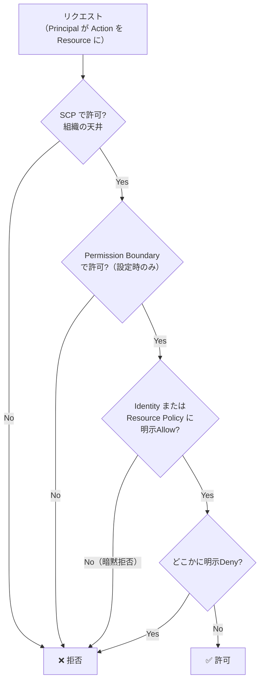

# 認可と最小権限

## 1. 概念理解

### 認可（Authorization）とは

「認証済みの主体が、何に、どの操作を、どの条件で行えるか」を決めること。認証（「お前は誰か」）で確定した相手を起点に、その**行動範囲を絞り込む**フェーズ。認証がゲートの入り口なら、認可は入った後に動ける範囲。

例：Cognito Identity Poolが `AssumeRoleWithWebIdentity` で発行したSTS一時認証情報が「実際に何をできるか」は、そこに紐づくIAM Policyが決める。ここが認可。

### 認可の基本モデル（4要素）

IAMは認可を4つの要素に分解する。

| 要素 | IAMでの呼び名 | 例 |
|---|---|---|
| 誰が | **Principal**（主体） | IAM Role / User / サービス |
| 何を | **Action**（操作） | `s3:GetObject`、`s3:PutObject` |
| どの対象に | **Resource**（対象） | `arn:aws:s3:::my-bucket/*` |
| どの条件で | **Condition**（条件） | 送信元IP、MFA有無、時間帯 |

この4要素を宣言的に記述したものが **Policy**（IAMではJSON）。1つの許可単位を **Statement** と呼ぶ。

```json
{
  "Effect": "Allow",
  "Action": "s3:GetObject",
  "Resource": "arn:aws:s3:::my-bucket/*",
  "Condition": { "IpAddress": { "aws:SourceIp": "203.0.113.0/24" } }
}
```

→「この主体は / my-bucket内のオブジェクトを / 読み取れる / ただし送信元が指定IP範囲のときだけ」。`Effect` が `Allow` か `Deny` かで許可・拒否が決まる。

### 許可（Allow）と明示的拒否（Deny）の評価ロジック

複数のPolicyが絡んでも、判定は次の3ステップで決まる。

1. **暗黙的拒否（Implicit Deny）**＝デフォルト。どのPolicyにも書かれていなければ拒否
2. **明示的許可（Explicit Allow）**＝どれか1つのPolicyにAllowがあれば許可候補
3. **明示的拒否（Explicit Deny）**＝1つでもDenyがあれば、他に何があろうと最優先で拒否

優先順位：`明示Deny > 明示Allow > 暗黙Deny`

**なぜデフォルト拒否か（fail closed）**：Allowの書き忘れ → 暗黙的拒否で止まる（安全側に倒れる）。もし逆に「Denyの書き忘れ → 誤って許可」だったら、気づかないまま穴が開く。間違えたときに危険な方へ倒れないための設計。

### 設計の3原則

**① 最小権限（Least Privilege）**
業務に必要な操作・対象・条件だけを与え、それ以上は与えない。`s3:*` で全許可ではなく「`my-bucket/uploads/*` に `PutObject` だけ」まで絞る。理由は、権限が漏れた／悪用されたときの被害範囲（blast radius）が権限の広さに比例するから。実務では「広めに始めて使っていないものを削る」が現実的で、それを支援するのが Access Analyzer。

**② 職務分離（Separation of Duties, SoD）**
強い操作を一人／一つの主体に集中させない。「一人では危険な操作を完遂できない」状態を作る。
- 本番デプロイする人と承認する人を分ける
- 監査ログを「読む」権限と「消す」権限を別主体に分ける（消せる人が読めると証拠隠滅できる）
- お金を動かす申請者と承認者を分ける

**③ 権限境界（Permission Boundary）**
主体に「与えられる権限の上限（天井）」を課す仕組み。**それ自体は権限を付与しない**。実効権限 ＝ 通常Policy（Allow） ∩ 権限境界 の **AND**。用途は権限委譲——「開発者に自分でRoleを作らせたいが、管理者権限だけは付けさせない」等。開発者がどんなPolicyを書いても天井は超えられない。

```
実効権限 = 通常Policyで許可 ∩ 権限境界で許可（− どこかのDeny）
例）通常 s3:*+ec2:* ／ 境界 s3:* → 実効は s3:* のみ（ec2は天井で不可）
```

## 2. 選択肢の比較

（Allow / 明示Deny の評価ロジックはセクション1に記載）

### Identity-based Policy vs Resource-based Policy

同じ「許可」でも、Policyをどこに貼るかで2種類ある。

| | Identity-based Policy | Resource-based Policy |
|---|---|---|
| 貼る場所 | 主体（User / Role / Group） | 対象リソース（S3バケット、SQS、KMSキー、Lambda等） |
| 視点 | 「この主体は○○できる」 | 「この対象は、これらの主体に触らせる」 |
| `Principal` 欄 | 無い（自分が主体で自明） | **必須**（誰に許すか書く） |
| 主な用途 | 通常の権限付与 | クロスアカウント、公開範囲の制御 |

- **同一アカウント内**：どちらか一方にAllowがあれば通る（和集合）
- **クロスアカウント**：両方必要（渡す側のIdentity Policy＋受ける側のResource Policyの両方でAllow）。他アカウントのS3を読ませるには、相手バケットのバケットポリシーに自分のRoleを許可する。

### RBAC vs ABAC

「誰に何を許すか」の決め方の設計思想。

| | RBAC（ロールベース） | ABAC（属性ベース） |
|---|---|---|
| 判定の基準 | 割り当てられたロール（役割） | 主体と対象の属性（タグ）＋条件 |
| 例 | 「管理者」「閲覧者」ロールを作り人を割り当て | 「`team=blue` の人は `team=blue` のリソースだけ」 |
| AWSでの実現 | Roleごとに個別Policy | Condition＋タグ（`aws:PrincipalTag` / `aws:ResourceTag`） |
| 長所 | 直感的・監査しやすい | 組み合わせが増えてもPolicyが増えない |
| 短所 | 組み合わせ爆発（ロール増殖） | パッと見で誰が何を触れるか読みにくい |

**スケール差の具体例**：テナントが毎月増えるSaaSで「admin/editor/viewer」の3権限を管理する場合——
- RBAC：テナントごとにリソースが違うため `3 × N テナント` 本のPolicyが必要（100社で300本）
- ABAC：`aws:PrincipalTag/tenant == aws:ResourceTag/tenant` という自己参照条件の3本だけ。新テナントは主体とリソースに `tenant=xyz` タグを付けるだけでPolicy本数は増えない

RBACは役割が少なく安定なとき、ABACはチーム・テナントが次々増えるときに効く。土台RBAC＋細部ABACの併用も多い。

## 3. AWSでの実装例

| サービス／仕組み | 役割 | 権限を「足す/絞る」 |
|---|---|---|
| **IAM Policy**（Identity-based） | 主体に権限を付与 | 足す |
| **Resource Policy** | リソース側から主体に許可（クロスアカウント等） | 足す |
| **Permission Boundary** | 特定の主体1つの権限上限 | 絞る（天井） |
| **SCP** | アカウント／OU全体の権限上限 | 絞る（天井） |
| **Access Analyzer** | 外部アクセス・未使用権限の検出、Policy生成／検証 | 監査・支援 |

### SCP（Service Control Policy）
AWS Organizations でアカウント／OU全体にかける天井。Permission Boundaryの「組織版」。
- 付与はしない、上限を絞るだけ
- アカウント内の全主体（IAM User・Role、**rootですら**）に効く
- 設定は組織の管理者
- 典型例：許可リージョン外を全Deny、CloudTrail無効化をDeny、危険操作を組織全体で禁止

### Access Analyzer
最小権限を仕組みで支えるツール。
- **外部アクセスの検出**：Resource Policyを解析し、外部・公開に晒されたリソースを洗い出す
- **未使用アクセスの検出**：一定期間使われていないRole・権限を可視化して削る
- **Policy生成／検証**：CloudTrail履歴から必要権限を割り出しPolicy案を生成、書いたPolicyの過剰さ・文法をチェック

### ガードレールの階層（全体像）
1リクエストは、複数の層を全部通過し、かつどこにもDenyが無いときだけ許可される。

```
実効権限 = SCP ∩ Permission Boundary ∩ (Identity-based ∪ Resource-based)  −  どこかの明示Deny

  SCP（組織の天井：管理者が設定、rootも超えられない）
   └ Permission Boundary（委譲の天井：主体ごと）
       └ Identity / Resource Policy（実際に許可を「足す」層）
           └ 明示Deny があれば最優先で却下
```

権限を「足す」のは Identity / Resource Policy だけ。SCPとPermission Boundaryは上限であり、いくら書いても権限は増えない。この非対称性がポイント。

## 4. アーキテクチャ図

### 認可の評価フロー



天井（SCP → Permission Boundary）を通過 → 明示Allowがある → 明示Denyが無い、を全部満たしたときだけ許可に到達。1か所でも引っかかれば拒否。

## 5. 設計トレードオフ

### ① 権限モデル：RBAC vs ABAC
| 観点 | RBAC寄り | ABAC寄り |
|---|---|---|
| 管理しやすさ | ◎ 誰が何を持つか一目瞭然 | △ タグ設計に依存し追いづらい |
| 柔軟性・拡張 | △ 組み合わせ増でロール爆発 | ◎ タグを揃えるだけで拡張 |
| 向く場面 | 役割が少なく安定 | テナント・チームが増え続ける |

### ② 最小権限をどこまで攻めるか
| | 厳格に絞る | 広めに与える |
|---|---|---|
| 過剰権限リスク | 低い | 高い（漏洩時のblast radius大） |
| 運用負荷 | 高い（都度Policy調整） | 低い |

現実解：広めに始め、Access Analyzerで未使用権限を削って締める（段階的最小化）。

### ③ 組織統制：SCP等のガードレールを敷くか
| | 敷く | 敷かない |
|---|---|---|
| 統制・事故防止 | ◎ rootでも危険操作を封じられる | × アカウントごとに事故りうる |
| 現場の自由度 | △ 制約が増える | ◎ |
| 初期コスト | 設計・例外対応が必要 | 無し |

定石：禁止事項（リージョン制限・監査無効化防止等）だけ最小限SCPで固め、許可は各アカウントに委ねる。

### ④ 過剰権限が生まれる典型パターン（設計ミス候補）
- `*:*` や `s3:*` で雑に付与 → 使わない権限が残り続ける
- 一時的に付けた強権限の外し忘れ
- ワイルドカード `Resource: "*"` でリソースを絞っていない
- Denyを保険で書かず、Allowの記述漏れだけに頼る

## 6. 自分の言葉で説明

<!-- 「RoleとPolicyの違い」「最小権限とは何か」を説明する -->

## 7. 理解確認

### 到達目標

主体、操作、対象、条件を分けて権限を読み、必要最小限のPolicyを考えられる。

### 現在の理解度

<!-- A：説明できる / B：見れば分かる / C：まだ怪しい -->
