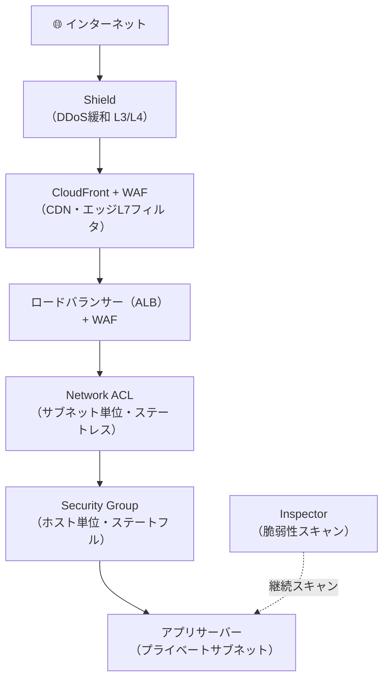

# ネットワークとアプリケーション防御

## 1. 概念理解

### 多層防御（Defense in Depth）

「1つの防御が突破されても次の層が止める」という設計原則。境界だけ固めて中は無防備という単点防御は、1箇所の突破で終わる。複数の独立した防御を重ね、**攻撃者がすべての層を突破しなければ成功しない**状態を作ることが目的。

```
インターネット
  ↓ [DDoS保護]
  ↓ [CDN・エッジフィルタ]
  ↓ [ネットワーク境界（サブネット・VLAN）]
  ↓ [ホスト境界（ファイアウォール）]
  ↓ [アプリケーション層（WAF・入力検証）]
  ↓ [脆弱性管理（パッチ・スキャン）]
アプリサーバー
```

---

### ネットワーク境界と配置設計

**外部公開範囲を最小化する**：ロードバランサーや踏み台など「外と会話する窓口」だけパブリックゾーン（インターネットから到達可能）に置く。アプリサーバーやDBは非公開ゾーン（プライベートネットワーク）に隠し、直接到達できないようにする。

| ゾーン | 置くもの | インターネットから直接届くか |
|---|---|---|
| パブリック | ロードバランサー・NAT・踏み台 | Yes（意図的に公開） |
| プライベート | アプリサーバー・DB | No（境界を経由しないと届かない） |

攻撃面（Attack Surface）の最小化が目的。直接届かなければ攻撃の的にならない。

---

### ファイアウォールの2種類：ステートフル vs ステートレス

通信制御の根幹。「接続の状態を記憶するか否か」で2種類に分かれる。

| | ステートフルFW | ステートレスFW |
|---|---|---|
| 状態の記憶 | **する**（セッションを追跡） | **しない**（パケット単体で判定） |
| 戻りパケット | 自動許可（往路を許可すれば復路は通る） | 別途ルールが必要（往復を明示的に書く） |
| ルール記述量 | 少ない | 多い（エフェメラルポートも書く） |
| 処理コスト | 高い（状態テーブルの管理） | 低い |
| 典型用途 | ホスト・インスタンス単位の制御 | サブネット単位の粗いフィルタ・IP帯域ブロック |

エフェメラルポート問題：ステートレスFWでは、クライアントが使う動的な返信ポート（通常1024-65535）もアウトバウンドルールに書かないと通信が詰まる。

---

### Web攻撃対策：WAFとは

**WAF（Web Application Firewall）**：HTTP/HTTPSの中身（URI・ヘッダ・ボディ）を解析してフィルタリングする。ネットワークFWは「どのポートか」しか見えないが、WAFは「何が書いてあるか」まで見る。

| 攻撃 | 仕組み | 対策 |
|---|---|---|
| SQLインジェクション | DBクエリに悪意ある文字列を混入（`' OR 1=1 --`） | WAFのSQLi検出ルール＋プリペアドステートメント |
| XSS（クロスサイトスクリプティング） | 入力値経由でJSを他ユーザーのブラウザで実行 | WAFのXSS検出ルール＋エスケープ処理 |
| パストラバーサル | `../../etc/passwd` でサーバー内ファイルを読む | WAFのパストラバーサルルール＋入力検証 |
| ブルートフォース | 短時間に多数のリクエストで認証を総当たり | レートベースルール（IPごとに閾値） |
| Botトラフィック | スクレイピング・不正ログイン試行 | Bot管理ルール・CAPTCHA |

WAFは万能ではなく、マネージドルールでもアプリの正常リクエストを誤検知することがある。最初は「検出のみ（Countモード）」でログ確認 → 精度を確認してからブロックモードへ切り替えるのが定石。

---

### DDoS対策

**DDoS（分散型サービス妨害）**：多数の送信元から大量トラフィックを送り、ネットワーク帯域やサーバーリソースを枯渇させる攻撃。

| 攻撃レイヤー | 例 | 緩和手段 |
|---|---|---|
| L3/L4（ネットワーク・トランスポート） | UDPフラッド・SYNフラッド・ICMPフラッド | 帯域フィルタリング・レート制限 |
| L7（アプリケーション） | HTTP Flood・Slowloris | レートベースルール・接続タイムアウト・CDN分散 |

**CDNの効果**：攻撃トラフィックをエッジ（世界各地の拠点）で吸収し、オリジンサーバーに届く前に処理できる。正規ユーザーのレイテンシ改善とDDoS緩和の両方を担う。

L7攻撃は正常なHTTPリクエストに見えることが多く、帯域だけで判断できない。WAFのレートルールや振る舞い解析が必要。

---

### 脆弱性管理

**脆弱性（CVE）**：ソフトウェアのバグや設定ミスを悪用できる弱点。CVEが公開されてから数日〜数週間で実際の攻撃コードが出回る。未パッチのシステムは攻撃の入口になる。

脆弱性管理は一度やって終わりではなく、**継続サイクル**を回すことが本質。

```
[検出]スキャン → [評価]リスクスコア・優先順位付け → [修正]パッチ適用・設定変更 → [確認]再スキャン → くり返し
```

検出して終わりにしないために、Criticalは72時間以内に修正するなどのSLAを定義して運用することが重要。

---

## 2. 選択肢の比較

### ステートフルFW vs ステートレスFW

（セクション1「ファイアウォールの2種類」を参照）

**組み合わせの定石**：ステートフルFWでホスト単位の細かい制御、ステートレスFWはサブネット単位の粗いIPブロック（攻撃元IP帯域をまとめて遮断する等）に使う。

### WAF vs NGFW（次世代ファイアウォール）

| | WAF | NGFW（次世代FW） |
|---|---|---|
| 対象レイヤー | L7（HTTP/HTTPS） | L3〜L7（ネットワークからアプリまで） |
| 何を見る | HTTPヘッダ・URI・ボディ | IPパケット・プロトコル・FQDNも含む |
| 典型用途 | WebアプリのSQLi/XSS等の攻撃遮断 | VPC全体の通信制御・マルウェアC2通信ブロック |

WAFはWebアプリを守る。NGFWはネットワーク全体を守る（例：感染端末の外部への不審通信を止める）。用途が違うので併用する。

### マネージドルール vs カスタムルール（WAF）

| | マネージドルール | カスタムルール |
|---|---|---|
| 管理者 | ベンダー（AWS・パートナー）が更新 | 自分 |
| カバー範囲 | 主要な攻撃パターンを網羅 | アプリ固有の要件に対応 |
| 誤検知 | アプリに合わない場合に発生しやすい | アプリに最適化できる |
| 運用コスト | 低い（更新不要） | 高い（継続的にメンテ） |

現実的な構成：マネージドルールをベースに、アプリ固有の例外・追加ルールをカスタムで足す。

---

## 3. AWSでの実装例

| 概念 | AWSサービス | 補足 |
|---|---|---|
| ステートフルFW（ホスト単位） | **Security Group** | ENI単位に適用。Allowのみ記述（DenyはDefault） |
| ステートレスFW（サブネット単位） | **Network ACL** | サブネット単位。Allow/Deny両方書ける。番号順評価 |
| WAF | **AWS WAF** | ALB・CloudFront・API GW・AppSyncに適用 |
| NGFW（VPC全体） | **AWS Network Firewall** | VPC境界でL3〜L7制御。FQDNフィルタリング |
| DDoS緩和（L3/L4） | **AWS Shield Standard** | 全ユーザー無料。自動緩和 |
| DDoS緩和（L7含む） | **AWS Shield Advanced** | 有料。24/7サポート・コスト保護 |
| CDN＋エッジ防御 | **CloudFront** | エッジで吸収。WAFと組み合わせてL7対策も |
| 脆弱性スキャン | **Amazon Inspector** | EC2・Lambda・コンテナのCVEを継続スキャン |

### Security Group の補足

```json
// ポート443のインバウンドをAllow（ステートフルなので戻りは自動許可）
{ "Type": "HTTPS", "Protocol": "TCP", "Port": "443", "Source": "0.0.0.0/0" }
```

Allowのみ記述できる。書いていないポートは暗黙Deny（fail-closed）。

### AWS WAFの適用ポイント

- **CloudFrontに貼る**：エッジで遮断。攻撃がオリジンに届かないため、サーバー負荷が下がる
- **ALBに貼る**：CloudFrontを通さない直接アクセスも守れる
- マネージドルールグループ（AWSCoreRuleSet・SQLiRuleSet・BotControlRuleSet等）が利用可能

### Amazon Inspector

- **脆弱性の種類**：OS・パッケージのCVE、ネットワーク到達可能性（外部から到達できる開放ポート）
- **自動再評価**：新CVEが公開されたら自動でスキャンし直す（定期ではなく随時）
- リスクスコアで「何から直すべきか」の優先順位を提示

---

## 4. アーキテクチャ図

### 多層防御の全体像



各層が独立した「通過チェック」。1箇所を突破しても次の層で止まる。

---

## 5. 設計トレードオフ

### ① 防御の強度 vs 運用負荷

| | 多層・細粒度 | 少ない層 |
|---|---|---|
| セキュリティ強度 | ◎ 複数箇所でブロック | △ 1箇所突破で終わり |
| 運用負荷 | △ ルール管理・チューニングが必要 | ◎ シンプル |
| 誤検知リスク | 高（WAFが正常リクエストを誤ブロックする可能性） | 低 |

### ② エッジで守るか、オリジン近くで守るか

| 防御の場所 | オリジンへの負荷 | コスト感 |
|---|---|---|
| エッジ（CDN＋WAF） | 低い（攻撃がオリジンに届かない） | CDN・WAF処理料 |
| ロードバランサー（WAF） | 中（通過後に処理） | WAF処理料 |
| アプリ内（入力検証） | 高い（全リクエストがサーバーに来る） | 追加コストなし |

エッジで遮断するほど効率が良い。ただし、CDNを通らない直接アクセス経路がないか（ALBのIPが知られていないか）の確認が必要。

### ③ WAF誤検知への対処

段階的なアプローチが定石。
1. **Countモード**：ブロックせずカウントのみでログを確認
2. **精度確認**：正常リクエストへの誤検知を洗い出す
3. **例外追加**：誤検知ルールを除外（exception）
4. **Blockモード**：精度確認後にブロックへ切り替え

初手からBlockモードにすると、正常サービスを止めるリスクがある。

### ④ 脆弱性放置リスク

「検出しているが放置」は検出していないのと同じ。CVEが公開されてから攻撃コードが出るまでの時間は年々短くなっている。

- **SLA定義**：Critical CVEは72時間以内、High CVEは1週間以内など
- **自動化**：スキャン → チケット起票 → パッチ適用 → 再確認のサイクルを自動化する
- **受け入れ基準**：修正不可能な場合（依存ライブラリの都合等）は、リスクを明示的に記録・承認する

---

## 6. 自分の言葉で説明

<!-- 「なぜ複数の防御層が必要か」を説明する -->

## 7. 理解確認

### 到達目標

通信経路ごとの脅威を考え、ネットワークとアプリケーションの防御手段を組み合わせられる。

### 現在の理解度

<!-- A：説明できる / B：見れば分かる / C：まだ怪しい -->
