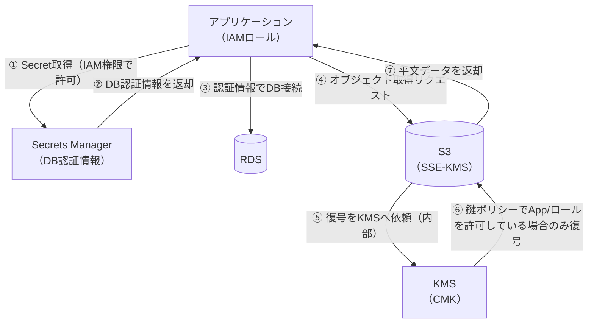

# 暗号化と秘密情報管理

## 1. 概念理解

### 学ぶ範囲

保存時暗号化、通信時暗号化、対称鍵と非対称鍵、鍵管理、Secretの保管とローテーション。

### 保存時暗号化 vs 通信時暗号化

- **保存時暗号化（at rest）**: ディスク・ストレージに書かれたデータそのものを暗号化。ディスクやスナップショットが盗まれても中身は読めない。
- **通信時暗号化（in transit）**: ネットワーク経路上のデータを暗号化。TLSが代表。盗聴・改ざんを防ぐ。

2つは独立した概念。S3で言えば「保存時はSSEで暗号化されているが、転送経路は別途TLSで守る」という2階建て。片方だけでは守備範囲が違う。

### 対称鍵 vs 非対称鍵

| | 対称鍵 | 非対称鍵 |
|---|---|---|
| 鍵 | 暗号化・復号で同じ鍵 | 公開鍵・秘密鍵のペア |
| 速度 | 速い | 遅い |
| 弱点 | 鍵の配送・共有が課題 | — |
| 典型用途 | 大量データの暗号化（AES-256） | 鍵交換・署名（TLSハンドシェイク） |

実務ではこの2つを組み合わせる**ハイブリッド方式**がほぼ標準：非対称鍵で対称鍵（データキー）を安全にやり取りし、実データ自体は対称鍵で暗号化する。

### 鍵管理：エンベロープ暗号化

KMSのようなマネージド鍵管理サービスの中核概念。

- ルートの鍵（CMK: Customer Master Key）は基本的に**対称鍵（AES-256）**。**直接データを暗号化しない**
- CMKは「データキー」を生成・暗号化するためだけに使う
- 実データは生成されたデータキー（対称鍵）で暗号化する
- 暗号化済みデータキーをデータと一緒に保存 → 復号時はCMKでデータキーを復号 → そのデータキーでデータを復号

**なぜCMKで直接データを暗号化しないか:**
1. KMSのEncrypt APIには4KBというサイズ上限がある（対称CMKの場合）。大きなデータを物理的に直接暗号化できない
2. 仮にできても暗号化は都度KMSへのネットワークAPI呼び出しになり、数GB単位のデータを都度投げるのはレイテンシ・スループット制限・API課金の面で非現実的

→ データキーをローカルで生成して実データを暗号化し、数十バイトのデータキーだけをCMKで包む（4KB制限に余裕で収まる）。CMKは「小さいものを守るための鍵」であり「データを直接守る鍵」ではない。

### Secretの保管とローテーション

「暗号鍵」と「Secret（パスワード・APIキーなど）」は別物として区別する。

- **暗号鍵**: データを暗号化/復号するための鍵そのもの → KMSが管理
- **Secret**: アプリが使う認証情報（DBパスワード、APIキー等）→ Secrets Manager / Parameter Storeが管理

ローテーションは「漏洩時の被害期間を短くする」ための仕組み。Secrets ManagerはRDS等と自動ローテーション連携があるが、Parameter Storeは基本手動（自前でEventBridge+Lambda等が必要）。

## 2. 選択肢の比較

### 暗号鍵 vs Secret（再確認）

（セクション1「Secretの保管とローテーション」を参照）暗号鍵はデータの暗号化/復号に使う鍵そのもの（KMSが管理）、Secretはアプリが使う認証情報（Secrets Manager/Parameter Storeが管理）。混同すると「DBパスワードをKMSで暗号化すれば終わり」のような誤った設計になりやすい。

### AWS管理鍵 vs 顧客管理鍵（CMK）

| | AWS管理鍵（aws/s3等） | 顧客管理鍵（Customer Managed CMK） |
|---|---|---|
| 作成者 | AWSが自動作成 | 自分で作成 |
| 鍵ポリシー編集 | 不可 | 可能（誰が使えるか制御できる） |
| ローテーション | 自動（年1回、無効化不可） | 任意設定可能 |
| クロスアカウント共有 | 不可 | 可能（鍵ポリシーで許可） |
| コスト | 無料 | 月額固定＋API課金 |
| 削除 | 不可 | 可能（待機期間あり、誤削除防止） |

使い分け：監査要件やクロスアカウントアクセスがなければAWS管理鍵で十分。鍵ポリシーによる細かい制御・監査証跡・クロスアカウント共有が必要なら顧客管理鍵。

### Secrets Manager vs Parameter Store

| | Secrets Manager | Parameter Store（Standard） | Parameter Store（Advanced） |
|---|---|---|---|
| 主な用途 | DB認証情報・APIキーなど「秘密」 | 設定値全般（非秘密含む） | 大きめの設定値、SecureStringでKMS暗号化可 |
| 自動ローテーション | あり（RDS/Redshift/DocumentDBは組み込み、他はLambda自作） | なし | なし |
| コスト | 有料（Secret単位＋API呼び出し） | 無料 | 有料 |
| サイズ上限 | 64KB | 4KB | 8KB |

実務の目安：ローテーションが必要な認証情報（DBパスワード等）はSecrets Manager。ただの設定値やローテーション不要のSecretはParameter Store（コスト重視）。

## 3. AWSでの実装例

### 概念 → AWSサービス対応表

| 概念 | AWSサービス | 補足 |
|---|---|---|
| 鍵管理（エンベロープ暗号化） | **AWS KMS** | 対称CMKでデータキーを生成・ラップ。ほぼ全暗号化機能の基盤 |
| 専有ハードウェアでの鍵管理 | **CloudHSM** | シングルテナントのHSM。KMSのカスタムキーストアとしても使える |
| TLS証明書管理 | **ACM** | ALB/CloudFront/API Gatewayに無料で発行・自動更新 |
| Secret管理（要ローテーション） | **Secrets Manager** | DB認証情報など。RDS等と自動ローテーション連携 |
| 設定値・軽量Secret | **Systems Manager Parameter Store** | 無料枠あり。SecureStringでKMS暗号化可能 |

### S3の暗号化オプション（SSE）

| | SSE-S3 | SSE-KMS | SSE-C |
|---|---|---|---|
| 鍵の所有者 | AWS | 自分（KMSのCMK） | 自分（毎回渡す） |
| 鍵の管理 | AWSに完全お任せ | KMSで管理・監査可能 | 自分で鍵そのものを保管 |
| CloudTrail監査 | 不可（誰が使ったか見えない） | 可能（鍵の使用ログが残る） | 不可 |
| アクセス制御 | バケットポリシーのみ | **S3権限＋KMS鍵ポリシーの2段階** | アプリ側で鍵管理が必要 |
| コスト | 無料 | KMS API呼び出し課金あり | 無料（自前管理コストあり） |
| 典型用途 | とりあえず暗号化したい | 監査要件・鍵アクセスを細かく制御したい | 鍵を絶対にAWSに渡したくない特殊要件 |

**SSE-KMSの2段階チェック**: S3のIAM権限でオブジェクトへのアクセスが許可されていても、KMS鍵ポリシーでDecrypt権限がなければ復号できない。SSE-S3にはこの2段目のゲートがない。監査・統制要件があるならSSE-KMSが実質デフォルトの選択肢になる。

**S3 Bucket Keys**: SSE-KMSはオブジェクトごとにKMS APIを呼ぶとコストが積み上がる。Bucket Key機能を有効にすると、バケット単位のデータキーを一定時間キャッシュして使い回せるため、KMSへのAPI呼び出し回数を大幅に削減できる。大量オブジェクトを扱うなら実務上ほぼ必須の設定。

### CloudHSM

- シングルテナント（専有）のハードウェアセキュリティモジュール。FIPS 140-2 Level 3準拠
- KMSは内部的にHSMを使うが**マルチテナント**（AWSが管理・共有）。CloudHSMは自分専用のクラスタを構築し、鍵の完全な所有権を持つ（AWSも鍵材料にアクセスできない）
- 代わりにクラスタのHA構成・パッチ適用などの運用は自己責任
- KMSの「カスタムキーストア」機能で、KMSのAPIの使いやすさを保ちつつ鍵材料の実体をCloudHSM上に置くハイブリッド構成も可能
- 典型用途：規制上「共有テナンシーのKMSでは要件を満たせない」ケース（金融・政府系の一部コンプライアンス）

### ACM（AWS Certificate Manager）

- TLS/SSL証明書の発行・管理。セクション1の「通信時暗号化」を実現する側
- ALB・CloudFront・API Gatewayなど向けに無料で証明書発行
- **自動更新**が最大の価値。証明書の更新忘れによる「気づいたらサイトがダウン」という事故を防ぐ
- 内部通信・mTLS用にACM Private CA（有料）も用意されている

## 4. アーキテクチャ図

### アプリがSecretを取得し、暗号化データへアクセスする流れ

ポイントは④〜⑦：S3自体が復号の可否を決めているわけではない。リクエスト元（IAMロール）がKMSの鍵ポリシーで許可されているかをKMSがチェックし、許可された場合のみS3が平文を返す。これが「S3権限＋KMS鍵ポリシーの2段階チェック」の実体。

## 5. 設計トレードオフ

### ① 鍵の所有権：AWS管理鍵 vs 顧客管理鍵

| | AWS管理鍵 | 顧客管理鍵（CMK） |
|---|---|---|
| 統制・監査 | △ 誰が使ったか見えない | ◎ 鍵ポリシー・CloudTrailで統制可能 |
| 運用負荷 | ◎ 何もしなくていい | △ 鍵ポリシー設計・ローテーション判断が必要 |
| コスト | ◎ 無料 | △ 月額固定＋API課金 |

「とりあえず暗号化」ならAWS管理鍵で十分。監査要件やクロスアカウント共有が絡んだ瞬間に顧客管理鍵が必須になる。

### ② 可用性・耐障害性

KMSはリージョンサービスとしてマルチAZ冗長化されており、可用性はAWS側の責任範囲が大きい。CloudHSMはクラスタ構成でのHA設計が自己責任になるため、可用性を自分で作り込む必要がある。「鍵の所有権を強めるほど、可用性の責任も自分側に寄る」という逆相関がある。

### ③ ローテーションの自動化 vs 手動

Secrets Managerの自動ローテーションはRDS/Redshift/DocumentDBなど組み込み対応のサービスに限られる。それ以外（外部APIキー等）は自分でLambdaのローテーション関数を実装する必要があり、運用コストは増えるが漏洩時の被害期間を縮められる。「自動化コストを払うか、漏洩リスクを許容するか」のトレードオフ。

### ④ 監査要件があるかどうかで選択肢が変わる

コンプライアンス・監査要件（誰がいつ鍵を使ったか追跡する必要がある）があるなら、SSE-S3やAWS管理鍵では要件を満たせず、実質SSE-KMS＋顧客管理鍵が唯一の選択肢になる。逆に要件がなければ、コストと運用負荷を優先してAWS管理鍵・SSE-S3で十分なケースも多い。**要件を確認せずに「とりあえずKMSにする」も「とりあえずSSE-S3にする」もどちらも先走った判断**になりうる。

### ⑤ コスト：KMS API呼び出しの積み上がり

SSE-KMSはオブジェクトアクセスのたびにKMS APIを呼ぶため、アクセス頻度が高いバケットではコストが無視できなくなる。S3 Bucket Keysを有効にすることで、バケット単位のデータキーを再利用しKMS呼び出し回数を削減できる。監査要件でSSE-KMSを選んだ場合でも、Bucket Keysの有効化はほぼセットで検討すべき設定。

---

## 6. 自分の言葉で説明

<!-- 「KMSは何をしているか」「Secretを直書きしない理由」を説明する -->

## 7. 理解確認

### 到達目標

暗号化対象、鍵、Secretを区別し、保管・利用・ローテーションの流れを説明できる。

### 現在の理解度

<!-- A：説明できる / B：見れば分かる / C：まだ怪しい -->
A-Bくらい
