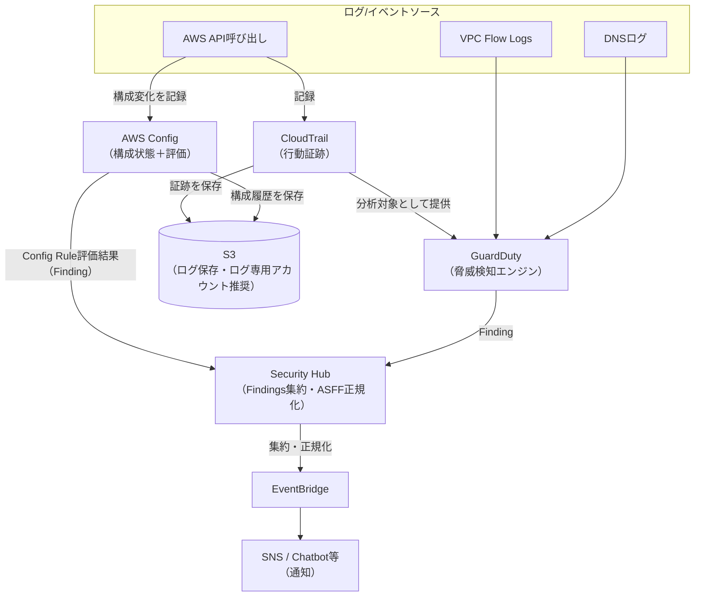

# 監査とガバナンス

## 1. 概念理解

### 学ぶ範囲

監査ログ、証跡、構成変更、コンプライアンス、組織統制、インシデント調査。

### 監査証跡・構成評価・脅威検知の違い

CloudTrail・Config・GuardDutyは3つとも「何かを記録・チェックする」ように見えるが、軸が全く違う。

- **CloudTrail**: 行動ログ（証跡）。「誰が・いつ・どのAPIを呼んだか」を記録する。
- **Config**: 構成状態＋コンプライアンス評価。「リソースの設定が今どうなっているか、それがルールに沿っているか」を継続的に評価する。
- **GuardDuty**: 脅威検知。CloudTrail・VPC Flow Logs・DNSログなど**既存のログを読み込んで**機械学習・脅威インテリジェンスで分析し、悪意ある/異常な挙動を検出する。**GuardDuty自身はログを保存しない**、あくまで分析エンジンで出力はFinding（検知結果）。

具体例：セキュリティグループを誤って`0.0.0.0/0`に開放した場合
- CloudTrail: 「ユーザーXが10:32に`AuthorizeSecurityGroupIngress`を呼んだ」（行動）
- Config: 「sg-0123のingressルールが`[]`→`[0.0.0.0/0]`に変化した、ルールがあればNON_COMPLIANT」（状態＋適合性）

CloudTrailが「監視カメラの録画」なら、GuardDutyは「その録画を見て異常に気づく警備員」に近い。

### Security Hub：検知結果の集約

GuardDuty・Config・Inspector・Macie・IAM Access Analyzerなど、検知系サービスが増えるほど「結果がバラバラで運用が大変・個別最適になる」問題が起きる。Security Hubは**新たに何かを検知するエンジンではなく**、各サービスの検知結果を**ASFF（AWS Security Finding Format）という共通形式に正規化して1箇所に集約するプラットフォーム**（加えてCISベンチマーク等への自動チェックも一部持つ）。

### インシデント調査の流れ（GuardDuty→CloudTrail→Config→Security Hub）

例：GuardDutyが「見慣れないIPからの異常なAPI呼び出し」を検知した場合

1. **GuardDuty**: Findingで検知（きっかけ）
2. **CloudTrail**: そのIAMユーザー/ロールが**他に何のAPIを呼んだか**を全履歴で追い、横展開（被害）の範囲を特定。※CloudTrailは通信の中身ではなく、あくまでAPI呼び出しの記録
3. **Config**: 該当時間帯前後の**構成変更履歴（タイムライン）**を確認し、侵害による実害・改変箇所（新規IAMユーザー作成、SG変更など）を特定
4. **Security Hub**: 上記の検知結果を集約し、他のFindingと合わせて優先度づけ

### 組織単位の統制：Organizations と Control Tower

- **Organizations**: 複数アカウントを1つの組織としてまとめる基盤サービス。OU（組織単位）でアカウントをグループ化し、**SCP（Service Control Policy）**でOU配下アカウントの「できないこと」の上限を設定する。アカウントの管理者権限があってもSCPで禁止された操作は実行できない。加えて一括請求も可能。
- **Control Tower**: Organizationsを内部で使い、ベストプラクティスなマルチアカウント構成（ログ集約用・監査用アカウントの自動作成、事前定義されたガードレールの適用）を自動構築するサービス。Organizations単体は使えるが、Control TowerはOrganizations無しでは成立しない（内部で必ず利用する）。

## 2. 選択肢の比較

### CloudTrail vs Config vs GuardDuty

| | CloudTrail | Config | GuardDuty |
|---|---|---|---|
| 軸 | 行動ログ（証跡） | 構成状態＋コンプライアンス評価 | 脅威検知 |
| 記録/検知対象 | 誰が・いつ・どのAPIを呼んだか | リソース設定の変化、ルール適合性 | ログを分析した結果の異常/悪意ある挙動 |
| 自身でログを保持するか | する | する（構成履歴） | しない（既存ログを分析するだけ） |

### 予防的統制 vs 検知的統制

「ルール違反をチェックする」点では同じでも、動くタイミングが違う。

| | 予防的統制（Preventive） | 検知的統制（Detective） |
|---|---|---|
| いつ働くか | 操作の**実行前**にブロック | 操作の**実行後**に気づく |
| 代表例 | SCP、IAMポリシー、S3 Block Public Access | Config Rules、GuardDuty、CloudTrailベースのアラート |
| メリット | 違反が物理的に発生しない | 柔軟。正当な理由がある例外にも対応しやすい |
| デメリット | 設計を誤ると正当な操作までブロックする | 違反発生から気づくまでの**露出時間**がある |

使い分けの目安：「絶対に起きてはいけないこと（例: 特定リージョン外でのリソース作成）」は予防的統制（SCP）で物理的に塞ぐ。「起きうるが、起きたら把握・是正したいこと（例: 暗号化されていないEBSボリュームの検出）」は検知的統制（Config Rule）＋必要なら自動修復で対応する。Control Towerのガードレールは、この両方（予防的ガードレール＝SCPベース、検知的ガードレール＝Config Ruleベース）を組み合わせたパッケージ。

### Organizations vs Control Tower

| | Organizations単体 | Control Tower |
|---|---|---|
| アカウント管理 | 手動でOU設計・アカウント招待 | Account Factoryで自動プロビジョニング |
| ガードレール | 自分でSCP/Config Ruleを設計・適用 | 事前定義済みガードレール（予防＋検知）を選んで適用 |
| ログ集約 | 自分でログ集約アカウント・S3バケットを設計 | 専用のログアーカイブ・監査アカウントを自動作成 |
| 前提関係 | 単体で利用可能 | 内部で必ずOrganizationsを使う（単体では成立しない） |
| 向いているケース | 既存の複雑な要件に細かく合わせたい | 素早くベストプラクティスな複数アカウント基盤を立ち上げたい |

## 3. AWSでの実装例

### 概念 → AWSサービス対応表

| 概念 | AWSサービス | 補足 |
|---|---|---|
| 行動証跡 | **CloudTrail** | 管理イベント/データイベントを記録。ログ保存先はS3。ログファイル整合性検証（改ざん検知用ダイジェストファイル）を有効化するのが実務上ほぼ必須 |
| 構成状態＋コンプライアンス評価 | **AWS Config** | 記録対象リソースタイプを絞らないとConfiguration Item数に応じた課金が積み上がる。マネージドルールをまず使い、足りない部分だけカスタムルール |
| 脅威検知 | **GuardDuty** | 有効化するだけで開始（追加インフラ不要）。誤検知が多い場合はSuppression Ruleで除外 |
| 検知結果の集約 | **Security Hub** | 有効化時にセキュリティ標準（CIS AWS Foundations Benchmark等）を選択可能。GuardDuty/Config/Inspector等の統合は個別に有効化状況を確認する必要がある |
| 複数アカウント管理の基盤 | Organizations | OU、SCP、一括請求 |
| 自動化されたランディングゾーン | Control Tower | Account Factory、事前定義ガードレール |

### 実装時の注意点（CloudTrail・Config・GuardDuty・Security Hub）

- **CloudTrailのログ保存先バケットは、可能なら本番運用アカウントとは別（ログ専用アカウント）にする。** 同一アカウントだと、侵害されたアカウントの犯人が自分の証跡ログ自体を削除・改ざんできてしまうため
- **Configは記録対象リソースタイプの絞り込みが重要。** 「全リソースタイプを記録」を無条件に選ぶとConfiguration Item数が膨らみ想定外のコストになりやすい
- **GuardDutyは有効化するだけで動き出す**が、これ単体では「気づく」だけで「通知」はしない。EventBridge経由でSNS/Chatbot等に飛ばす設定を別途行わないと、誰にも届かない
- **Security Hub自体も通知ツールではない。** findingsを集約・正規化する場所であり、実際に人に届けるにはSecurity HubからEventBridge経由で通知先に転送する設定が必要

## 4. アーキテクチャ図

### CloudTrail・Config・GuardDutyの検知結果がSecurity Hubに集約され、通知に届くまで

ポイントは右側の流れ：GuardDuty・ConfigのFindingはSecurity Hubに集まるが、Security Hub自体は通知ツールではないため、**EventBridge経由で明示的に転送設定をしない限り誰にも届かない**。「検知される」ことと「人が気づく」ことの間に、もう1段設定が必要。

## 5. 設計トレードオフ

### ① 保存期間：コストと監査要件のバランス

CloudTrailのログはS3に無期限保存できるがコストがかかる。コンプライアンス要件（業界・規制によって必要保持期間は異なる）に応じて、S3ライフサイクルルールで一定期間後に安価なストレージクラスへ移行するのが基本設計。Configの構成履歴も同様にリテンション期間を設定できる。「必要な期間だけ高コストの層に置き、それ以降は安価な層に落とす」という考え方は暗号化ノートのコスト最適化と同じ発想。

### ② 改ざん防止：ログの信頼性をどう担保するか

CloudTrailの**ログファイル整合性検証**（SHA-256ダイジェストファイル）を有効化すると、ログが後から改ざん・削除されていないかを検証できる。加えて、ログ保存先アカウントを本番運用アカウントと分離し、本番側からは削除できない権限設計にすることで、万一本番アカウントが侵害されても攻撃者が自分の証跡を消せないようにする。より強固にしたい場合はS3 Object Lock（WORM）も選択肢。

### ③ 検知速度：リアルタイム性の違い

GuardDutyは数分単位でFindingを生成する準リアルタイム型。Config Ruleは設定変更トリガー型なら比較的早いが、周期評価型のルールは評価間隔ぶんのラグが生じうる。CloudTrail自体には検知の仕組みがないため、特定のAPI呼び出しに即座に反応したい場合はEventBridgeでCloudTrailイベントを直接フックする必要がある。「今すぐ気づきたいか、後から追えれば十分か」で採用する仕組みが変わる。

### ④ 通知量：ノイズとの戦い

GuardDuty・Config Ruleの検知結果を無差別に通知へ流すと、重要度の低いものに埋もれて本当に重要な検知を見逃す。Security Hubの重要度（severity）でフィルタし、低重要度は自動アーカイブ、高重要度だけ通知するといったルーティング設計が必要になる。「検知すること」と「気づける形で届けること」は別の設計課題として扱う。

### ⑤ 管理負荷：一元化しても消えないもの

Security Hubで集約すれば見る場所は1つになるが、裏側の各サービス（Configのカスタムルール保守、GuardDutyのSuppression Rule調整など）の個別チューニングはなくならない。「ダッシュボードが1つになること」と「運用負荷がゼロになること」はイコールではない。

## 6. 自分の言葉で説明

<!-- 「誰が何をしたかをどう確認するか」を説明する -->

## 7. 理解確認

### 到達目標

必要な証跡を残し、設定違反や不審な操作を検知・調査する流れを説明できる。

### 現在の理解度

<!-- A：説明できる / B：見れば分かる / C：まだ怪しい -->
A