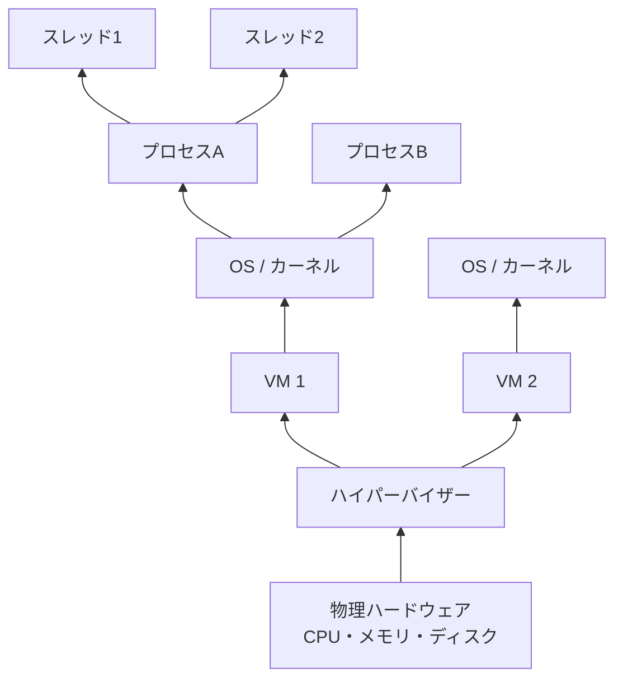

# プロセス・メモリ・仮想化

## 1. 概念理解

### 学ぶ範囲

OS、カーネル、プロセス、スレッド、CPU、メモリ、ストレージ、仮想化、ハイパーバイザー。

### OSとカーネルの役割

プログラムの実体は、ディスクに保存された命令の並び。「実行する」とは、その命令をメモリに読み込み、CPUが1つずつ処理し続けること。

- **メモリへの配置**（どのファイルをメモリのどこに置くか）
- **CPUの割り当て**（次にどのプログラムにCPUを使わせるか）

これらを実際に担っているのが**カーネル**。OSはカーネル＋その上で動く補助的なプログラム群（GUI、CLIツールなど）の総称で、ハードウェアを直接管理しているのはカーネル。

### プロセス

メモリに読み込まれて実際に動いている状態のプログラム。

- 同じ実行ファイルでも、起動するたびに別々のプロセスになる（例: `python`を2回起動→2プロセス）
- 各プロセスはカーネルによって専用のメモリ領域を割り当てられ、他のプロセスのメモリを勝手に見られない

プログラム（静的な手順書）と、それに従って動く実体（プロセス）の違い、と捉えると分かりやすい。

### スレッド

プロセス内でさらに分割される実行の単位。同じプロセス内のスレッド同士は**メモリ空間を共有する**（プロセス同士は共有しない、という点と対照的）。

| | 内容 |
|---|---|
| メリット：並列化 | 複数スレッドで処理を同時に進められる → 速度向上 |
| メリット：生成コスト | プロセスより軽い（メモリ空間を新規に用意する必要がない） |
| デメリット：競合（race condition） | 同時に読み書きするとデータが不定になる／壊れる |
| デメリット：影響範囲 | メモリを共有するため、1スレッドのクラッシュ・暴走が同じプロセス内の全スレッドに波及する |

### CPUのスケジューリングとコンテキストスイッチ

物理的なCPUコア数より多くのプロセス／スレッドが同時に動いているように見えるが、実際に同時実行しているわけではない。

- カーネル内の**スケジューラ**が、各プロセス／スレッドにごく短い時間（ミリ秒オーダー）ずつCPUを順番に割り当てる
- 切り替えの際、実行状態（レジスタの値など）を保存・復元する処理を**コンテキストスイッチ**と呼ぶ
- 高速に切り替えることで、人間の目には並列に動いているように見える（**タイムシェアリング**）

### 仮想化とハイパーバイザー

「限られた物理リソースを時間で分割し、複数の実行主体に専有しているように見せる」という発想は、CPUスケジューリングだけでなく、CPU・メモリ・ディスクなど**ハードウェア全体**にも適用できる。これが**仮想化**。

1台の物理サーバーを、複数の「独立した仮想的なサーバー（VM）」であるかのように見せる。各VMは自分専用のCPU・メモリ・ディスクを持っているかのように振る舞うが、実際には1台の物理マシンのリソースを分割・共有している。これを実現する管理者が**ハイパーバイザー**。

| 階層 | 管理者 | 分割する対象 | 分割される側 |
|---|---|---|---|
| 1台のOS内 | カーネル | CPU時間（スケジューリング） | プロセス／スレッド |
| 1台の物理マシン | ハイパーバイザー | CPU・メモリ・ディスクなど | 仮想マシン（VM＝その上で動く別々のOS） |

ハイパーバイザーは「OSそのものを1つの実行主体として管理する存在」＝**OSにとってのカーネル**、と捉えると構造が繋がる。

### 仮想化の目的

1. **リソースの効率的な利用（サーバー統合）**：1台の物理マシンを1用途専用にすると遊んでいる時間が多い。複数VMを同居させることで、遊んでいたリソースを他のVMが使えるようになる。
2. **分離（マルチテナンシー）**：複数の独立したワークロード（別々の顧客も含む）を同じ物理マシンに安全に同居させられる。あるVMがクラッシュ・乗っ取られても他のVMには影響しない。

（可用性向上はここから派生する副次的なメリット。VM単位で別の物理マシンに移動できる、など）

## 2. 選択肢の比較

### プロセス vs スレッド

| | プロセス | スレッド |
|---|---|---|
| メモリ空間 | 専用（他から隔離される） | 同じプロセス内で共有 |
| 生成コスト | 重い | 軽い |
| 障害の影響範囲 | そのプロセス内に閉じる | 同じプロセス内の他スレッドに波及しうる |

### 物理マシン vs 仮想マシン

| | 物理マシン | 仮想マシン |
|---|---|---|
| ハードウェアアクセス | 直接 | ハイパーバイザー経由 |
| 性能 | オーバーヘッドなし | わずかにオーバーヘッドが生じる |
| 得られるもの | － | リソースの効率的な利用、分離（マルチテナンシー） |

### 垂直スケール vs 水平スケール

| | 垂直スケール（Scale up） | 水平スケール（Scale out） |
|---|---|---|
| やること | 1台のマシンをより高スペックに | 同スペックのマシンを台数で増やす |
| 得意な処理 | 分割しにくい単一の重いジョブ | 分割・並列可能な大量の処理 |
| 限界 | 1台に搭載できるCPU・メモリの物理的な上限 | 処理が分割可能であることが前提。台数を増やす限り理論上は際限なく伸ばせる |

## 3. AWSでの実装例

EC2、vCPU、インスタンスタイプ、Nitro System、EBS。

AWSのEC2は仮想化の実例そのもの。物理サーバー群をNitro System（AWS独自のハイパーバイザー）で細かく切り分け、複数の顧客に「専用の仮想マシン」として貸し出している。

## 4. アーキテクチャ図

- ハイパーバイザーが物理ハードウェアを複数のVMに分割
- 各VM上でOS（カーネル）が動き、カーネルがCPU時間をプロセスに配分（スケジューリング）
- プロセスの中がさらにスレッドに分かれ、メモリ空間を共有する

## 5. 設計トレードオフ

### 分離 vs 性能（オーバーヘッド削減）

判断の軸は「速度が求められるか」よりも**「誰が同じインフラを使うか（信頼境界）」**。

| 軸 | 分離を優先 | 性能（オーバーヘッド削減）を優先 |
|---|---|---|
| 典型例 | マルチテナント環境（複数の異なる顧客・ワークロードが同居。例: AWSのEC2） | HFT（超高頻度取引）、リアルタイム制御、3Dレンダリングなど単一目的・信頼できる環境 |
| 理由 | 1つの障害・侵害が他に波及すると被害が大きい。信頼できない／異なる主体が混在するなら分離必須 | 全リソースを1つの目的に使い切りたい。信頼できる環境なので分離のコストを払う理由がない |
| CPU/メモリ/I/Oへの影響 | ハイパーバイザー経由でオーバーヘッドが乗る | ベアメタルに近いほど直接アクセスでき、オーバーヘッドが最小 |

基幹システムのように「重要な業務が複数同居する」ケースでは、速度が不要だから分離するのではなく、**1つの不具合が他業務に波及するのを防ぐため**に分離する、という理由づけが正確。

**基本スタンス**：特別な理由がない限り分離（仮想化）をデフォルトにし、オーバーヘッドが許容できない場面（超低レイテンシ、生の計算資源を使い切りたい場面）だけ、あえて分離を薄くする、という優先順位で考える。

## 6. 自分の言葉で説明

<!-- 「プログラムが実行されるとは何か」を説明する -->

## 7. 理解確認

### 到達目標

アプリケーション実行時にOS、CPU、メモリが果たす役割と仮想化の目的を説明できる。

### 現在の理解度

<!-- A：説明できる / B：見れば分かる / C：まだ怪しい -->
