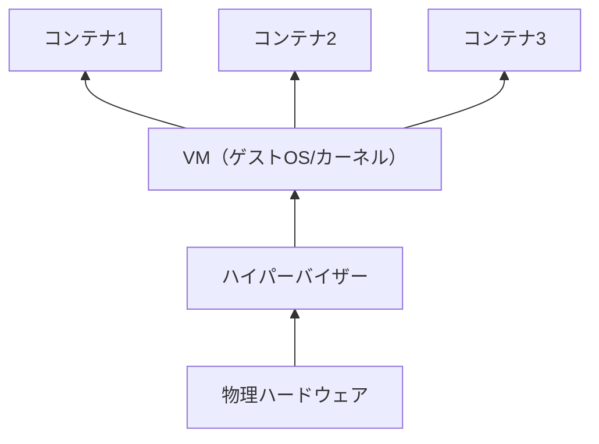
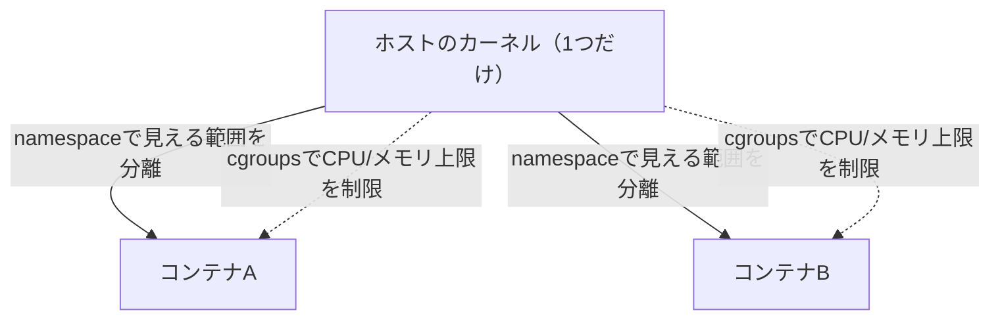
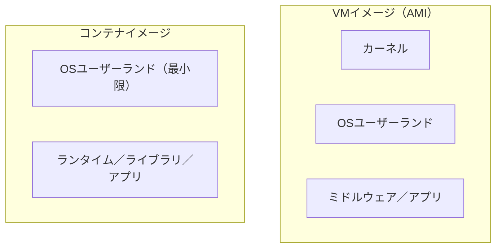
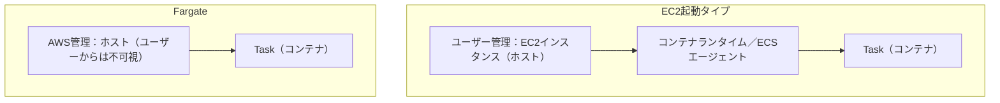

# コンテナ

## 1. 概念理解

### 学ぶ範囲

コンテナ、イメージ、レジストリ、オーケストレーション、Task/Pod、Service、ホスト管理。

### コンテナの実体（VMとの構造の違い）

| | VM | コンテナ |
|---|---|---|
| 仮想化しているもの | ハードウェア（CPU/メモリ/ディスク） | 何も仮想化していない |
| OS/カーネル | VMごとに別々の1台分（ハイパーバイザーが用意） | ホストのカーネルを1つだけ、全コンテナで共有 |
| 隔離の実現方法 | ハイパーバイザーによるハードウェアの分割 | カーネルのnamespace（見える範囲）＋cgroups（使える量） |
| 実体 | 仮想的な「1台のマシン」 | ホストOS上で動く、ただの1つのプロセス |

コンテナは仮想マシンではなく、**ホストOS上で動く、ただの1つのプロセスに、namespaceとcgroupsで特別な「見え方」と「使える量」の制限をかけたもの**が実体。VMは新しいハードウェアとOSをまるごと1台分用意するのに対し、コンテナは既に起動済みのホストのカーネルにただ相乗りするだけなので、起動が速く軽量になる。

VMとコンテナは同じ層の二択ではなく、コンテナは大抵VMのカーネルの上でさらに動く（ECSのEC2起動タイプはこの構成そのもの）。

### namespaceとcgroups（隔離の仕組み）

カーネルは本来、動いている全プロセスの一覧・ネットワークインターフェース・マウントされているファイルシステム・ホスト名などをグローバルに1つずつ管理している。これをそのまま全プロセスに見せると他のコンテナの中身が丸見えになるため、2つの仕組みで制御する。

| 仕組み | 役割 |
|---|---|
| namespace（名前空間） | 同じグローバルなリソースを、プロセスごとに違う「見える範囲」でフィルタして見せる（PID、Mount、Network、UTSなど） |
| cgroups（control groups） | 見える範囲ではなく、CPU・メモリ・I/Oを実際にどれだけ使えるか（上限）を制限する |

namespace＝「何が見えるか」、cgroups＝「どれだけ使えるか」という2軸で整理すると分かりやすい。

同じカーネルを共有しながら、namespaceが「見える範囲」を、cgroupsが「使える量」をそれぞれ別軸でコンテナごとに絞っている。

### イメージの中身（VMイメージとの違い）

コンテナイメージには、カーネルを除いた「OSのユーザーランド〜アプリまで」一式（ランタイム・依存ライブラリ・アプリケーションコード・設定ファイルなど）が入っている。カーネル以外の、OSの上に乗る全部（ライブラリ・ランタイム・ツール・アプリ）を**ユーザーランド**と呼ぶ。

| | VMイメージ（AMI） | コンテナイメージ |
|---|---|---|
| 含まれるもの | OS全体（カーネル含む）＋ミドルウェア＋アプリ | カーネルを除いたユーザーランド（ランタイム・ライブラリ・アプリ・設定） |
| カーネル | 含む（起動時にVM自身のカーネルとして動く） | 含まない（実行時にホストのカーネルを間借りする） |
| サイズ | 大きい（GB単位） | 小さい（MB〜数百MB） |

イメージとカーネルが分離されていることが、コンテナの起動が速い理由の一つ。OSをまるごと起動する必要がなく、ユーザーランドを展開してホストの（既に起動済みの）カーネル上ですぐプロセスとして動かすだけで済む。

コンテナイメージには「カーネル」の段がそもそも存在しない点が、VMイメージとの決定的な違い。

### レジストリ（イメージの保管と配布）

イメージをどこかに保管し、実行したいホストまで運ぶ仕組みが必要になる。流れはgitの push/pull に近い。

1. ローカルでイメージをビルド
2. レジストリ（ECRなど）に**push**（アップロード）して保管
3. 実際にコンテナを動かすホストが、レジストリからそのイメージを**pull**（ダウンロード）
4. ホストにイメージを展開し、ホストのカーネル上でコンテナ（プロセス）として起動

レジストリは「イメージ専用のパッケージリポジトリ」（gitのリモートリポジトリに相当）で、あくまで保管庫。ECSがタスクを起動する際は、裏側でホストが自動的にECRからイメージをpullしてから起動する。この「どのホストで何をpullして起動するか」を自動でやってくれる仕組みが、次に学ぶオーケストレーション。

### オーケストレーション（本番運用の自動化）

複数のコンテナを複数のホストにまたがって本番運用しようとすると、手動では以下がすぐに立ち行かなくなる。オーケストレーターはこれらを自動化する。

| 責務 | 内容 |
|---|---|
| スケジューリング | どのホストに空きリソースがあるかを見て、どこでコンテナを動かすか自動で決める |
| 自己修復（セルフヒーリング） | コンテナやホストが落ちたら、自動的に別の場所で作り直す |
| スケーリング | 負荷に応じてコンテナの数を自動増減 |
| ロールアウト／ロールバック | 新旧バージョンを少しずつ入れ替え、ダウンタイムなく更新（失敗したら自動で戻す） |
| サービスディスカバリ／ロードバランシング | 動的に増減するコンテナ群の場所を把握し、ALBのようにトラフィックを正しく振り分ける |

### Task/Pod（コンテナのまとまりを1単位として扱う理由）

オーケストレーターがスケジューリングする最小単位は「コンテナ1つ」ではなく「1つ以上のコンテナのまとまり」（ECSでは**Task**、Kubernetesでは**Pod**）。

強く依存し合うコンテナ（例：メインのアプリコンテナ＋ログ収集用のサイドカーコンテナ）を別々のホストに配置してしまうと、通信やデータ共有ができず困る。Task/Podとしてまとめることで、常に同じホストに配置され、ネットワーク（localhost経由の通信）やストレージ（共有ボリューム）を共有しつつ、起動・停止のライフサイクルも一緒に管理される。

### Service（Task/Podを維持し続ける上位の層）

Task/Podは「1回配置される単位」でしかなく、「常に指定した数だけ起動させておく」「落ちたら自動で補充する」「新しいTask/PodをALBに自動登録する」といった継続的な管理は担わない。これを担当するのが**Service**（ECS）／概ねDeployment＋Service（Kubernetes）。

Task/Podが「1個のプロセス起動レシピ」だとすると、Serviceは「そのレシピを指定した数だけ常に維持し続ける監督者」に相当する。

### ホスト管理（EC2起動タイプ vs Fargate）

Task/PodやServiceが実際に動く先は、結局どこかの物理的なホスト。このホストを誰が用意し、OSのパッチを当て、必要な台数を確保するかは、[02_virtual_machines.md](02_virtual_machines.md)の「責任共有モデル」と同じ構造の話。

| | EC2起動タイプ | Fargate |
|---|---|---|
| ホスト（コンテナが動くサーバー）の管理者 | ユーザー（EC2インスタンスとして自分で用意・パッチ・スケール） | AWS（ホストという概念自体がユーザーから見えなくなる） |
| ユーザーが意識するもの | Task/Pod定義 ＋ 裏側のEC2インスタンス（クラスタのキャパシティ管理） | Task/Pod定義のみ |

VMノートで整理した「EC2はハイパーバイザーの直上が境界線」という話と同じで、ECSでもこの境界線がAWS側にずれるかどうかでEC2起動タイプとFargateが分かれる。「自由度と運用負荷はセット」という原則もここでそのまま当てはまる。

EC2起動タイプはホストの管理が1段追加される分、ユーザーが意識するレイヤーが増える。FargateはそのレイヤーごとAWS側に隠れる。

## 2. 選択肢の比較

### VM vs コンテナ（あえてVMを選ぶ理由）

コンテナの方が軽量・高速だが、それでもVMに直接アプリを入れたくなる理由がある。

| 観点 | VMを選ぶ理由 |
|---|---|
| 自由度 | 好きなOS・カーネルバージョン・カーネルパラメータを自由に選べる（コンテナはホストのカーネルに縛られる） |
| 隔離の強さ | ハイパーバイザーによる隔離は、カーネルを共有するnamespace/cgroupsより堅牢 |

特に「信頼できない／未知のワークロードを同居させる場合」（例：複数の異なる顧客のコードを実行するマルチテナントSaaS基盤）は、VMレベルの隔離が欲しくなる。AWSのFargateは裏側で軽量VM技術の**Firecracker**を使い、「コンテナの使い勝手」と「VM並みの隔離」を両立させている。

### ECS vs EKS（なぜEKSは重いのか）

EKSの中身である**Kubernetes**は、AWS専用ではなく業界標準のOSSオーケストレーター（元々Google開発）で、GCP・Azure・オンプレでも同じものが動く。この「どこでも動く」という汎用性が、ECSとの根本的な違いを生む。

| | ECS | EKS（Kubernetes） |
|---|---|---|
| 技術の性質 | AWS独自技術 | 業界標準のOSS、どこでも動く |
| 移植性 | AWSの中でしか動かない | AWS/GCP/Azure/オンプレ間で移植できる |
| AWSサービスとの結合 | IAM・ALB・CloudWatchなどと直接密結合 | 「どこでも動く」ため、AWS固有の機能とは抽象化レイヤー（CNI＝ネットワーク、CSI＝ストレージなど）を挟んで繋がる |
| 概念の数 | Cluster/Task/Serviceなど少数でシンプル | Pod/Deployment/Service/Ingress/ConfigMap/Namespaceなど多い |

**汎用性（移植性）とシンプルさ（学習コスト・運用負荷の低さ）はトレードオフの関係**にある。ECSは汎用性を最初から捨ててAWSに閉じることでシンプルさを得た。EKSは「どこでも動く」を実現するため、抽象化レイヤーの分だけ概念数・設定項目・学習コストが増える。これが「EKSは重い」の正体で、Kubernetes自体が悪いのではなく、汎用的であろうとする設計上の必然として複雑になっている。

判断軸としては、AWSだけで完結し学習コストを抑えたいならECS、マルチクラウド／将来的な移植性が必要、または既存のKubernetesエコシステム（Helm、Operatorなど）を活用したいならEKS、という整理になる。

### EC2起動タイプ vs Fargate（実際どちらを選ぶか）

責任の所在（誰がホストを管理するか）はセクション1で整理済み。ここでは実際の選択基準を整理する。

| 観点 | EC2起動タイプ | Fargate |
|---|---|---|
| インスタンスの自由度 | GPU・特殊インスタンスファミリー・カスタムAMIなど細かい要求に対応できる | 汎用的な設定に限られる |
| コスト最適化 | Reserved/Savings Plans、Spotで単価を下げられる（常時稼働・大量ワークロード向け） | 運用の楽さと引き換えに、単価自体はEC2最適化ほど下げにくい |
| Task間の隔離 | 通常のコンテナ隔離（同一ホスト上の複数Taskはカーネルを共有） | Task単位でFirecracker microVMによるVM並みの隔離が標準 |
| 運用負荷 | ホストのキャパシティ管理・パッチ適用が必要 | ホスト管理自体が不要（AWSが肩代わり） |

基本方針は「特別な理由がなければFargateをデフォルトにする」。EC2起動タイプは、GPU・特殊インスタンス・大規模ワークロードでのコスト最適化など、明確な理由がある場合の選択肢という位置づけになる。

## 3. AWSでの実装例

ECR、ECS、EKS、Fargate、ECS Service、ALB。

## 4. アーキテクチャ図

<!-- ECRからイメージを取得し、複数コンテナを実行する構成を表す -->

## 5. 設計トレードオフ

<!-- 移植性、制御範囲、学習コスト、運用負荷、起動速度、コストを考える -->

## 6. 自分の言葉で説明

<!-- 「コンテナとは何か」「なぜEKSは重いのか」を説明する -->

## 7. 理解確認

### 到達目標

VMとの違いを説明し、ECS/EKSとEC2/Fargateの組み合わせを要件から選べる。

### 現在の理解度

<!-- A：説明できる / B：見れば分かる / C：まだ怪しい -->
