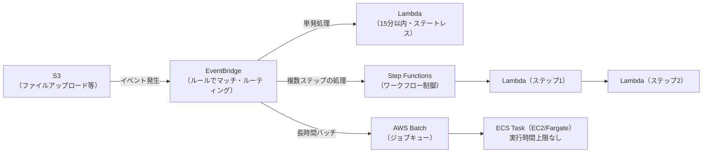

# サーバーレスとバッチ

## 1. 概念理解

### 学ぶ範囲

イベント駆動、Function as a Service、実行時間、ステートレス、コールドスタート、バッチ処理。

### イベント駆動 vs 常駐（LambdaとFargate Serviceの違い）

「サーバーレス」は物理的にサーバーが存在しないという意味ではなく、インフラ（物理・OS・ランタイム）の管理をAWSに任せ、使った分だけ課金される、という意味。ホスト管理をAWSに任せる点は[03_containers.md](03_containers.md)のFargateも同じだが、実行モデルが決定的に違う。

| | Fargate（Service配下のTask） | Lambda |
|---|---|---|
| リクエストがない時 | 指定した数だけ起動しっぱなし（常駐） | 何も起動していない |
| 起動のトリガー | 常時稼働、外からのリクエストを待ち受ける | イベント（リクエスト等）ごとに都度起動 |

### FaaS（Function as a Service）とランタイム管理

| | Fargate | Lambda |
|---|---|---|
| ランタイムの用意 | 自分でDockerイメージに含める | AWSが提供するランタイム（Python、Node.jsなど）を選ぶだけ、パッチ当てもAWSが実施 |
| ユーザーが用意するもの | コンテナイメージ全体 | 関数コードのみ |

FaaSは「コードだけ書けばOK」というモデルで、ランタイム自体の管理もAWSに委ねる点が、コンテナ（Fargate含む）よりさらに一段抽象化されている。

### 実行時間の上限

Lambdaの実行時間には上限があり、2026年8月時点でも最大**15分（900秒）**（デフォルトは3秒、1秒刻みで変更可能）。この制約のため、Lambdaはアドホックで短時間の処理に向き、長時間・複雑な処理には不向き。

出典: [AWS公式ドキュメント（Configure Lambda function timeout）](https://docs.aws.amazon.com/lambda/latest/dg/configuration-timeout.html)

### ステートレス

Lambdaの実行環境は呼び出しごとに独立しており、インスタンス内にデータは引き継がれない（呼び出しをまたぐ状態を持たない設計が前提）。複数リクエストにまたがって保持したいデータは外部に置く。

| 保持したいデータ | 向いている保存先 |
|---|---|
| 画像・ファイルなどのオブジェクト | S3 |
| セッション情報・カウンターなど低レイテンシな状態 | DynamoDB（Lambdaと同じ従量課金・サーバーレスの思想で相性が良い） |

### コールドスタート

リクエストが来るまで何も起動していないLambdaは、初回リクエスト時に実行環境の起動（コード取得・ランタイム初期化・初期化コードの実行）が発生し、常駐しているFargateのTaskに比べてレイテンシが増える。これを**コールドスタート**と呼ぶ。

### バッチ処理とAWS Batch

バッチ処理＝オンラインでリアルタイム応答を返すものではなく、まとまった処理をひとかたまりで、決まったタイミング（夜間など）に非同期で流す処理（例：経理の日次伝票転記を夜間バッチで実行）。

Lambdaは15分の壁があるため長時間バッチには不向き。かといって、単発のECS Taskスケジュール実行では足りない場面がある。

| 状況 | ECS Taskスケジュール実行 | AWS Batch |
|---|---|---|
| ジョブが1つ、決まった時刻に1回 | 十分 | オーバースペック |
| ジョブ数が実行時まで変動する | 自前でキューイングの仕組みが必要 | ジョブキューに投入するだけで自動処理 |
| ジョブ間に依存関係がある | 自前で制御ロジックが必要 | 依存関係を定義として持てる |
| 失敗時のリトライ・優先度制御 | 自前実装 | 標準機能 |

AWS Batchは裏側で実はECS（EC2またはFargate）上でジョブをコンテナとして実行しており、その上に「ジョブキュー・優先度・依存関係・リトライ」を管理する層を被せたサービス。

## 2. 選択肢の比較

### Lambda / ECS Task（スケジュール実行） / AWS Batch

| 観点 | Lambda | ECS Task（スケジュール実行） | AWS Batch |
|---|---|---|---|
| 起動トリガー | イベント駆動（都度起動） | EventBridge Schedulerなどで定時起動 | ジョブキューへの投入 |
| 実行時間上限 | 15分 | 上限なし | 上限なし |
| 常駐/イベント駆動 | イベント駆動（リクエストがなければ何も起動しない） | 単発実行（常駐ではない） | 単発実行（常駐ではない） |
| キューイング・依存関係・リトライ | 自前実装が必要 | 自前実装が必要 | 標準機能 |
| ステート管理 | ステートレス（外部ストアに保存） | コンテナ実行中は状態を保持できる | コンテナ実行中は状態を保持できる |
| 向いている用途 | 短時間・軽量なイベント処理 | 単発の長時間ジョブ | 大量・可変数・依存関係のあるジョブ群 |

## 3. AWSでの実装例

Lambda、AWS Batch、ECS Task、EventBridge、Step Functions。

EventBridgeはイベントの検知とルーティングを担う「入口」で、S3アップロードなどのイベントをルールにマッチさせ、Lambda・Step Functions・ECS Task・AWS Batchなどのターゲットを起動する。Step Functionsは複数ステップ（複数のLambda呼び出しなど）の実行順序・分岐・リトライを管理する「ワークフロー制御」で、EventBridgeのターゲットとしてStep Functions自体を指定し、その中で複数ステップを繋ぐ構成が典型的。

| | EventBridge | Step Functions |
|---|---|---|
| 役割 | イベントの検知とルーティング | 複数ステップの実行順序・分岐・リトライ管理 |
| 典型的な呼び出し先 | Lambda、Step Functions、ECS Task、AWS Batchなど | Lambda、ECS Taskなど複数ステップ |

## 4. アーキテクチャ図

- EventBridgeが「何が起きたか」を検知し、処理の性質によって行き先を振り分ける入口の役割を果たす
- 単発・短時間ならLambda直接起動、複数ステップに分かれる処理ならStep Functions経由でLambdaを連鎖させる
- 長時間・大量・可変数のジョブはAWS Batch（裏側はECS Task）が受け持ち、Lambdaの15分制限を回避する

## 5. 設計トレードオフ

| 論点 | Lambda（サーバーレス） | Fargate/ECS Task（常駐） |
|---|---|---|
| 実行時間 | 15分の上限、超える処理は分割が必要 | 上限なし |
| 起動時間 | コールドスタートが発生しうる | 常駐のため起動待ちなし |
| 同時実行 | 自動スケールするが下流DBの接続数枯渇に注意（RDS Proxy等で対策） | Task数は自分でスケーリング設定、下流負荷は制御しやすい |
| 状態管理 | ステートレス前提、状態は外部（DynamoDB/S3等）へ | コンテナ実行中は状態を保持できる |
| アイドルコスト | トラフィックがなければ課金なし、不定期・スパイクに強い | 常時起動分のコストが発生、安定した大量トラフィックなら単価有利 |

基本方針：トラフィックが不定期・小規模で処理が短時間に完結するならLambda、安定して大量のトラフィックがある・長時間やステートフルな処理が必要ならFargate/ECS、大量かつ可変数のバッチジョブはAWS Batch、という整理になる。

## 6. 自分の言葉で説明

<!-- 「なぜECSではなくLambdaか」を説明する -->

## 7. 理解確認

### 到達目標

処理時間と起動条件からサーバーレス、コンテナタスク、バッチ基盤を使い分けられる。

### 現在の理解度

<!-- A：説明できる / B：見れば分かる / C：まだ怪しい -->
