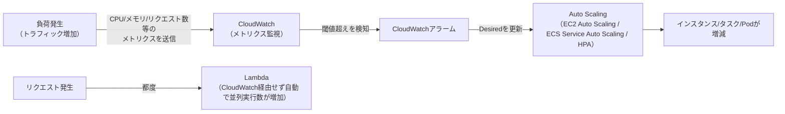

# スケーリングと実行基盤の選択

## 1. 概念理解

### 学ぶ範囲

垂直/水平スケール、Auto Scaling、ステートレス設計、負荷指標、キャパシティ管理。

### 垂直スケール vs 水平スケール

- 垂直スケール：1台のマシンの性能を上げる（スペックアップ）
- 水平スケール：マシンの台数を増やす

水平スケールでは、リクエストが毎回同じサーバーに届くとは限らない（ロードバランサーが別サーバーに振り分けることがある）。

### ステートレス設計

サーバーがユーザー固有の状態（ログイン状態など）をローカルメモリに持っていると、次のリクエストが別サーバーに振られた際にその状態が失われる。これが水平スケールの自由度（サーバーを自由に増減・入れ替えできること）と可用性を下げる。

そこで、サーバー自体は状態を持たず、状態は外部の共有ストアに置く（＝ステートレス設計）。[04_serverless_and_batch.md](04_serverless_and_batch.md)のLambdaの話と同じ原則で、Lambda固有の制約ではなく水平スケールする構成全般に共通する。

| | EBS | EFS | DynamoDB |
|---|---|---|---|
| 共有可否 | 基本1インスタンスにのみアタッチ | 複数インスタンスから同時マウント可能（NFS） | 複数インスタンスから同時アクセス可能 |
| アクセス形式 | ブロックストレージ | 共有ファイルシステム | 低レイテンシのKey-Value |
| セッション状態への適性 | ✕（共有できない） | △（共有はできるがファイルI/Oで細かい読み書きに不利） | ◎（高頻度な読み書きに最適化） |
| 典型用途 | DB専用ボリューム等、1台に紐づくデータ | 複数インスタンスで共有したいファイル | セッション、カウンター、状態管理 |

### 負荷指標

Auto Scalingの判断材料になる指標。

| 指標 | 特徴 |
|---|---|
| CPU使用率 | 最も一般的。I/O待ちが多い処理では負荷を正しく反映しないことがある |
| メモリ使用率 | メモリリークや大量データ処理系で重要 |
| リクエスト数（ALBのRequestCountPerTargetなど） | CPUより直接的にユーザー影響を捉えられる |
| キューの長さ（SQSのApproximateNumberOfMessagesVisibleなど） | ワーカー型構成で有効。CPUが上がる前に検知できる先行指標 |
| レスポンスタイム | ユーザー体感速度に直結 |

### キャパシティ管理（Min / Max / Desired）

| 用語 | 意味 |
|---|---|
| Min | 常に維持する最低台数 |
| Max | 許容する最大台数（コスト・キャパシティ上限） |
| Desired | 現在の目標台数。動的スケーリングポリシーがMin〜Maxの範囲内でこの値を上下させる |

動的スケーリングは指標が閾値を超えたらDesiredを増減させ、実際のインスタンス数がそれに追従する。スケール直後に指標が落ち着く前に連続でスケールしすぎないよう、クールダウン期間（一定時間は次のスケーリング評価をしない）で制御する。

Auto Scalingの発火条件には、指標閾値によるもの（動的スケーリング）のほか、時刻を指定した定時スケーリングもある。

## 2. 選択肢の比較

### EC2 / ECS / EKS / Lambda

| 観点 | EC2 | ECS | EKS | Lambda |
|---|---|---|---|---|
| 運用の手間 | 大（OSパッチ・スケーリング設計等すべて自前） | 中（Fargateならホスト管理不要、タスク定義は必要） | 大（コントロールプレーンはAWS管理だがKubernetesの運用知識が必要） | 小（インフラ・ランタイム管理不要） |
| スケールする単位 | インスタンス（台数） | タスク（コンテナ数） | Pod（＋EC2ノードの場合はノードも） | 同時実行数（自動で並列起動、ユーザーはスケール設計不要） |
| 実行時間の上限 | なし | なし | なし | 15分 |
| コストモデル | 起動時間課金（アイドルでも課金） | Fargate：vCPU/メモリの秒課金（実行中のみ）／EC2起動タイプ：裏のEC2に課金 | コントロールプレーン固定料金＋ノード分（EC2 or Fargate） | リクエスト数＋実行時間課金、アイドル時は無料 |
| 向いている用途 | 細かいOS制御が必要、特殊なミドルウェア | コンテナ化された常駐サービス、シンプルな構成 | マルチクラウド前提やKubernetesエコシステム活用が必要な組織 | 短時間・イベント駆動の処理、トラフィックが不定期 |

## 3. AWSでの実装例

| AWSサービス | 役割 |
|---|---|
| CloudWatch | 各リソースの指標（CPU・メモリ・リクエスト数等）を収集、アラームで閾値を監視 |
| EC2 Auto Scaling | CloudWatchアラームを起点にMin/Max/DesiredでEC2インスタンス数を増減 |
| ECS Service Auto Scaling | CloudWatchアラームを起点にタスク数を増減 |
| EKS Autoscaling | 2階層ある：Pod数を増減するHPA（Horizontal Pod Autoscaler）と、Podを置くノード（EC2）自体を増減するCluster Autoscaler/Karpenter |
| Lambda Concurrency | リクエスト数に応じて自動で並列実行数が増減（ユーザーが閾値設定する対象ではない） |

EKSだけ「Pod数」と「ノード数」の2階層でスケーリングが必要になる点がECSとの運用上の違い（ECSはタスク数の管理のみで、Fargateならノードの概念自体がない）。

## 4. アーキテクチャ図

- EC2/ECS/EKSは「メトリクス→アラーム→Auto Scaling→リソース増減」という共通の経路をたどる
- Lambdaだけこの経路を通らず、リクエストのたびに実行環境が直接並列起動する（ユーザーがスケーリングを設計・監視する対象ではない）

## 5. 設計トレードオフ

<!-- 制御、運用責任、応答速度、上限、アイドル容量、予測可能性を考える -->

## 6. 自分の言葉で説明

<!-- 要件を示し、EC2/ECS/EKS/Lambdaの採用理由を説明する -->

## 7. 理解確認

### 到達目標

ワークロードの特徴から実行基盤とスケーリング方式を比較し、判断根拠を説明できる。

### 理解度ログ

<!-- 「開始」行のみAIが判定して記入。それ以外は自分で書く -->
<!-- A：説明できる / B：見れば分かる / C：まだ怪しい -->

- 開始 2026-08-08: B（垂直/水平スケールの定義とAuto Scalingの発火条件〔定時・指標閾値〕は即答できた。ステートレス設計との関係やEC2/ECS/EKS/Lambdaの使い分けはこれから）
- 終了 YYYY-MM-DD:
