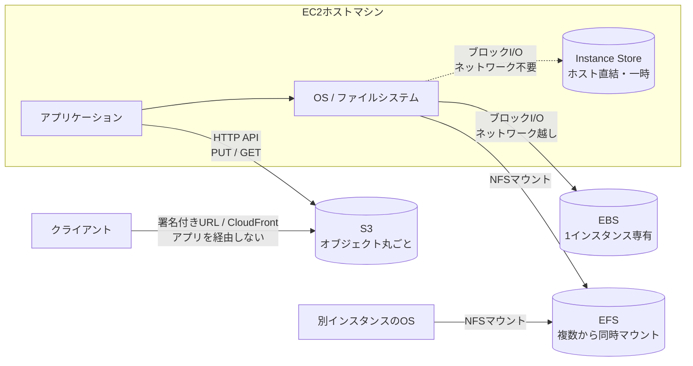

# ストレージモデル

## 1. 概念理解

### 学ぶ範囲

オブジェクト、ブロック、ファイル、ローカル/ネットワーク、永続/一時ストレージ。

### 3モデルを分けるのは「ファイルシステムを誰が持つか」と「読み書きの最小単位」

| | ブロック（EBS） | ファイル（EFS） | オブジェクト（S3） |
|---|---|---|---|
| サーバから見えるもの | 生のディスク（`/dev/xvdf`） | マウントされたディレクトリ | HTTPエンドポイント |
| ファイルシステム | OS側が作る（mkfs → mount） | ストレージ側が持つ（NFSでマウント） | 無い（フラットなキー空間） |
| 読み書きの最小単位 | ブロック（数KB） | ファイル（部分書き込み可） | オブジェクト丸ごと |
| アクセス手段 | OSのファイルI/O（ディスクとして） | OSのファイルI/O（ネットワーク越し） | HTTP API（PUT/GET） |

EBSは「ディスクそのもの」を渡すため、OSがフォーマットして初めて使える。EFSは既にファイルシステムになっているものをネットワーク越しに借りる形。

### なぜDBのデータファイルをS3に直接置けないのか

3モデルの違いが実務でどう効くかの代表例。

1. **ファイルシステムが無い** — OSが `open`/`seek`/`write` で扱えないため、DBエンジンがそもそもファイルとして操作できない
2. **ランダムな部分更新ができない** — DBは1行更新のたびにデータファイルの一部（数KB）だけを書き換える。S3は1バイト変えるだけでもオブジェクト全体をPUTし直すので、100GBのデータファイルなら毎回100GB転送になり成立しない
3. **レイテンシの桁が違う** — EBSはサブms〜数ms、S3は数十msオーダー

逆にS3が向くのは、**追記・丸ごと置き換えが基本で、更新頻度が低く、サイズが大きい**データ（ログ、画像、バックアップ、データレイク）。

### ローカル/ネットワーク が 永続/一時 を決めている

「Instance Storeは揮発性、EBSは永続」の正体は、**ディスクが物理的にどこにあるか**。

| | Instance Store | EBS | EFS / S3 |
|---|---|---|---|
| 物理的な位置 | EC2が動いているホストマシンに直結したディスク | ネットワーク越しの独立したストレージサービス | ネットワーク越しの独立したストレージサービス |
| ネットワーク経由 | 不要 | 必要 | 必要（EFSはNFS、S3はHTTP） |
| 速度 | 最速（ホスト直結） | ネットワーク分のオーバーヘッドあり | さらに遅い |
| インスタンスから切り離せるか | 不可（起動時にのみアタッチ、付け替え不可） | 可（デタッチして別インスタンスにアタッチ可） | そもそも独立したサービス |
| インスタンス消滅時 | データも消える | 残る | 残る |

つまり **ホストに直結している＝速いが、ホストの寿命に縛られる**。独立させると遅くなるが、インスタンスと別のライフサイクルを持てる。永続/一時はこの構造の結果であって、性質として先にあるわけではない。

#### Instance Store の消えるタイミング（正確な条件）

「サーバ停止で消える」はおおむね正しいが、**再起動（reboot）では消えない**点が実務上の分かれ目。

| イベント | データ |
|---|---|
| 再起動（reboot / OSからのrestart） | **残る** |
| 停止（stop） | 消える |
| 休止（hibernate） | 消える |
| 終了（terminate） | 消える |
| インスタンスタイプ変更 | 消える |
| 基盤ディスク障害 | 消える |
| 電源障害 | 再起動後に残る |

stop / hibernate / terminate 時は、全ブロックが暗号的に消去（cryptographically erased）される。
出典: [Data persistence for Amazon EC2 instance store volumes](https://docs.aws.amazon.com/AWSEC2/latest/UserGuide/instance-store-lifetime.html)

## 2. 選択肢の比較

### オブジェクト / ブロック / ファイル

| 観点 | ブロック（EBS） | ファイル（EFS） | オブジェクト（S3） |
|---|---|---|---|
| アクセス方式 | OSがディスクとして認識、ファイルシステムを自分で作成 | NFSv4.1/4.0でマウント | HTTP API（PUT/GET）、キー指定 |
| 名前空間 | ファイルシステム次第（OSが管理） | ディレクトリ階層（POSIX権限・ファイルロック対応） | フラット（`/`はプレフィックスの慣習にすぎない） |
| 部分更新 | 可（ブロック単位） | 可（ファイル内の一部書き込み） | 不可（オブジェクト丸ごと置き換え） |
| 共有（同時アクセス） | 原則1インスタンス専有（io1/io2のMulti-Attachは例外） | 多数のクライアントから同時マウント可（EC2/ECS/EKS/Lambda/Fargate） | 無制限に同時アクセス可 |
| レイテンシ | サブms〜数ms | 数ms（ネットワーク越しのファイルI/O） | 数十ms |
| 容量管理 | 事前にサイズを指定（拡張は可能） | 自動で伸縮（プロビジョニング不要） | 実質無制限 |
| 耐久性・冗長範囲 | AZ内の複数サーバに自動レプリケーション（io2 Block Express 99.999%、他は99.8〜99.9%） | Regionalは複数AZに冗長化、One Zoneは単一AZ | 複数AZに冗長化 |
| 典型用途 | OSのブートディスク、DBのデータファイル | 複数サーバで共有する設定・コンテンツ、共有ホームディレクトリ | ログ、画像、バックアップ、データレイク |

出典: [Amazon EBS features](https://docs.aws.amazon.com/ebs/latest/userguide/what-is-ebs.html) / [What is Amazon EFS?](https://docs.aws.amazon.com/efs/latest/ug/whatisefs.html)

判断の起点は「**部分更新が要るか**」→「**複数サーバから同時に触るか**」の順。部分更新が不要ならS3、必要かつ1台専有ならEBS、必要かつ共有が要るならEFS。

## 3. AWSでの実装例

| サービス | モデル | 位置づけ |
|---|---|---|
| S3 | オブジェクト | HTTP APIでアクセス。ログ、画像、バックアップ、データレイクの標準的な置き場 |
| EBS | ブロック | EC2/ECSタスクにアタッチする仮想ディスク。OSブートディスク、DBのデータファイル |
| EFS | ファイル | NFSv4.1/4.0の共有ファイルシステム。EC2/ECS/EKS/Lambda/Fargateから同時マウント可 |
| Instance Store | ブロック（一時） | ホスト直結の物理ディスク。キャッシュ・スクラッチ領域専用 |
| FSx | ファイル | 特定のファイルシステムをマネージドで提供するファミリー |

### FSx ファミリー

EFSがLinux/NFS前提なのに対し、FSxは「別のファイルシステムをそのまま使いたい」ケースを埋める。

- [FSx for Windows File Server](https://docs.aws.amazon.com/fsx/latest/WindowsGuide/what-is.html) — SMB（2.0〜3.1.1）、Active Directory認証、Windows ACL。Windows資産のリフト&シフト用。Single-AZ / Multi-AZ を選べる
- [FSx for Lustre](https://docs.aws.amazon.com/fsx/latest/LustreGuide/what-is.html) — HPC・機械学習向けの高スループット並列ファイルシステム
- [FSx for NetApp ONTAP](https://docs.aws.amazon.com/fsx/latest/ONTAPGuide/what-is-fsx-ontap.html) / [FSx for OpenZFS](https://docs.aws.amazon.com/fsx/latest/OpenZFSGuide/what-is-fsx.html) — 既存のONTAP/ZFS運用をAWSに持ち込む用途

（対応プロトコルの詳細は各ガイドで要確認。ここで一次情報を確認済みなのはWindows File Serverのみ）

### ECS(Fargate)での実務メモ

Fargateタスクにも **EBSをアタッチできる**（platform version 1.4.0以降、Linuxのみ）が、永続ストレージとしては使えない。

| 制約 | 内容 |
|---|---|
| 個数 | 1タスクにつき最大1ボリューム |
| 既存ボリューム | アタッチ不可（新規のみ。スナップショットからの復元は可） |
| ライフサイクル | **サービス管理下のタスクでは、タスク終了時に必ず削除される** |

つまりFargate+EBSは「タスク単位のスクラッチ領域」。**複数タスクで共有したい永続データはS3かEFSに置く**、という原則は変わらない。
出典: [Use Amazon EBS volumes with Amazon ECS](https://docs.aws.amazon.com/AmazonECS/latest/developerguide/ebs-volumes.html)

## 4. アーキテクチャ図

- **EBS / EFS / Instance Store はOSのファイルI/Oを経由する** — アプリからは「ファイル」に見え、ファイルシステムの存在が前提
- **S3だけアプリが直接HTTP APIを叩く** — OSのファイルシステムを通らないので、既存のファイル操作コードはそのまま使えない
- S3はクライアントが**アプリサーバを経由せず**直接取得できる。EFSに置いた場合は必ずアプリ経由の配信になり、その分の帯域とCPUを消費する

## 5. 設計トレードオフ

| 観点 | ブロック（EBS） | ファイル（EFS） | オブジェクト（S3） | 一時（Instance Store） |
|---|---|---|---|---|
| 性能 | 低レイテンシ、高IOPS | 中（ネットワーク越しのファイルI/O） | レイテンシ大、スループットは高い | 最速 |
| 共有範囲 | 原則1インスタンス | 多数から同時 | 無制限 | 1インスタンス（起動中のみ） |
| 耐久性 | AZ内で複製、インスタンスから独立 | Regionalは複数AZ、One Zoneは単一AZ | 複数AZ | 無し（stop/terminateで消滅） |
| 整合性 | ローカルディスクと同等 | 強い整合性、ファイルロック対応 | 書き込み後の読み取り整合性あり。ただし部分更新できず丸ごと置換 | ローカルディスクと同等 |
| 管理 | サイズを事前指定、拡張は手動操作 | 自動伸縮。マウントターゲット・SGの設計が必要 | 容量管理不要。IAM/バケットポリシー設計が中心 | 管理不要（インスタンスタイプに付随） |
| コスト | プロビジョニング量に課金（未使用分も） | 使用量課金だがGB単価は高め | GB単価は最安クラス、リクエスト課金あり | 追加費用なし（インスタンス料金に込み） |

※ GB単価は改定されるため、比較時は [S3](https://aws.amazon.com/s3/pricing/) / [EFS](https://aws.amazon.com/efs/pricing/) / [EBS](https://aws.amazon.com/ebs/pricing/) の価格ページで都度確認する。

### 判断の順序

1. **部分更新（ランダムライト）が要るか** — 不要ならS3。DBのデータファイルやOSブートディスクは自動的に除外される
2. **複数サーバから同時に触るか** — 1台専有ならEBS、共有が要るならEFS
3. **POSIXファイルシステムが前提か** — 既存ソフトがファイルパス・ファイルロックを要求するならEFS（Windows/SMBならFSx）
4. **消えて困るか** — 困らない一時データ（キャッシュ、スクラッチ）ならInstance Storeで最速かつ無料

### 迷いやすい論点：画像・添付ファイルをS3とEFSのどちらに置くか

判断軸1で決着する（画像は部分更新しないのでS3）が、EFSに引っ張られやすい理由と、それを選ばない根拠を明示しておく。

| | S3 | EFS |
|---|---|---|
| 実装のしやすさ | SDK経由。既存のファイル操作コードは書き換えが必要 | ただのファイルパスとして扱えるので既存コードがそのまま動く |
| 配信経路 | 署名付きURL/CloudFrontでクライアントに直接返せる | アプリサーバ経由でしか配信できず、帯域とCPUを消費する |
| 運用 | バケットとIAMのみ | マウントターゲット、SG、AZごとの設定が必要 |
| GB単価 | 安い | 高い |

「実装が楽」の1点だけがEFS有利で、それ以外は全てS3有利。**EFSを選ぶべきなのは、既存ソフトがPOSIXファイルシステムを前提にしていて書き換えられない場合**に限られる。

## 6. 自分の言葉で説明

<!-- 「S3/EBS/EFSの違い」を説明する -->

## 7. 理解確認

### 到達目標

アクセス方法とデータ特性から、適切なストレージモデルを選べる。

### 理解度ログ

<!-- 「開始」行のみAIが判定して記入。それ以外は自分で書く -->
<!-- A：説明できる / B：見れば分かる / C：まだ怪しい -->

- 開始 2026-08-09: B（S3をAPI経由で「丸ごと」読み書きするものと捉えられており実務利用あり、Instance Storeの揮発性も即答。EBSとEFSの違い〔ブロック vs ネットワークファイルシステム、共有可否〕はこれから）
- 終了 YYYY-MM-DD:

### 疑問・判断問題への回答

<!-- 自分で書く。AIは勝手に埋めない -->
