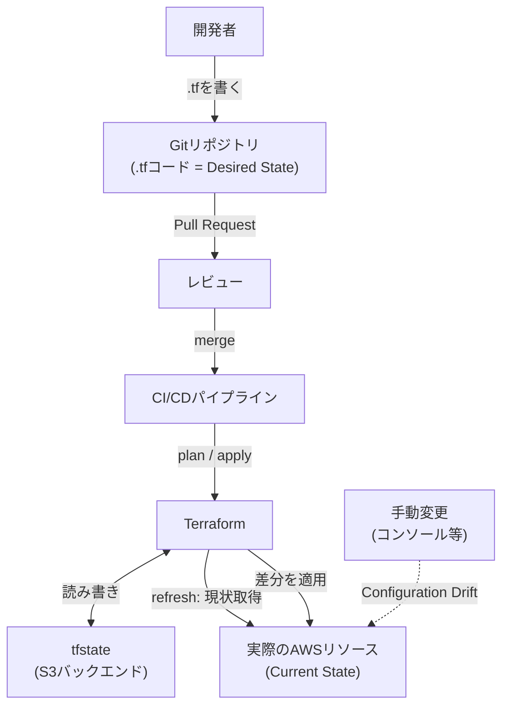

# IaCの基礎

## 1. 概念理解

### 学ぶ範囲

宣言的/命令的、Desired State、Plan/Apply、State、Module、Configuration Drift、冪等性。

### 宣言的（Declarative）と命令的（Imperative）

- 命令的：「Aを作れ、次にBを作れ」と手順を書く（`aws cli`を順番に叩く、手作業も同じ）
- 宣言的：「最終的にこうあるべき」という状態を書く。Terraformの`.tf`はこちら

### Desired StateとState

`.tf`に書いたリソース定義が「あるべき姿（Desired State）」。Terraformの仕事は、実際のインフラ（Current State）をDesired Stateに近づけること。

AWS側のリソースには「Terraformが作った」という印は付いていないため、どのリソースをTerraformが管理しているかを記録する台帳が`tfstate`。**Stateは、実インフラとコード（プログラム論理）を一致させるための仕組み**。

### Plan/Apply（差分計算のサイクル）

1. `.tf`（Desired State）を読む
2. `tfstate`（前回の記録）を読む
3. AWS APIに問い合わせて実際の状態を確認する（**refresh**）
4. Desired StateとCurrent Stateの差分を計算し、`plan`として提示 → `apply`で反映

`tfstate`を紛失すると、Terraformは「まだ何も存在しない」と誤認し、既存リソースを再度`CREATE`しようとして名前衝突や重複作成が起きる。復旧には`terraform import`で1つずつ紐付け直しが必要。ローカルではなくS3などリモートバックエンドに置くのは、紛失・競合を避けるため。

### Module

Terraformコードを再利用可能にまとめた部品（関数のようなもの）。「ECSサービス一式」をモジュール化すれば、dev/staging/prodで同じ構成をパラメータだけ変えて使い回せる。コピペ運用は修正漏れ・環境間差異の温床になる。

### Configuration Drift

`tfstate`（Terraformの記憶）に対し、実際のAWSリソースがTerraform経由ではない変更（コンソールでの手動変更など）でずれてしまう状態。次の`plan`の`refresh`で「コードにない差分」として検出される。

**なぜapplyが壊れるか**
- 単純な値の手動変更（例：desired_count）→ 素直に「コードの値へ戻す」プランになり、大抵は通る
- immutable（変更不可）な属性を手動変更 → AWS的に削除→再作成が必要になるが、依存関係や一意制約で失敗しうる
- リソースを手動で削除・再作成 → AWS側のIDが変わり、`tfstate`は古いIDを指したまま。参照時に`ResourceNotFoundException`
- ECSのタスク定義リビジョンを手動更新 → コンソールは新リビジョン、`tfstate`は古いリビジョンを「正」として記憶したままズレる

**対処**
- `terraform apply -refresh-only`（またはplan）：コードは変えずtfstateだけ実際のAWSに合わせてから、改めてplanを取る
- 特定できない場合は`terraform state rm` → `terraform import`でtfstateを作り直す
- 根本対策：変更経路をTerraform（IaC）に一本化し、緊急時以外はコンソールから直接触らない運用ルール

### 冪等性（Idempotency）

同じ`apply`を何度実行しても結果が同じ状態に収束する性質。差分がなければ何もしない設計になっているため、CI/CDでリトライや再実行があっても安全。`aws cli`で単純に`create`コマンドを並べただけだと、2回実行時にエラーまたは重複作成が起きるのと対照的。

## 2. 選択肢の比較

### 手作業 vs IaC

| | 手作業 | IaC |
|---|---|---|
| 再現性 | 人によるブレ・手順忘れ | コード通りに同一の結果 |
| レビュー | 困難（手順が残らない） | Git上でPRレビュー可能 |
| 変更履歴 | コンソールログ頼み | Git履歴として残る |
| ロールバック | 手動で逆手順を実施 | 過去のコードに戻してapply |
| Drift検知 | 検知手段がない | plan/refreshで検知できる |

個人での小さな検証はコンソールでポチポチが分かりやすいこともあるが、チームで管理する前提ならIaCが一択になる。

### 宣言的 vs 命令的

| | 宣言的 | 命令的 |
|---|---|---|
| 書くもの | あるべき状態 | 実行手順 |
| 差分計算 | ツールが自動でやる | 自分で条件分岐を書く必要 |
| 冪等性 | ツールが保証 | 自分で担保する必要 |
| 代表 | Terraform, CloudFormation | シェルスクリプト、`aws cli`連打 |

### CloudFormation vs CDK vs Terraform

| | CloudFormation | CDK | Terraform |
|---|---|---|---|
| 対応範囲 | AWSのみ | AWSのみ（内部でCFnに変換） | マルチクラウド・SaaS含め広い（Provider次第） |
| 記述方法 | YAML/JSON宣言 | TypeScript/Python等の汎用言語 | HCL（宣言的専用言語） |
| State管理 | AWS側が管理（意識不要） | 内部的にCFn任せ | 自前で`tfstate`を管理する必要 |
| エコシステム | AWS公式 | AWS公式 | HashiCorp＋コミュニティ、対応Providerが多い |

Terraformを選ぶ理由は「対応範囲」「エコシステム」の広さ（汎用性）。引き換えに、State管理を自分で担う責任を負う。

## 3. AWSでの実装例

CloudFormation、CDK、Terraform、CloudFormation StackSets。

### Terraform × AWS

- `aws` providerがHCLの`resource`ブロックをAWS APIコールに変換する層
- ECSでいえば`aws_ecs_cluster`／`aws_ecs_task_definition`／`aws_ecs_service`がそれぞれDesired Stateを表す
- `tfstate`はS3バックエンド（＋ロック用DynamoDB）に置くのが定石。ローカルのままだと紛失・複数人での競合リスクをそのまま抱える

### CloudFormation / CDK

- CloudFormationはAWSネイティブのIaC。YAML/JSONでテンプレートを書き、State相当の情報はAWS側が内部管理してくれる（tfstateを自分で持つ必要がない）
- CDKはTypeScript/Pythonなどでインフラを書き、裏でCloudFormationテンプレートに変換して実行する（CDK自体はCloudFormationの上に乗っている）

### CloudFormation StackSets

1つのテンプレートを複数のAWSアカウント・複数リージョンに一括デプロイする仕組み。個々のアプリ基盤というより、「全アカウント共通のガードレール（CloudTrail有効化、IAMベースライン等）を組織全体に配る」ようなマルチアカウント統治の文脈で使われる。TerraformやCDKにはこの「複数アカウントへの一括配布」を直接担う標準機能はなく、AWS Organizations連携を前提としたCloudFormation側の強み。

## 4. アーキテクチャ図

- 開発者が書く`.tf`（Desired State）は、必ずレビューを経てからパイプラインに乗る＝人手の適用経路を作らない
- Terraformは`tfstate`と実際のAWSリソースの両方を見て差分を計算し、その差分だけをAWSに適用する
- コンソールなどからの手動変更（点線）は`tfstate`を経由しないため、Drift（ズレ）として後から検出される

## 5. 設計トレードオフ

### 学習コスト vs 可搬性

| | 学習コスト | 可搬性 |
|---|---|---|
| Terraform | HCLという専用言語の習得が必要 | 複数クラウド・SaaSに使い回せる |
| CloudFormation | AWSの知識だけで完結 | AWS外では使えない |
| CDK | 普段使う言語（TS/Python等）で書ける分、体感的には低い | 実体はCloudFormation。可搬性はCloudFormationと同じ（AWS専用） |

### 状態管理の所在

- Terraform：自分で`tfstate`を管理する責任を負う（S3+DynamoDBなどの設計が要る）代わりに、他クラウドも同じ仕組みで扱える汎用性を得る
- CloudFormation/CDK：AWSが状態管理を肩代わりしてくれるが、それはAWS専用が前提だからこそ成り立つ

### 再利用性・変更影響の見え方

- Terraform Module／CDK Construct／CloudFormation Nested Stackはいずれも「まとめて使い回す」仕組みを持つが、StackSetsだけは「複数アカウントへの配布」という別軸の再利用性を持つ
- Terraformの`plan`はリソース単位の差分を明示的に見せる。CDKはコードは読みやすい一方、実際にAWSで何が起きるかはsynth後のテンプレート/changeset側で確認する必要がある場面もある

### 判断例：汎用性 vs ガバナンス配布

「当面AWS以外を触る予定がなく、全社の複数アカウントに共通ガードレールを配ることが最優先」というケースでは、TerraformよりCloudFormation StackSetsを選ぶ理由が成立する。StackSetsは「AWS専用」という制約を受け入れる代わりに、AWS Organizations連携によるマルチアカウント配布を標準機能として持つ。Terraformで同じことをやろうとすると、配布の仕組み自体を自前で組む必要があり、そのぶんのコストがかかる。**汎用性を捨てる代わりに、ガバナンス配布という専用の強みを買う**トレードオフ。

## 6. 自分の言葉で説明

<!-- 「なぜIaCが必要か」を説明する -->
IaCの必要性 = 一括一元管理　
TerraformとCDnのトレードオフは、states管理の有無⇨個人的にはTerraformの方が良いと思う

## 7. 理解確認

### 到達目標

IaCによる再現性、レビュー可能性、変更追跡の価値と注意点を説明できる。

### 現在の理解度

<!-- A：説明できる / B：見れば分かる / C：まだ怪しい -->
