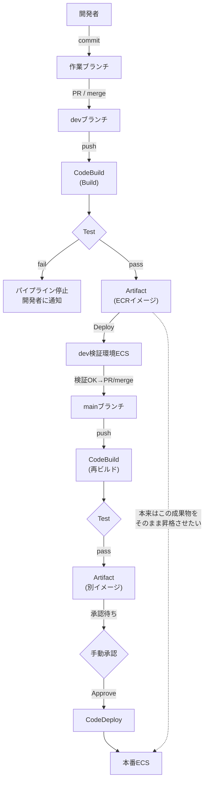

# CI/CDパイプライン

## 1. 概念理解

### 学ぶ範囲

Continuous Integration、Delivery、Deployment、Build、Test、Artifact、Approval、Pipeline。

### Continuous Integration（CI）

変更を頻繁に主ブランチへ統合し、その都度自動でビルド・テストを走らせて検証する仕組み。名前の"Integration"が指すのは「ビルドが通ること」よりも、複数人の変更を頻繁に合流させること自体。

**なぜ必要か**

分岐期間が長いほど、マージコストは線形ではなく加速度的に増える（変更ファイルが増える、前提が食い違う、直した本人も理由を忘れる＝Integration Hell）。頻繁に小さく統合すれば、問題を小さく・早く・原因を特定しやすい状態で検出できる。

**どう壊れるか**

- CIツール（CodePipeline等）を導入していても、運用として各自が長期間ブランチを分けたままなら「頻繁な統合」という本質を満たしておらず、効果は薄い（ツールの導入とCIという実践は別物）
- テストが遅い・不安定（flaky）だと開発者が実行を省略し始め、形骸化する

### Continuous Delivery / Continuous Deployment / Approval

土台はCIと同じ（自動でビルド・テストし、デプロイ可能な状態を作る）。違いは本番への最後の一押しを人が判断するか、自動でやるかだけ。

- Continuous Delivery：変更は自動で「いつでも本番に出せる状態」まで作られるが、実際に出すかは人（Approval）が判断する
- Continuous Deployment：承認なし。CIを通った変更はそのまま自動で本番まで到達する

**どう壊れるか**

- 承認（Approval）が中身を見ずに反射的にApproveするだけの作業になると、実質Deploymentと同じ速度で進みながら承認という手順だけが残る（Approval Theater）。遅延だけ生んでリスク低減の実効性は失われる

### Build / Artifact（Build once, deploy many）

- Build：ソースコードから実行可能な成果物（Dockerイメージ等）を作る工程
- Artifact：Buildで作られた成果物そのもの。CI/CDのベストプラクティスは「Build once, deploy many」＝一度ビルドした同じArtifactを、dev→本番へそのまま昇格させること。環境差はArtifactの中身ではなく外側（環境変数・タスク定義等）で吸収する

**どう壊れるか**

- ブランチごとに別パイプライン（別CodeBuild）を持ち、mainマージ後に再ビルドする構成だと、ソースは同じでも「ビルドという行為」をやり直すことになる
- 依存パッケージのバージョン固定が甘い、ベースイメージが`latest`参照など再現性が低いと、devで検証したものと本番で動くものが厳密には別物になり、「devで通ったのに本番で落ちる」の原因になる

### Test

Buildの後（または並行して）自動実行される検証。CIの文脈では「ビルドが通る」だけでなく、ロジックの破綻を検出する役割を持つ。テストが遅い・不安定（flaky）だとCI自体が形骸化するのは前述の通り。

### Pipeline

Commit → Build → Test → Artifact生成 → (Approval) → Deployを直列に繋いだ一連の自動化フロー全体。各ステージが独立して失敗しうるため、「どこで失敗したか」を切り分けられる設計になっているかが重要。

## 2. 選択肢の比較

<!-- CI/CD、継続的Delivery/Deployment、Push/Pull型デプロイを比較する -->

### CI vs Continuous Delivery vs Continuous Deployment

| | CI | Continuous Delivery | Continuous Deployment |
|---|---|---|---|
| 自動化される範囲 | Build〜Test | Build〜Test〜デプロイ可能な状態（Artifact）まで | Build〜Test〜本番反映まですべて |
| 本番反映 | 対象外（統合の話） | 人の承認が必要 | 自動（承認なし） |
| 目的 | 統合の破綻を早期検出 | 「いつでも出せる」状態を保証しつつ、出すか否かはビジネス判断に委ねる | リリース頻度の最大化、人の介在によるボトルネック排除 |
| 主なリスク | 本番品質そのものは保証しない | 承認が形骸化するとApproval Theaterになる | 自動テストの信頼性が低いと不良がそのまま本番に届く |

### Push型 vs Pull型デプロイ

- Push型：CI/CDツールが能動的に環境へ書き込む。デプロイイベント発生時のみ更新が走り、その後は誰も監視しない。手動変更などのDriftは次の意図的デプロイまで残り続ける
- Pull型（GitOps）：環境側のエージェントが自らGit/レジストリの状態を定期的に取りに行き、実際の状態と継続的に比較・是正する。IaCの`plan`/`refresh`サイクルを、人手を介さず自動でループし続けているイメージ

| | Push型 | Pull型（GitOps） |
|---|---|---|
| 更新の起点 | CI/CDツールが能動的に環境へ書き込む | 環境側のエージェントが自ら定期的に取りに行く |
| 実行タイミング | デプロイイベント発生時のみ | 継続的なループ（常時Drift監視） |
| Driftへの耐性 | 手動変更は次の意図的デプロイまで残る | 次のポーリングで自動的に是正される |
| 権限の向き | CI/CDツール→環境への書き込み権限が必要 | 環境内エージェントの読み取り権限のみでよい |
| 代表 | CodePipeline + CodeDeploy(ECS) | ArgoCD, Flux（Kubernetes） |

一般的には、チーム規模が大きくクラスタが分散するほどPull型（GitOps）の「継続的な自己修復」の恩恵が効いてくる。小〜中規模で信頼できる範囲が閉じている場合は、Push型のシンプルさ（追加のエージェント運用が不要）が実務上の妥協点になりやすい。この判断は規模・チーム体制に依存するため、Section 5で自分のユースケースに当てはめて検討する。

## 3. AWSでの実装例

CodePipeline、CodeBuild、CodeDeploy、ECR、GitHub Actions。

### 概念とサービスの対応

| 概念 | サービス | 役割 |
|---|---|---|
| Pipeline全体 | CodePipeline | Source→Build→Deployのステージを繋ぐオーケストレーター。自身はビルドもデプロイも実行しない |
| Build | CodeBuild | `buildspec.yml`に従って実行環境を立ち上げ、ビルドコマンドを実行する |
| Deploy | CodeDeploy | ECSタスク定義の切り替え、Blue/Greenの切り替えなどを実行する |
| Artifact保存 | ECR（コンテナイメージ）／S3（CodePipelineの一般的な成果物） | Dockerイメージという特殊なArtifactはECRに保存され、そのイメージURI（タグ/digest）をECSタスク定義に渡す |

### GitHub Actions（AWSネイティブとの対比）

GitHub ActionsはAWSに限定されない汎用CI/CDツールという点が、CodePipelineとの本質的な違い。前述のTerraform（汎用）vs CloudFormation（AWS専用）と同じ構図。

- リポジトリの置き場所自体がトリガー元なので、push/PR/マージにネイティブに反応する（CodePipelineはGitHub連携のために別途CodeStar Connections等が必要）
- ランナーはAWSアカウントの外側にいるため、AWSへデプロイするには外から中への認証が必要になる。長期のIAMアクセスキーをGitHub Secretsに置くのは漏洩リスクが高く、OIDC連携で一時クレデンシャルを発行するのがベストプラクティス

## 4. アーキテクチャ図

<!-- CommitからBuild、Test、Artifact、Deployまでを表す -->

- 作業ブランチ→devブランチ→mainブランチという2段階のPR/マージを経る。各マージのたびにCI（Build/Test）が独立して走る
- devとmainで別々にBuild/Testが走る＝Section1で話した「再ビルド型」。点線はArtifactを使い回す理想形（Build once, deploy many）で、実際のフローとの差分を表している
- Test失敗時はその場でパイプラインが止まり、後続のArtifact生成・Deployには進まない
- 手動承認（Approve）はArtifact生成後・本番Deploy前に挟まる。ここが形骸化するとほぼContinuous Deploymentと同じ速度で本番に届いてしまう

## 5. 設計トレードオフ

<!-- 速度、品質ゲート、承認、並列化、再現性、コストを考える -->

### Push型 vs Pull型（規模とチーム体制）

| | 小〜中規模・信頼範囲が閉じたチーム | 大規模・クラスタが分散するチーム |
|---|---|---|
| 有利な型 | Push型 | Pull型（GitOps） |
| 理由 | 追加のエージェント運用が不要でシンプル | 常時Drift監視による自己修復の価値が相対的に上がる |

### 品質ゲートの置き場所：共有dev環境 vs ブランチごとの並列環境

| | マージ後に共有dev環境で検証 | 作業ブランチごとに検証環境を並列用意（プレビュー環境） |
|---|---|---|
| コスト | 環境は1つで済み低い | ブランチ数だけ環境を用意・破棄するコストが増える |
| 障害の影響範囲 | 誰かの変更がdev環境を壊すと他の作業者もブロックされる（共有資源の奪い合い） | 1つが壊れても他に影響しない（隔離される） |
| 複雑さ | シンプル | 環境のプロビジョニング/破棄の自動化が必要 |

速度・品質ゲートの厳密さを取るほど、コストと運用の複雑さが増えるという軸で並列化を捉えられる。

### 再現性：Build once, deploy many vs 再ビルド

| | Build once, deploy many | 再ビルド型（dev/mainで別々にBuild） |
|---|---|---|
| 再現性 | 高い（同じArtifactを使い回すため一致が保証される） | ビルドの再現性が完全でないと「devで検証したもの」と「本番で動くもの」が別物になりうる |
| 構成の追加コスト | 環境差分（設定値等）をイメージの外側で管理する設計が必要 | パイプラインの構成はシンプル |

### 承認（Approval）の価値

| | 承認が実質機能している場合 | 承認が形骸化している場合（内容を見ずApprove） |
|---|---|---|
| 追加される価値 | 自動テストでは拾えない人の判断（リリースタイミング等）を確認できる | 実質的な追加価値はない。あってもなくても同じ |

## 6. 自分の言葉で説明

<!-- 「本番へ安全に変更を届ける流れ」を説明する -->

## 7. 理解確認

### 到達目標

変更を自動テストし、同一Artifactを安全に各環境へ届けるPipelineを説明できる。

### 現在の理解度

<!-- A：説明できる / B：見れば分かる / C：まだ怪しい -->
