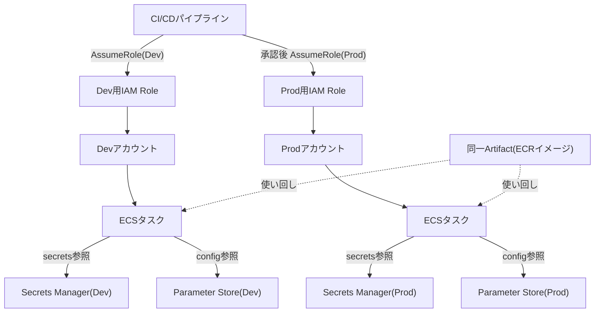
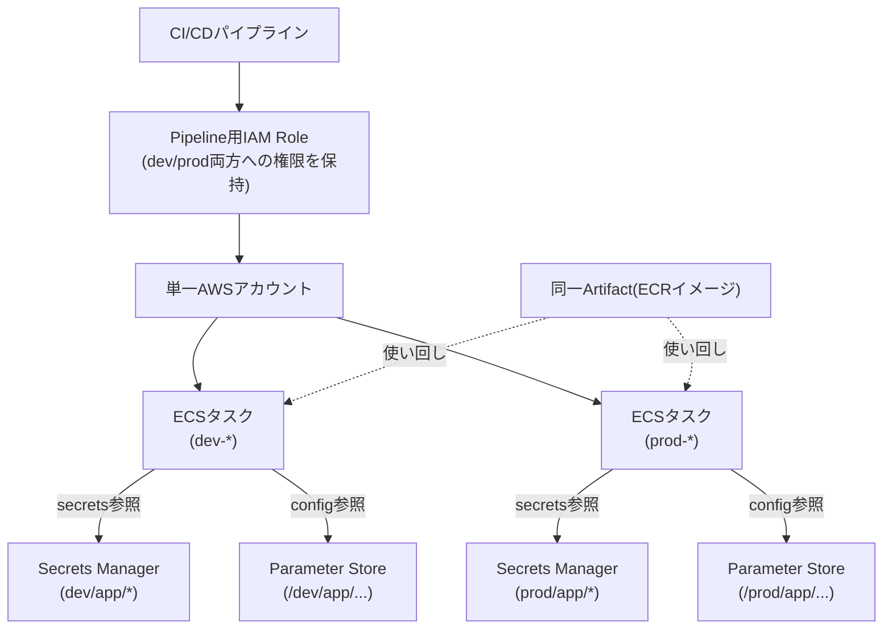

# 環境分離とSecret

## 1. 概念理解

### 学ぶ範囲

dev/stg/prod、アカウント分離、設定値、Secret、権限分離、Promotion。

### 設定値とSecretの実現方法の違い

ECSタスク定義を例にすると、コンテナへ値を渡す方法は2つある。

- `environment`：平文の値をタスク定義に直接書く（IaCコード内、タスク定義JSON内に値そのものが残る）
- `secrets`：値そのものは書かず、Secrets Manager/Parameter Storeへの**参照（ARN）**だけを書く。実際の値はコンテナ起動時にECSエージェントが取得して注入する

**なぜ分けるか**

「値そのもの」と「値への参照」を分けることで、参照経路（コード）は誰でも見て良いが、実体（値）は権限とログで守る、という設計にできる。平文で書いた場合に守れなくなる理由は3つ。

- Gitの履歴に残る（後から消しても`git log`で追跡可能）
- Terraformのstateファイルに平文で残る（stateを見れる人には中身が全部見える）
- アクセス制御と監査の粒度が違う：Secrets Manager/Parameter Storeなら「このRoleはこのSecretだけ読める」と絞れ、読んだ記録がCloudTrailに残る。コードに書かれた平文はコードを見れる人に無条件で見え、誰がいつ見たかも追えない

### アカウント分離（同一アカウント内 vs 別アカウント）

dev/stg/prodを分ける方法は、同一AWSアカウント内でリソース名・タグを分ける方法と、環境ごとに別アカウントを用意する方法の2通り。

- 同一アカウント：IAMポリシーの絞り込みだけで権限を分離する。ポリシーの書き漏れ・誤ったリソース指定が一つあれば、devの操作がprodに届く可能性が原理的に残る
- 別アカウント：アカウント境界自体がハードな壁になる（Blast Radius＝影響範囲がアカウント内に閉じる）。ポリシー記述の正確さに依存しない。コスト集計・サービスクォータもアカウント単位で独立する

個人開発・PoCは同一アカウントで十分だが、組織的な開発ではアカウント分離が基本になる。

### Promotion

Artifactを環境間で昇格させる流れ。別アカウント構成の場合、Pipeline自身が他アカウントへの書き込み権限を持つ必要があり、Cross-Account IAM Role（AssumeRole）による権限の受け渡しが必要になる。同一アカウント構成より一手間増える部分。

## 2. 選択肢の比較

### 同一アカウント vs 別アカウント

| | 同一アカウント | 別アカウント |
|---|---|---|
| 分離の実現方法 | IAMポリシーの絞り込み | アカウント境界そのもの |
| 分離の強さ | ポリシー記述の正確さに依存する | ポリシーの巧拙に依存しないハードな境界（Blast Radiusが限定される） |
| コスト・クォータ | 環境間で共有（devの負荷がprodのクォータを圧迫しうる） | アカウント単位で独立 |
| 運用の複雑さ | シンプル（追加の管理コストなし） | Organizations管理、Cross-Account Role設定などの追加運用が必要 |
| Promotion時の作業 | 不要（同一アカウント内で完結） | Cross-Account IAM Role（AssumeRole）が必要 |
| 向いている規模 | 個人開発・PoC・小規模 | 組織的な開発、複数チーム、本番運用 |

### 設定値とSecretのストアの使い分け（Parameter Store vs Secrets Manager）

| | Parameter Store | Secrets Manager |
|---|---|---|
| 用途 | 非機密設定値、軽量な機密値 | DB認証情報・APIキー等の本格的なSecret |
| 暗号化 | SecureString型ならKMS暗号化可能（String型は平文） | 常にKMS暗号化 |
| 自動ローテーション | なし（自前実装） | ネイティブサポート（RDS等と連携） |
| コスト | 無料〜低コスト | Secret単位で課金（有料） |
| 判断基準 | ローテーション不要・機密性が低い | ローテーションが必要・機密性が高い |

### 環境別Build vs 同一Artifact（02「Build once, deploy many」との接続）

| | 環境ごとに再ビルド | 同一Artifactを使い回す |
|---|---|---|
| 再現性 | devとprodが厳密には別物になりうる | 高い（同じイメージなので一致が保証される） |
| 環境差分の扱い | ビルド時に埋め込む | 実行時に外部（env/secrets参照）から注入 |
| Secretとの関係 | ビルド時に埋め込むとイメージ内に残ってしまう（ECRからpull/exportすれば中身が見える＝漏洩リスク） | Secretは実行時参照のみ、イメージには一切残らない |

02では「再現性」の観点で同一Artifactを推す理由を扱ったが、Secretの観点からも「ビルド時埋め込みは危険」という理由が上乗せされる。

## 3. AWSでの実装例

Organizations、IAM Role、Secrets Manager、Parameter Store、KMS。

### 概念とサービスの対応

| 概念 | サービス | 役割 |
|---|---|---|
| アカウント分離の管理 | AWS Organizations | 複数アカウントを一元管理し、SCP（Service Control Policy）で組織全体の権限上限をアカウント横断で設定できる |
| 環境ごとの権限切り替え | IAM Role | PipelineやECSタスクが環境ごとに異なるRoleを引き受け（AssumeRole）、その環境のリソースだけにアクセスする |
| 機密性の高いSecret | Secrets Manager | DB認証情報等を暗号化保存し、自動ローテーションに対応 |
| 非機密〜軽量な機密設定値 | Parameter Store | 環境ごとの設定値をパス階層（`/dev/app/...`、`/prod/app/...`）で管理 |
| 暗号化の基盤 | KMS | Secrets Manager/Parameter StoreのSecureStringを暗号化するキー管理。Key単位でIAMポリシーによるアクセス制御も可能 |

## 4. アーキテクチャ図

<!-- Pipelineが権限を切り替えて各環境へ配置する流れを表す -->

Pipelineは環境ごとに別のRoleへスイッチ（AssumeRole）してから、その環境のアカウント内でリソースにアクセスする。同一Artifactは両環境で使い回すが、参照先のSecrets Manager/Parameter Storeはアカウントごとに独立しているため、値の中身は環境間で混ざらない。

### 同一アカウント版（PoC想定）

アカウントを分けない分、環境の区別は「命名規則（`dev-*`/`prod-*`）」と「パス階層（`/dev/...`/`/prod/...`）」だけで行う。AssumeRoleによるアカウント境界の壁がないため、Pipelineが使う単一のRoleが誤って`prod-*`のリソースにも書き込めてしまわないよう、IAMポリシー側でリソースARN・パスプレフィックスを条件指定して絞り込む必要がある。ここが弱点で、Section 2で触れた「同一アカウントは分離強度がポリシー記述の正確さに依存する」がそのまま図に表れている。

## 5. 設計トレードオフ

<!-- 分離強度、管理負荷、環境差分、Secret露出、監査を考える -->

### 分離強度 vs 管理負荷

| | 分離強度を優先 | 管理負荷を優先 |
|---|---|---|
| 選択 | アカウント分離＋個別Role設計 | 同一アカウント＋大まかなIAMポリシー |
| メリット | Blast Radius最小化、監査が明確 | Organizations運用・Cross-Account Role設定が不要 |
| デメリット | Organizations運用、Cross-Account Roleの保守コストがかかる | ポリシーの書き漏れが即座に本番へ波及するリスクが残る |

### Secret露出 vs 開発の利便性

| | Secrets Manager徹底 | ローカルの`.env`等 |
|---|---|---|
| Secret露出リスク | 低い（参照のみ、アクセス制御・監査あり） | 高い（誤ったgit commit、共有ファイルへの記載などのリスク） |
| 開発の利便性 | 取得にAPI呼び出しと権限が必要でやや手間 | ローカルで即座に使える |

実務上は「開発時のみローカル`.env`を許容し、そこに本番Secretは絶対に入れない」という線引きが落とし所になりやすい。

## 6. 自分の言葉で説明

<!-- 「なぜ本番環境とSecretを分離するか」を説明する -->

## 7. 理解確認

### 到達目標

環境ごとの権限と設定を分離し、Secretをコードやログへ残さない仕組みを説明できる。

### 現在の理解度

<!-- A：説明できる / B：見れば分かる / C：まだ怪しい -->
