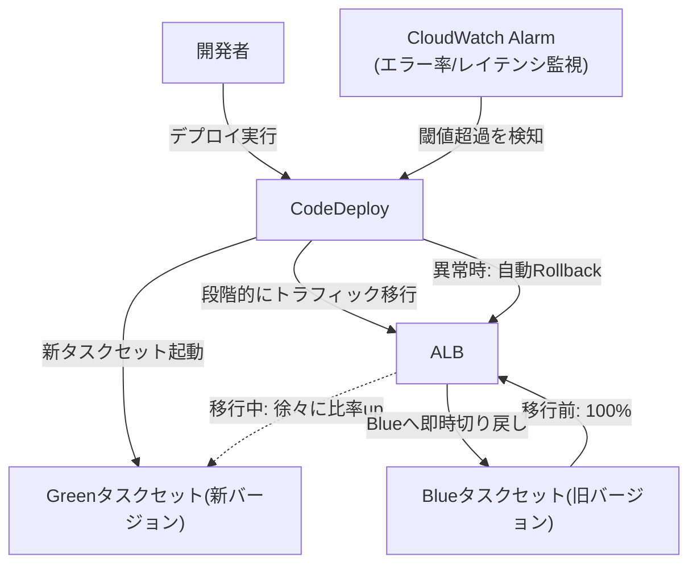

# デプロイとロールバック

## 1. 概念理解

### 学ぶ範囲

Rolling、Blue/Green、Canary、Feature Flag、Database Migration、Rollback、Roll-forward。

### デプロイ方式

- **Rolling**：稼働中のインスタンス/タスクを少数ずつ新バージョンへ入れ替える方式。追加インフラなしで実施できるが、入替中は新旧が必ず混在する
- **Blue/Green**：新バージョン（Green）を旧バージョン（Blue）とは別にまるごと用意し、準備ができたらトラフィックを一括で切り替える方式。Blueを残しておけるため切り戻しが速い
- **Canary**：新バージョンへ小さい割合のトラフィックだけ最初に流し、問題がなければ比率を段階的に上げる方式。異常があっても影響を少数のユーザーに限定できる

### Feature Flag

「デプロイ（コードを本番環境に配置する）」と「リリース（機能をユーザーに見せる）」を分離する仕組み。コード自体は全環境に配っておき、機能の有効・無効はランタイムのフラグで制御する。Rolling/Blue-Green/Canaryとは直交する概念で、組み合わせて使える（例：Blue/Greenでコードは全部Greenに配るが、機能はFlagで一部ユーザーにだけ見せる）。

### Rollback / Roll-forward

- **Rollback**：問題発生時に旧バージョンへ戻す対応
- **Roll-forward**：戻すのではなく、問題を修正した新バージョンを前へ進めてリリースする対応

### Database Migrationと後方互換性（Expand/Contract）

Rolling/Canaryのように新旧バージョンが同時稼働する方式では、DBスキーマ変更を1回のデプロイで完結させると新旧どちらかのコードが壊れる。これを避けるため、スキーマ変更を複数デプロイに分割する。

1. **Expand**：新しいカラム/テーブルを追加する（旧コードには影響しない）
2. **Migrate**：アプリを新バージョンへデプロイし、新カラムを使い始める
3. **Contract**：旧カラムが不要になったら削除する（後続のデプロイで）

この分割により、任意の時点でRollbackしてもDBスキーマは新旧どちらのアプリコードでも動作する状態を保てる。

## 2. 選択肢の比較

### Rolling / Blue-Green / Canary

| | Rolling | Blue/Green | Canary |
|---|---|---|---|
| 追加インフラ | 不要（既存を入れ替える） | 必要（新環境をまるごと用意、一時的に倍） | 必要な場合が多い（新バージョン用に一部リソース） |
| 切替速度 | 段階的・遅い | 即時（一括切替） | 段階的（意図的にゆっくり） |
| ロールバックの速さ | 遅い（逆方向にも入替が必要） | 速い（旧環境が残っているため即切替） | 速い（比率を0に戻すだけ） |
| 新旧混在期間 | あり（入替中は必ず混在） | なし（切替は一括） | あり（意図的に少数のみ新版） |
| リスクの影響範囲 | 全ユーザーが段階的に対象 | 切替後は全ユーザーが対象 | 小さいトラフィックのみに限定できる |
| コスト | 低い | 高い（一時的に倍のリソース） | 中程度 |

### Rollback vs Roll-forward

| | Rollback | Roll-forward |
|---|---|---|
| 対応方向 | 旧バージョンへ戻す | 修正した新バージョンへ進める |
| 速さ | 速い（Blue/Green等なら即時） | 修正・テスト・デプロイの時間が必要 |
| 前提条件 | 旧バージョンがDBスキーマ等と互換であること | 原因を特定し修正できること |
| 向いているケース | 原因不明／切り戻しが安全な場合 | DBスキーマが旧版と非互換な場合、旧バージョンにも同じ不具合がある場合 |

Database Migrationとの関係：スキーマ変更がExpand/Contractで段階化されていればRollbackは安全に選べる。すでにContract（旧カラム削除）まで進んでいる場合、Rollbackすると旧コードが削除済みカラムを参照できず壊れるため、Roll-forwardを選ばざるを得ない。

## 3. AWSでの実装例

CodeDeploy、ECS Blue/Green、Lambda Alias、ALB Weighted Target、CloudWatch Alarm。

### 概念とサービスの対応

| 概念 | サービス | 役割 |
|---|---|---|
| デプロイの制御・自動化 | CodeDeploy | EC2/ECS/LambdaへのRolling・Blue/Green・Canaryデプロイをオーケストレーションし、CloudWatch Alarmと連携して自動ロールバックできる |
| ECSでのBlue/Green | ECS + CodeDeploy | 新旧タスクセットを両方起動し、ALBのターゲットグループをCodeDeployが切り替える |
| Lambdaでの段階的切替 | Lambda Alias + Version | AliasがどのVersionへ何%流すか（Weighted Alias）を指定してCanary/Linearデプロイを実現 |
| ALBでのトラフィック配分 | ALB Weighted Target Group | 複数のターゲットグループへの重み付けルーティングでCanary・Blue/Greenの比率制御を実現 |
| 異常検知・自動ロールバックの起点 | CloudWatch Alarm | エラー率・レイテンシ等の閾値超過を検知し、CodeDeployへロールバックをトリガーする |

## 4. アーキテクチャ図

<!-- 新旧バージョンへの段階的なトラフィック移行を表す -->

CodeDeployがGreen（新）タスクセットを起動し、ALBのトラフィックをBlueからGreenへ段階的に移す。移行中にCloudWatch Alarmがエラー率やレイテンシの閾値超過を検知すると、CodeDeployが自動でALBのルーティングをBlueへ戻す（Rollback）。Blueタスクセットは切替完了まで残しておくため、切り戻しはALB側の参照先を変えるだけで完了する。

## 5. 設計トレードオフ

<!-- リスク、切替速度、追加容量、データ互換性、観測性を考える -->

### リスク・切替速度・追加容量

| | Rolling | Blue/Green | Canary |
|---|---|---|---|
| リスク | 中（全ユーザーが段階的に影響） | 高（切替後は全ユーザーが新版、検証時間が短いと影響大） | 低（影響を小さいトラフィックに限定できる） |
| 切替速度 | 遅い | 速い | 意図的に遅くする（検証のため） |
| 追加容量 | 不要 | 必要（一時的に倍） | 必要（小規模） |

### データ互換性

新旧が同時稼働する時間があるRolling/Canaryでは、DBスキーマの後方互換性（Expand/Contract）が必須。Blue/Greenは切替自体は一括だが、Blueをロールバック用に残す間はDBを共有し続けるため、Rollbackの選択肢を残す限りやはり後方互換性が必要になる。

### 観測性

どの方式でも、CloudWatch Alarm等で異常を検知できなければ自動Rollbackは機能しない。Canaryは影響範囲が小さい分、異常の兆候（エラー率の微増等）も小さくなりやすく、検知の感度設計（閾値・評価期間）がより重要になる。

## 6. 自分の言葉で説明

<!-- 「失敗時にどう戻すか」を含めてデプロイ方式を説明する -->
PoCの場合、RollingでOK!

## 7. 理解確認

### 到達目標

変更リスクとシステム特性からデプロイ方式を選び、安全な中止条件を定められる。

### 現在の理解度

<!-- A：説明できる / B：見れば分かる / C：まだ怪しい -->
A